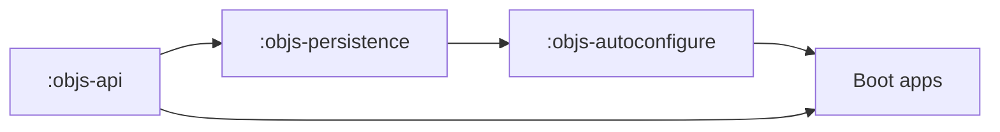
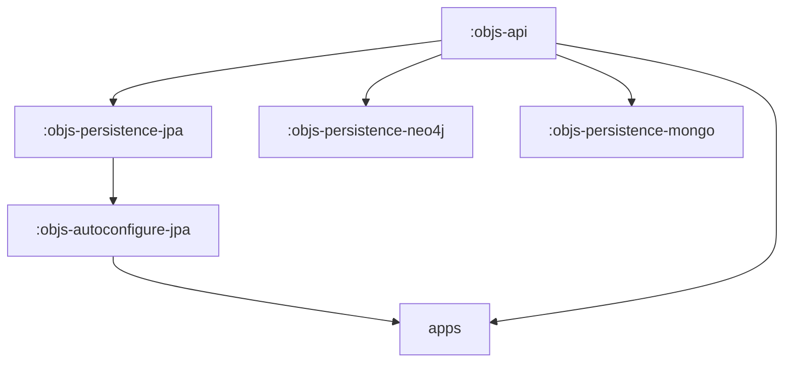

# Persistence backends and future splits

**Status:** living design (forward-looking; not committed work)  
**Parent:** [`README.md`](README.md) · [`spring-split.md`](spring-split.md)  
**Related:** [`../graph/persistence.md`](../graph/persistence.md) · C-25 GAPS **G-X2** (non-JPA); **G-X7** Gradle rename (`:objs-persistence`) is done

## Shipped today

| Module | Role |
|--------|------|
| `:objs-api` | Domain model, matcher/JEXL, validation **contracts**, seed **parse**, thin store **ports** |
| `:objs-persistence` | Spring-free **JPA** persistence: DAOs, store impls, SQL pushdown, Flyway SQL, seed **apply** |
| `:objs-autoconfigure` | Boot adapter: `spring.datasource` → beans, Spring UoW, objs Flyway ordering |

Java packages remain `org.poc.objs.core.*` for now (Gradle name ≠ package prefix). Domain/SDK on api is already JDBC/JPA-free.

## Goal: other backends without rewriting the SDK

In principle **yes**: another store (Neo4j, MongoDB, Cosmos DB, …) should plug in **under** `:objs-api`, not inside it. That is why C-25 separated model from persistence (deferred **G-X2**).

What stays stable on api:

- Graph domain (`Entity` / `Edge` / `Graph` / schemas / catalogs)
- Matcher DSL + in-memory / JEXL evaluation
- Validation contracts, seed parse, store ports

What stays backend-specific:

- Physical mapping (tables / documents / graph DB)
- Transactions / unit-of-work for that engine
- Pushdown (SQL today; other engines may omit or use native queries)
- Seed **apply**, Flyway-or-equivalent migrations
- Boot autoconfigure for that stack

### Caveat — ports are still thin

Today `org.poc.objs.api.store.GraphStore` is **read/select-only**. Full mutate, named graphs, versions, copy/merge live on concrete `org.poc.objs.core.persistence.GraphStore` / `NamedGraphStore`. REST and examples depend on those classes.

Before a second backend is useful for apps, **promote that store surface to interfaces** (prefer growing `:objs-api` store ports). That is additive api work; domain types need not change.

## Strategies (choose when needed)

### 1. Complete store ports on `:objs-api` (recommended prep)

- Expand ports for mutate / named-graph / version ops apps actually call.
- Keep **one** impl module (`:objs-persistence` = JPA).
- Apps depend on interfaces; JPA remains the only implementation until a second backend exists.

**Do this before** inventing extra Gradle modules for packaging.

### 2. Do **not** add `-persistence-api` + `-impl` for JPA alone

A separate `:objs-persistence-api` with a single JPA impl is packaging churn: same consumers, more wiring, no second backend. Prefer strategy 1.

### 3. Multi-backend module split (when a second store is real)

- Rename/split current `:objs-persistence` → `:objs-persistence-jpa` (same code).
- Add `:objs-persistence-neo4j` / `-mongo` / `-cosmos` as needed.
- Matching `:objs-autoconfigure-*` per stack.
- Optional later: extract ports into `:objs-persistence-api` **only if** keeping them out of the domain SDK module is desired — not a prerequisite.

### Backend fit (sketch only)

| Backend | Sketch |
|---------|--------|
| **PostgreSQL + JPA** (shipped) | Tables `objs_*`, EM DAOs, SQL pushdown, objs Flyway |
| **Neo4j** | Natural for entity/edge graphs; map membership + HEAD/history carefully |
| **MongoDB / Cosmos DB** | Document collections; membership and version semantics need an explicit model (not drop-in tables) |

None of Neo4j / Mongo / Cosmos are scheduled work — possibilities only.

## Package tidy (later)

Gradle module is `:objs-persistence`. Java packages may later move `org.poc.objs.core.persistence.*` → `org.poc.objs.persistence.*`. That is a separate mechanical story; not required for multi-backend ports.

## Out of scope here

- Implementing a non-JPA store
- Replacing Hibernate with jOOQ / JDBC-only
- Spring-free `:objs-service`
- Public rename of concrete `GraphStore` / `NamedGraphStore` class names (G-X6)
