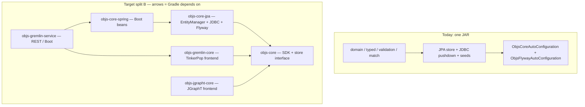
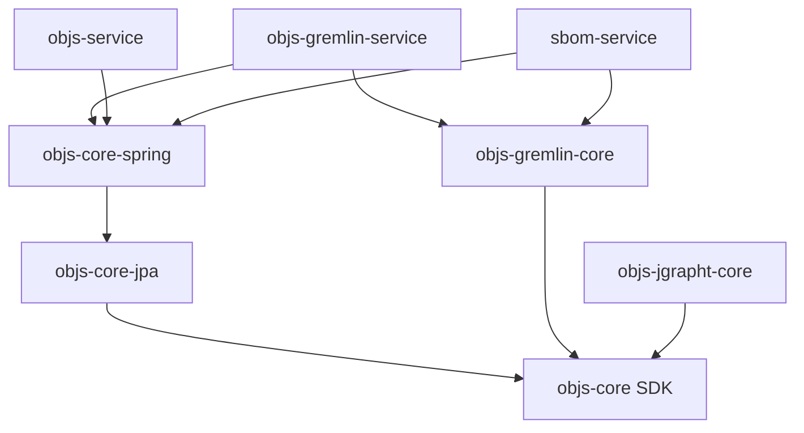

# objs-core layering: Spring-free SDK vs store vs Boot

**Status:** **normative for C-25** — story [`objs-core-spring-split`](../../workitems/in-progress/objs-core-spring-split/STORY.md) (backlog **C-25**). Design GAPS locked in story [`GAPS.md`](../../workitems/in-progress/objs-core-spring-split/GAPS.md).  
**Modules (C-25 target):** `:objs-api` · `:objs-core` (persistence, keep Gradle name) · `:objs-autoconfigure`  
**Parent:** [`README.md`](README.md)  
**Related:** [`../graph/persistence.md`](../graph/persistence.md), [`../graph/gremlin.md`](../graph/gremlin.md), [`../platform/overview.md`](../platform/overview.md)

> **Historical note:** Sections below that speak of "Split A / Split B" and module names `:objs-core-jpa` / `:objs-core-spring` are the **pre-story exploration**. **Authoritative locks** for this delivery are G-A1…G-A21 in GAPS (three modules: api + Spring-free core + tiny autoconfigure; DAOs 1:1; UoW internal; package matrix G-A20). Treat Split A/B wording as background, not competing requirements.

## Shipped layout (C-25)

The split is implemented. Verdict / Split A-B sections below are pre-story exploration.

| Module | Role |
|--------|------|
| `:objs-api` | Model, matcher/JEXL, validation contracts, seed parse, store ports |
| `:objs-core` | Spring-free persistence (DAOs, store impls, Flyway SQL, seed apply) |
| `:objs-autoconfigure` | Boot adapter: `spring.datasource` to beans, Spring UoW, objs Flyway ordering |

Boot apps depend on `:objs-autoconfigure`. Graph frontends (`:objs-gremlin-core`) depend on `:objs-api` only. Gradle name `:objs-core` stays until G-X7.

## Verdict

| Goal | Feasible? | What it actually takes |
|------|-----------|------------------------|
| Use **SDK** (types, catalogs, matchers, validator, seed *parse*) without a Spring context | **Yes today** at the type level; Gradle still *leaks* Boot via `api` | Drop stereotypes; stop exporting Boot starters |
| Stop forcing **Boot** on every consumer | **Yes — small** | Split A: move autoconfig to `:objs-core-spring` |
| Persist to Postgres from a **non-Spring** process (Quarkus, Micronaut, plain Hibernate, CLI) | **Yes — large** | Split B: replace Spring Data + Spring TX + Spring JDBC; keep Jakarta Persistence + Flyway |
| Keep Boot apps (workbench, SBOM, asset repository) drop-in | **Yes** | `-spring` module owns `@AutoConfiguration`, entity scan, runners |

**Do not stop at “move autoconfig and delete `@Service`.”** Stereotypes are cheap. Spring Data and
Spring transactions *are* the store.

**No Spring ≠ no Hibernate / Flyway.** A Spring-free store still needs a JPA provider, a
`DataSource`, and the objs Flyway line (`bom_*` / `flyway_schema_history_objs`).

## Layers (today vs target)



| Layer                    | Packages (today)                                           | Spring?                       |
| ------------------------ | ---------------------------------------------------------- | ----------------------------- |
| Entity SDK               | `domain`, `match`, `typed`, `validation`                   | Almost none (two stereotypes) |
| Persistence + seed apply | `persistence`, `seed`                                      | Heavy                         |
| Boot wiring              | `ObjsCoreAutoConfiguration`, `ObjsFlywayAutoConfiguration` | Boot-only                     |

Wiring is **stereotype-driven**. Autoconfig scans the whole tree instead of listing store beans:

```kotlin
@AutoConfiguration
@Import(ObjsFlywayAutoConfiguration::class)
@ComponentScan(basePackages = ["org.poc.objs.core"])
@EntityScan(basePackages = ["org.poc.objs.core.persistence"])
@EnableJpaRepositories(basePackages = ["org.poc.objs.core.persistence"])
```

That scan is why `@Service` / `@Component` sit on SDK types that do not need Spring
(`BoMCatalogSupport`, `FullCatalogJsonSchemaExporter`, seed handlers). Domain unit tests already
`new` those types with `InMemoryBoMSchemaCatalog` / `InMemoryBoMAllowedEdgeCatalog` — the
annotations fire only when something scans them.

## Clarifications

1. **Three cuts, not two.** “Spring-free core + autoconfig” is incomplete if the goal is a
   non-Spring *store*. SDK / JPA store / Boot autoconfig must be named separately.
2. **`:objs-gremlin-core` is the existence proof of a graph frontend.** It never imports Spring, but
   `api(project(":objs-core"))` plus `BoMGremlinEngine.selectAndEval(store: BoMGraphStore, …)`
   pulls Boot + JPA onto its compile classpath. It only needs `store.select(matcher)` and
   `BoMGraphContents`. After split B it stays a **sibling of the SDK**, not inside JPA/Boot — same
   slot as a future JGraphT frontend. See [§11](#11-graph-frontends-gremlin-jgrapht).
3. **Gradle `api` is a leak, not just a convenience.** Core declares Boot starters as `api`, so
   every consumer compiles against Spring whether it uses the store or not.
4. **Catalog interfaces already hide persistence.** `BoMSchemaCatalog` / `BoMAllowedEdgeCatalog`
   live in `domain`. JPA implementations (`JpaBoMSchemaCatalog`, `JpaBoMAllowedEdgeCatalog`) are
   write-through caches over `InMemoryBoM*`.
5. **Seed parse ≠ seed apply.** YAML parse (`SeedYaml`, `SeedDocumentHandler` SPI) is SDK.
   `GraphSeedHandler` → `BoMNamedGraphStore` and `BoMSeedLedger` → JPA are store. Startup loading
   (`BoMSeedStartupLoader` + `ResourceLoader` + `BoMSeedProperties`) is Boot.
6. **The GraphStore cycle is Spring-specific.** `BoMGraphStore` → `BoMNamedGraphStore` →
   `@Lazy BoMGraphStore` (copy / merge / clone go through `graphStore.write`). A Spring-free split
   needs a store **interface** (or a setter), not Boot’s lazy proxy.
7. **Jackson 2 vs 3 is independent of Spring.** Domain `@Json*` and `BoMValidator` (networknt)
   use Jackson 2 (`com.fasterxml`). `PayloadMapper`, matcher DSL, and seed YAML use Jackson 3
   (`tools.jackson`). Unrelated to the split; do not conflate.

## 1. Gradle modules today (declared)

`api` = on **consumers’ compile classpath**. `impl` = module-private.

| Module | Depends on (compile) | Scope | Also leaked transitively |
|--------|----------------------|-------|--------------------------|
| `:objs-core` | Boot BOM, `boot-starter`, `boot-starter-data-jpa`, `boot-starter-flyway`, Jackson 3 bundle, `kotlin-reflect` | **api** | Spring Framework, Spring Data JPA, Hibernate, Flyway, JDBC |
| | `json-schema-validator`, `commons-jexl3` | **impl** | not leaked |
| `:objs-gremlin-core` | `:objs-core`, TinkerPop (`gremlin-core`, TinkerGraph, gremlin-language), `kotlin-reflect` | **api** | **all of objs-core’s api**, including Boot/JPA |
| `:objs-service` | `:objs-core`, `boot-starter-webmvc`, springdoc, `kotlin-reflect` | **api** | core + WebMVC |
| `:objs-gremlin-service` | `:objs-gremlin-core`, `:objs-service` | **api** | core + gremlin + WebMVC |
| `:objs-service-app` | `:objs-service`, `:objs-gremlin-service` | impl | workbench stack |
| `:sbom-service` | `:objs-core`, `:objs-gremlin-core`, WebMVC | impl | Boot/JPA via core |
| | `:objs-service`, `:objs-gremlin-service`, UIs | **runtimeOnly** | workbench sidecar |
| `:asset-repository-service` | `:objs-service`, `:objs-gremlin-service`, WebMVC, data-jpa, flyway | impl | full Boot stack |

`:objs-gremlin-core` never imports `org.springframework`, but **cannot be Spring-free** while
`api(project(":objs-core"))` re-exports Boot starters.

Same pattern already exists for Gremlin: engine in `-core`, REST/Boot in `-service`. Core should
follow that cut.

## 2. `objs-core` packages × libraries (source)

Legend: **D** = type used in code; **A** = stereotype / `@Transactional` only; **—** = unused.

| Package / type | Jackson 3 | Jackson 2 | JEXL | networknt | Jakarta JPA | Hibernate | JDBC | Spring Data | Spring TX | Spring JDBC | Spring IO | Boot |
|----------------|:---:|:---:|:---:|:---:|:---:|:---:|:---:|:---:|:---:|:---:|:---:|:---:|
| `domain` | — | **D** (`@Json*` on schema types) | — | — | — | — | — | — | — | — | — | **A** (`BoMCatalogSupport`, `FullCatalogJsonSchemaExporter`) |
| `typed` | **D** (`PayloadMapper`) | — | — | — | — | — | — | — | — | — | — | — |
| `validation` | — | **D** (`ObjectMapper` for networknt) | — | **D** | — | — | — | — | — | — | — | — |
| `match` | **D** (DSL YAML/JSON) | — | **D** | — | — | — | — | — | — | — | — | — |
| `seed` parse / SPI | **D** (`SeedYaml`) | — | — | — | — | — | — | — | **A** (`SeedImporter`) | — | — | **A** |
| `seed` startup / ledger | — | — | — | — | — | — | — | **D** (`BoMSeedLedgerRepository`) | **D** (`REQUIRES_NEW`) | — | **D** (`ResourceLoader`) | **D** (`BoMSeedProperties`) |
| JPA records | — | — | — | — | **D** | **D** (`@JdbcTypeCode`) | — | — | — | — | — | — |
| Spring Data repos | — | — | — | — | — | — | — | **D** `JpaRepository` | — | — | — | — |
| `BoMGraphStore` | — | — | — | — | **D** `EntityManager` | — | — | **D** | **D** | — | — | **A** |
| `BoMNamedGraphStore` | — | **D** | — | — | — | — | **D** | **D** | **D** | **D** `JdbcTemplate` | — | **A** + `@Lazy` |
| `BoMPoolEntityReader` | — | — | — | — | — | — | **D** | — | — | **D** `DataSourceUtils` | — | **A** |
| `JpaBoM*Catalog` | — | — | — | — | — | — | — | **D** | **D** + `TransactionSynchronizationManager` | — | — | — |
| `ObjsFlyway` helper | — | — | — | — | — | — | — | — | — | — | — | **D** `DatabaseDriver` |
| Autoconfig | — | — | — | — | EMF type | — | **D** | `@EnableJpaRepositories` | — | — | — | **D** `@AutoConfiguration` |

Hibernate `@JdbcTypeCode` on JSON/JSONB columns is **not** Spring. It stays in a JPA module.

## 3. Internal package DAG

```
domain          ← no objs-core packages
  ↑
typed, validation
  ↑
match, seed-parse
  ↑
persistence (store, JDBC, JPA) ← seed-apply (GraphSeedHandler, BoMSeedLedger)
  ↑
autoconfig (ObjsCoreAutoConfiguration, ObjsFlywayAutoConfiguration)
```

| From \ To | domain | typed | validation | match | seed | persistence |
|-----------|:---:|:---:|:---:|:---:|:---:|:---:|
| domain | | — | — | — | — | — |
| typed | D | | — | — | — | — |
| validation | D | — | | — | — | — |
| match | D | D | D | | — | — |
| seed | D | D | D | — | | **D** (`GraphSeedHandler` → `BoMNamedGraphStore`; ledger → JPA) |
| persistence | D | D | D | D | D (autoconfig → loader / properties) | cycle: `BoMGraphStore` ↔ `BoMNamedGraphStore` (`@Lazy`) |

`GraphSeedHandler` is the seed→store edge. Object-schema and allowed-edge handlers only need
`BoMSchemaCatalog` / `BoMAllowedEdgeCatalog`.

## 4. What each consumer actually uses from core

| Consumer | domain | match | validation | typed | seed | `BoMGraphStore` **class** | Boot autoconfig |
|----------|:---:|:---:|:---:|:---:|:---:|:---:|:---:|
| `:objs-gremlin-core` | D (`BoMGraphContents`, entity/edge) | D (`BoMMatcher`) | — | — | — | **D** (`select`) | unused, **leaked** |
| `:objs-service` | D | D | D | | D | D | used |
| `:sbom-service` | D | D | D | | D | D | used (same JVM) |
| `:asset-repository-service` | via service | | | | | D | used |
| Domain unit tests in core | D | D | D | D | parse | — | — |
| `@DataJpaTest` / `testIT` in core | | | | | D | D | D |

Gremlin only needs a **store interface** with `select(matcher): BoMGraphContents`. The concrete
JPA class is an accidental compile dependency.

## 5. Load-bearing Spring (what a store split must replace)

| Coupling | Where | Why it is not an annotation delete |
|----------|-------|-------------------------------------|
| Spring Data `JpaRepository` | `BoMEntityRepository`, `BoMEdgeRepository`, graph/membership/catalog/ledger repos | Public constructors of `BoMGraphStore` / `BoMNamedGraphStore` take these types |
| `@Transactional` | Almost every store / catalog / seed write | Consistency of mutate / copy / merge |
| `Propagation.REQUIRES_NEW` | `BoMSeedLedger` | Fingerprint rows must commit even when the seed resource rolls back |
| `TransactionSynchronizationManager` | `JpaBoMCatalogs` | Rehydrate in-memory catalog cache after rollback so seed visibility does not outlive a failed TX |
| `JdbcTemplate` | `BoMNamedGraphStore` graph-expr pushdown | Postgres `annotations @>` SQL |
| `DataSourceUtils` | `BoMPoolEntityReader` | Pool scan must join the JPA transaction |
| `ResourceLoader` | `BoMSeedStartupLoader` | `classpath:` / `file:` seed locations |
| `@Lazy` | named-graph store → graph store | Cycle breaker for copy/merge/clone |
| Boot `DatabaseDriver` | `ObjsFlywayVendor` | `{vendor}` in Flyway locations (`postgresql`, `h2`) |
| `@ConfigurationProperties` | `BoMSeedProperties`, `ObjsFlywayProperties` | Boot binding only |

`EntityManager.flush()` in `BoMGraphStore` is Jakarta Persistence — keep it.

## 6. Target — split A (Boot out only)

Move Boot out; **keep Spring Framework + Spring Data** on `:objs-core`.

| New module | Allowed deps | Forbidden | Non-Spring app |
|------------|--------------|-----------|----------------|
| `:objs-core` | Spring Context / TX / JDBC / Data JPA, Hibernate, Flyway **core**, Jackson, JEXL, networknt | `spring-boot-starter*`, `@AutoConfiguration`, `DatabaseDriver`, `@ConfigurationProperties` | SDK yes; **store only if the app brings Spring TX + Spring Data** |
| `:objs-core-spring` | `:objs-core` **api**, Boot autoconfigure, Flyway Boot, `ApplicationRunner` | WebMVC (stays in `:objs-service`) | Boot apps only |

Moves into `:objs-core-spring`:

- `ObjsCoreAutoConfiguration`, `ObjsFlywayAutoConfiguration`
- `BoMSeedProperties`, `ObjsFlywayProperties`
- `ObjsFlywayVendor` (or replace `DatabaseDriver` with a URL map and keep vendor resolution in core)
- `META-INF/spring/org.springframework.boot.autoconfigure.AutoConfiguration.imports`
- `ApplicationRunner` beans for catalog hydrate + seed load
- `@EntityScan` / `@EnableJpaRepositories` / `@ComponentScan` (prefer explicit `@Bean` over scan)

Gradle after A:

| Module | `:objs-core` | `:objs-core-spring` | Boot Web |
|--------|:---:|:---:|:---:|
| gremlin-core | api | — | — |
| objs-service | — | api | api |
| sbom-service | impl *or* spring | impl if it wants hydrate/seeds | impl |
| non-Spring CLI (validate/match only) | impl | — | — |

Gremlin still compiles against Spring Data **types** until `BoMGraphStore` is an interface in core.
Introduce that interface in A even if the only impl stays Spring Data — otherwise A does not
fix the gremlin classpath.

**Effort:** small. Mechanical move + explicit beans + Flyway vendor helper. Tests that are
`@DataJpaTest` keep working if they `@Import` the new autoconfig.

## 7. Target — split B (Spring-free store)

| New module | Compile deps | Runtime | Non-Spring app |
|------------|--------------|---------|----------------|
| `:objs-core` (SDK) | Jackson 3, Jackson 2 (until networknt migrates), JEXL, networknt, `kotlin-reflect` | no Spring / JPA | **yes** — types, matchers, validator, in-memory catalogs, seed **parse** |
| `:objs-core-jpa` | `:objs-core`, Jakarta Persistence, Hibernate, `javax.sql`, Flyway core | DataSource + migrations | **yes** — construct `EntityManager` + a small `TxRunner` |
| `:objs-core-spring` | `:objs-core-jpa`, Boot | Boot | Boot apps; beans + Flyway `{vendor}` + seed `ResourceLoader` |

Replace:

- `JpaRepository` → `EntityManager` DAOs (or small repository types that do not extend Spring Data)
- `@Transactional` → `TxRunner` SPI (`EntityTransaction`, Jakarta `UserTransaction`, or ~10 lines)
- catalog rollback hook → same SPI’s after-rollback callback
- `JdbcTemplate` / `DataSourceUtils` → `Connection` from `DataSource` (join the active TX)
- `ResourceLoader` → `(location: String) -> InputStream`
- `ObjsFlywayVendor` → JDBC-URL → `postgresql` \| `h2` map (fail fast on unknown)
- `@Lazy` cycle → store interface + constructor of the impl pair, or a setter

Seed follows the same cut: parse/SPI in `:objs-core`; `GraphSeedHandler` + ledger in
`:objs-core-jpa`; startup loader in `:objs-core-spring`.

| Consumer after B | SDK | JPA store | Spring autoconfig | Graph frontend |
|------------------|-----|-----------|-------------------|----------------|
| gremlin-core / jgrapht-core | **api** | — | — | (they *are* the frontend) |
| gremlin-service | — | via spring | **api** | gremlin-core |
| objs-service / workbench | — | via spring | **api** | optional `runtime`/`impl` of a frontend |
| SBOM (in-process Gremlin) | api or via spring | via spring | **api** | **api** gremlin-core |
| Quarkus / CLI with Postgres | api | impl | — | optional gremlin-core / jgrapht-core |
| in-memory tools | api | — | — | optional frontend on a hand-built `BoMGraphContents` |

**Effort:** weeks, not a rename. Every repository method, every `@Transactional`, the catalog
rollback hook, the store cycle, and `@DataJpaTest` suites must be re-expressed.

## 8. What a non-Spring app can do at each step

| Goal | Today | After A | After B |
|------|-------|---------|---------|
| Validate payloads, matchers, identity, JSON Schema export | Yes, if you ignore leaked Boot JARs | Yes | Yes |
| In-memory catalogs + seed parse | Yes | Yes | Yes |
| `objs-gremlin-core` without Spring on the classpath | No (`api` leak + `BoMGraphStore` class) | Only with a store **interface** | Yes |
| Persist to Postgres from a non-Spring process | No | No | Yes (Hibernate + Flyway) |
| Drop-in Boot apps | Yes | Yes, via `-spring` | Yes, via `-spring` wrapping the same store |

## 9. Coupling hardness (priority)

| Dependency | How it shows up | Remove by |
|------------|-----------------|-----------|
| Boot autoconfig | 2 classes + `AutoConfiguration.imports` + properties | Split A |
| `@Service` / `@Component` | `ComponentScan` | Explicit `@Bean` in `-spring` |
| Store **interface** | `BoMGremlinEngine` takes the JPA class | Split A (do this first) |
| Spring Data `JpaRepository` | public constructors of stores | Split B |
| `@Transactional` / `REQUIRES_NEW` / rollback sync | write / seed / ledger semantics | Split B: TX SPI |
| `JdbcTemplate` / `DataSourceUtils` | 2 classes | Split B: plain JDBC |
| `ResourceLoader` | seed startup | `(String) -> InputStream` |
| `@Lazy` GraphStore cycle | copy / merge / clone | store interface |
| Hibernate `@JdbcTypeCode` | JSON/JSONB columns | keep in `-jpa` |
| Boot `DatabaseDriver` | Flyway `{vendor}` | URL map in SDK or `-jpa` |
| Jackson 2 + 3 | domain + validator vs mapper | independent of Spring |

## 10. Recommended sequence

1. **Store interface** in `:objs-core` (`select` and whatever gremlin actually calls). Point
   `BoMGremlinEngine` at the interface. This is the cheapest classpath win and unblocks extra
   frontends (JGraphT) on the same type.
2. **Split A** — `:objs-core-spring` owns Boot. Core remains a library, not a starter. SBOM /
   workbench depend on `-spring`. Gremlin-core still `api`s `:objs-core` only.
3. **Split B** — only if a real non-Spring embedder needs the **store**. Do not start B “for
   purity” while every launchable is still Boot. Frontends do not move; their Gradle dep is
   already correct once the store interface lives in the SDK.
4. **JGraphT (or any later frontend)** — new `:objs-jgrapht-core` beside `:objs-gremlin-core`.
   Do not wait for split B. Do not put JGraphT inside `:objs-core`.

Module names above (`:objs-core-jpa`, `:objs-core-spring`) are proposals. The cut is the
requirement; Gradle paths can match existing `objs-gremlin-core` / `objs-gremlin-service`
naming when a story implements this.

## 11. Graph frontends (Gremlin, JGraphT)

A **graph frontend** is a read-side engine over an already-selected BoM subgraph. It is not the
store, not a second persistence model, and not part of `:objs-core`.

Pipeline (Gremlin today; JGraphT the same shape):

```text
BoMMatcher  →  store.select  →  BoMGraphContents  →  materialize native graph  →  query  →  project
                     │                    │
                     └─ optional ─────────┴─ eval(contents) needs no store
```

| Piece | Owner | Notes |
|-------|--------|--------|
| Entity/edge/subgraph types | `:objs-core` SDK | `BoMEntity`, `BoMEdge`, `BoMGraphContents` |
| Matcher + `select` | SDK **interface** + JPA impl | Frontend may skip `select` and take contents |
| Native graph + query engine | **frontend `-core`** | TinkerPop, JGraphT, … one library per module |
| HTTP / Boot | frontend `-service` (optional) | Only if that engine is exposed on the wire |
| Writes | `:objs-core-jpa` only | Snapshot mutations **never** write back |

`:objs-core` stays free of TinkerPop **and** JGraphT. That rule already exists for Gremlin
([`../graph/gremlin.md`](../graph/gremlin.md)); JGraphT follows it.

### After split B — where `:objs-gremlin-core` sits

**Unchanged slot, cleaner classpath.** It does not migrate into `-jpa` or `-spring`.

```text
:objs-core              SDK + BoMGraphStore interface          ← gremlin-core api()
:objs-core-jpa          Hibernate / JDBC / Flyway              ← gremlin-core does not depend
:objs-core-spring       Boot beans                             ← gremlin-service may depend
:objs-gremlin-core      TinkerGraph materialize + gremlin-lang ← Spring-free
:objs-gremlin-service   POST …/traverse/gremlin                ← Boot; depends on gremlin-core + spring
```

`BoMGremlinEngine` already has both doors:

- `eval(subgraph: BoMGraphContents, …)` — no store (tests, in-memory tools, another frontend’s output)
- `selectAndEval(store, matcher, …)` — product path; `store` is the SDK **interface**, not the JPA class

After A/B, Gradle is `api(project(":objs-core"))` only. No Hibernate, no Boot. SBOM that calls
Gremlin in-process keeps `implementation(:objs-gremlin-core)` plus `:objs-core-spring` for the
store beans.

### JGraphT (planned sibling)

Same layer as Gremlin, different native model (algorithms, typed graphs, not gremlin-lang).

| Module | Role | Depends on |
|--------|------|------------|
| `:objs-jgrapht-core` | `BoMGraphContents` → JGraphT `Graph` + algorithm helpers | **api** `:objs-core` (SDK). **Not** `-jpa`, **not** `-spring`, **not** TinkerPop |
| `:objs-jgrapht-service` | Optional REST later | `-jgrapht-core` + `-core-spring`. Skip until there is an HTTP API |

Do **not**:

- fold JGraphT into `:objs-gremlin-core` (TinkerPop would leak onto algorithm-only callers)
- fold JGraphT into `:objs-core` (SDK must stay engine-agnostic)
- share a “frontend SPI” module until the second engine exists and the duplication hurts — the
  portable type is already `BoMGraphContents`

Suggested engine shape (mirrors Gremlin, not a shared interface until needed):

```text
BoMJgraphtEngine.from(contents: BoMGraphContents): Graph<…>
BoMJgraphtEngine.select(store, matcher): Graph<…>
```

Projection back to `BoMGraphContents` is optional (shortest-path as entity ids is enough for many
callers). Ephemeral: never persist the JGraphT graph.

### Who depends on what (split B)



| App | Store | Frontends |
|-----|--------|-----------|
| Workbench | `-core-spring` | gremlin-service on the classpath; JGraphT only if Query/UI needs it |
| SBOM | `-core-spring` | gremlin-core in-process today; add jgrapht-core the same way |
| Non-Spring CLI | `-core-jpa` or in-memory catalogs | whichever `-core` frontend; no `-service` |

### Coupling hardness (frontends)

| Dependency | Allowed on a frontend `-core`? |
|------------|--------------------------------|
| `:objs-core` SDK (`BoMGraphContents`, `BoMMatcher`, store **interface**) | **yes** (`api`) |
| TinkerPop / JGraphT / other engine | **yes**, that module’s reason to exist |
| `:objs-core-jpa`, Hibernate, Flyway | **no** |
| `:objs-core-spring`, Boot, WebMVC | **no** (those belong on `-service` or the launchable) |
| Another frontend (Gremlin ↔ JGraphT) | **no** — compose at the app, or via `BoMGraphContents` |

## Out of scope

- Replacing Hibernate with jOOQ / JDBC-only persistence
- Making `:objs-service` Spring-free (REST stays Boot / WebMVC)
- Migrating Jackson 2 → 3 in `BoMValidator` (networknt)
- Changing Flyway’s two-line rule ([`../graph/persistence.md`](../graph/persistence.md))
- Implementing `:objs-jgrapht-core` in this note (placement only)
- A shared `objs-graph-frontend` SPI before a second engine exists
