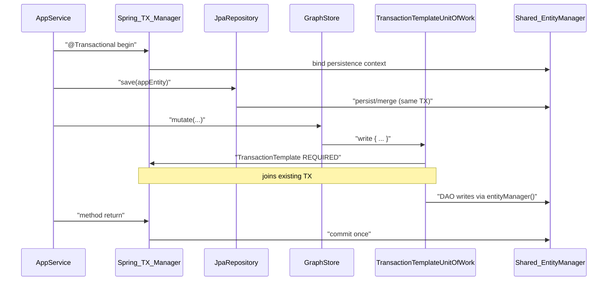
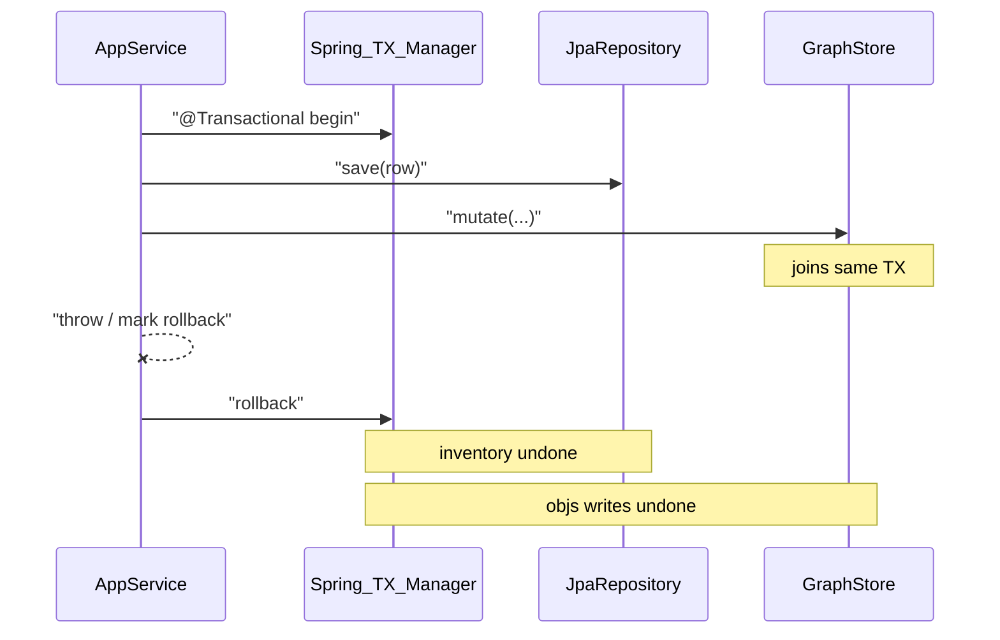

# Transaction recipes

**Status:** living how-to  
**Parent:** [`README.md`](README.md)  
**Modules:** `:objs-persistence` (`UnitOfWork`) · `:objs-autoconfigure` (`TransactionTemplateUnitOfWork`)  
**Related:** [`spring-integration.md`](spring-integration.md) · [`../graph/programmatic-recipes.md`](../graph/programmatic-recipes.md) · [`../graph/persist-sketch.md`](../graph/persist-sketch.md) · [`spring-split.md`](spring-split.md)

Copy-paste patterns for **who owns the transaction boundary** in Spring and non-Spring apps. Store **calls** (create/mutate/clear/…) stay in [`programmatic-recipes.md`](../graph/programmatic-recipes.md). Boot wiring: [`spring-integration.md`](spring-integration.md).

## Contract

| Layer | Responsibility |
|-------|----------------|
| `GraphStore` / `NamedGraphStore` / catalogs / seed apply | Wrap work in `uow.read` / `uow.write` / `uow.writeNew` |
| Application | Choose the `UnitOfWork` **impl** via wiring; optionally own an **outer** Spring `@Transactional` |
| Boot default | `TransactionTemplateUnitOfWork` — `read`/`write` use `PROPAGATION_REQUIRED` (join); `writeNew` uses `REQUIRES_NEW` |
| Non-Spring default | `EntityManagerUnitOfWork` — owns short-lived EM + `EntityTransaction` |

Inject **stores**, not DAOs. Do not open JDBC/`EntityTransaction` around stores unless you intentionally replace UoW.

## Spring: join outer `@Transactional`

**Goal:** one transaction for app `JpaRepository` writes **and** objs graph mutations.

Requirements (see [spring-integration](spring-integration.md#app-entities-alongside-objs)): shared `DataSource`, shared EMF (app + objs entities), Boot `TransactionTemplateUnitOfWork`.

```kotlin
@Service
class ApplicationVersionService(
    private val versions: SbomApplicationVersionRepository, // Spring Data (app tables)
    private val graphStore: GraphStore,                     // objs
    private val namedGraphs: NamedGraphStore,
) {
    @Transactional // owns the boundary
    fun addAsset(/* … */) {
        val row = versions.findById(versionId).orElseThrow()
        row.label = "…"
        versions.save(row)                 // (1) app mutation

        graphStore.mutate(/* … */)         // (2) objs — joins (1), no early commit
        // or namedGraphs.attach / detach / mutate / updateAnnotations …
    }
}
```

On success: **one commit**. On exception / rollback-only: **both** inventory and `objs_*` roll back.

Real consumer: SBOM `ApplicationVersionService` (and siblings) under `examples/sbom/sbom-service`.



### Rollback



## Spring: no outer transaction

If the service method is **not** `@Transactional`, each store entrypoint still opens a TX via `uow.write` / `uow.read` and commits when that call returns. Fine for single-call APIs; **not** atomic across multiple store (or store + repo) calls.

## Non-Spring

Use `:objs-persistence` with an EMF you create, and `EntityManagerUnitOfWork`:

```kotlin
val emf: EntityManagerFactory = /* Hibernate bootstrap */
val uow = EntityManagerUnitOfWork(emf)
// construct DAOs / GraphStore / NamedGraphStore with the same uow
// (mirrors ObjsPersistenceTestSupport)

// Multi-step app work in one TX:
uow.write {
    graphStore.mutate(/* … */)
    namedGraphs.create(/* … */)
}

// Or rely on per-method uow.write inside a single store call.
```

`PassthroughUnitOfWork` is for in-memory / seed unit tests that must not touch JPA.

## Pitfalls

| Pitfall | Effect |
|---------|--------|
| `EntityManagerUnitOfWork` inside a Boot `@Transactional` app | Separate EM/TX — **no join** with Spring |
| `uow.writeNew` (seed ledger) | `REQUIRES_NEW` — commits even if outer Spring TX rolls back (intentional) |
| `@Transactional` self-invocation (`this.foo()`) | No proxy → outer TX never starts; objs may commit per store call |
| Second DataSource/EMF for objs vs app | Shared `@Transactional` needs XA — unsupported; keep one EMF |
| Calling DAOs without an active UoW | `entityManager()` fails unless Spring TX is active **and** you are on the Spring UoW adapter |

## Out of scope

- A second `objs-persistence-spring` / Spring Data stack for `objs_*` — not required for same-TX join
- XA / multi-database transactions

## Related

- [spring-integration.md](spring-integration.md) — autoconfigure how-to
- [../graph/programmatic-recipes.md](../graph/programmatic-recipes.md) — store recipes
- [../graph/persist-sketch.md](../graph/persist-sketch.md) — write-path mechanics
- [spring-split.md](spring-split.md) — C-25 module split
