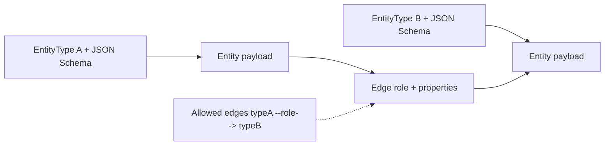

# Graph / entity domain

**Status:** early design (requirements captured; implementation not started)  
**Packages (target):** `org.poc.objs.*`  
**Modules:** [`objs-core`](../core/README.md) (entity SDK + persistence), [`objs-service`](../service/README.md) (REST — later stories)

Objs is an **entity store**: independent informational **entities** linked by **relations (edges)** into a **graph**. Callers select **subgraphs** via **annotations**. Validation uses JSON Schema (payloads) and allowed type–role rules (edges), enforced at the **persistence** boundary.

**Naming:** the domain element is **Entity**, not Object — avoids clashing with `java.lang.Object` in Java APIs. (Prefer carefully managed imports vs `jakarta.persistence.Entity` on JPA types.)

## Documents in this folder

| Doc | Contents |
|-----|----------|
| [model.md](model.md) | Entity, entity type, payload, relation/edge |
| [annotations-and-subgraphs.md](annotations-and-subgraphs.md) | Annotations as subgraph selection; additive edges |
| [validation.md](validation.md) | Persist-time enforcement vs audit validation |
| [persistence.md](persistence.md) | PostgreSQL, generic columns, JSONB |

## Core ideas (summary)

- **Entity** — independent element with a **type**, **JSON payload**, and **annotations**.
- **Entity type** — binds a **JSON Schema** for the payload; many types coexist.
- **Relation / edge** — link with a **role** and **properties**; subject to **allowed type–role** rules.
- **Annotation** — caller-defined, opaque criteria used to **select** entities (hence subgraphs).
- **Subgraph** — entities matching an annotation filter, plus **edges that exist on those entities** (edges not annotated — provisional).

## Access

- **Entity SDK** (`objs-core`): construct any in-memory graph without validation enforcement.
- **Persistence**: validation enforced immediately before persist; reject invalid writes. REST comes in a later story.
- **Read**: return whatever graph exists, including non-conforming data.

## Coordinates

| Concern | Choice |
|---------|--------|
| Java package root (target) | `org.poc.objs` |
| Maven group (scaffold today) | still `io.qpointz.poc.objs` until a rename WI |
| Primary DB | PostgreSQL |
| HTTP prefix (later) | `/api/v1/objs/**` |

## Open decisions

See each child doc. Cross-cutting items still open:

- Entity identity; type/schema registry and versioning
- Annotation shape and matching semantics
- Allowed-edge rule declaration (direction, cardinality)
- Edge property schema; edge table shape
- Whether edges may later carry annotations (**half-open**)
- Update/delete enforcement details; audit-validation API shape
- REST resource design beyond status stub (out of scope for first story)
- Flyway / migrations
- Code rename from `io.qpointz.poc.objs` → `org.poc.objs`
