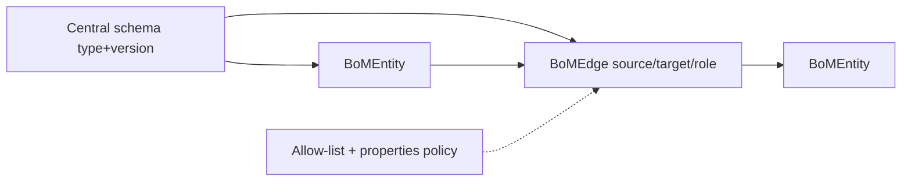

# Graph / entity domain

**Status:** early design (gaps for foundation story largely resolved — see story [`GAPS.md`](../../workitems/planned/entity-graph-foundation/GAPS.md))  
**Packages (target):** `org.poc.objs.*`  
**Modules:** [`objs-core`](../core/README.md) (entity SDK + persistence), [`objs-service`](../service/README.md) (REST — later stories)

Objs is an **entity store**: independent informational **entities** linked by **relations (edges)** into a **graph**. Callers select **subgraphs** via **annotations**. Validation uses JSON Schema generated from the authoritative object-schema DSL and allowed type–role rules, enforced at the **persistence** boundary.

**Naming:** domain **entity** / **edge**; Java types **`BoMEntity`**, **`BoMEdge`** (`Bo` prefix).

## Documents in this folder

| Doc | Contents |
|-----|----------|
| [model.md](model.md) | Entity, central schema `(type, version)`, relation/edge |
| [object-schema-dsl.md](object-schema-dsl.md) | Authoritative recursive schema DSL and JSON Schema projection |
| [annotations-and-subgraphs.md](annotations-and-subgraphs.md) | Annotations, matchers, induced subgraphs |
| [validation.md](validation.md) | Persist gate, batch two-stage validation, create/update by id |
| [persistence.md](persistence.md) | PostgreSQL, JSONB, Flyway, H2 tests |

## Core ideas (summary)

- **Entity** (`BoMEntity`) — **type + version**, JSON **payload**, **annotations**; optional id (absent → create, present → update).
- **Edge** (`BoMEdge`) — **source** / **target**, **role**; optional properties per allow-list **properties policy** (`none` = bare edge, `schema` = JSON Schema).
- **Central schema repo** — `(type, version)` → typed DSL definition; PostgreSQL authoritative, memory cached, JSON Schema generated.
- Allowed edges: **`(sourceType, role, targetType)`** + properties policy + optional **cardinality**
  (`UNSPECIFIED` / `1:1` / `1:*`); directed allow-list.
- **Annotations** — key-value map; matcher base + default **match-all**; subgraph = matched entities + **induced** edges.
- **Batch write** — entities + edges in one payload; **two-stage** validation (entities vs schema, then edges vs payload∪store).
- **Persist gate** — create / update / delete; SDK may build invalid graphs in memory.

## Access

- **Entity SDK** (`objs-core`): construct any in-memory graph without validation enforcement.
- **Persistence**: two-stage gate; Flyway; PostgreSQL runtime; H2 plus Testcontainers coverage.
- **Read**: return whatever exists, including non-conforming data.

## Coordinates

| Concern | Choice |
|---------|--------|
| Java package root (target) | `org.poc.objs` (WI-001) |
| Primary DB | PostgreSQL + **Flyway** |
| Tests (foundation) | **H2** |
| HTTP prefix (later) | `/api/v1/objs/**` |

## Remaining / deferred

Normative list: story [`GAPS.md`](../../workitems/planned/entity-graph-foundation/GAPS.md).

- **G-13** default-ok: artifact names stay `objs-core` / `objs-service`
- **Half-open:** edge annotations (G-14), JSONB indexing (G-16), soft-delete/versioning (G-17)
- **Completed follow-ups:** REST (C-2); persistent schema and edge-rule catalogs (C-3)
- **During WIs:** exact DDL columns; annotation map value types (string vs richer); cascade/delete detail; audit report shape (G-18)
