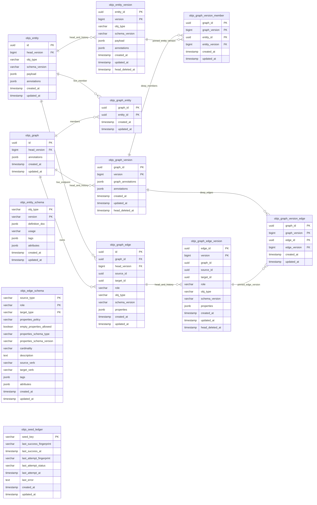

# Database model (as-built)

**Status:** C-18 shipped schema  
**Source of truth:** Flyway SQL + JPA in `objs-core`, not the story [`ER.md`](../../workitems/completed/20260819-versions-and-snapshots/ER.md) (that file is the historical lock).  
**Vendors:** PostgreSQL (JSONB + GIN) and H2 (JSON, no GIN). Same tables.  
V6 migrates existing databases from the former `bom_*` table names to the `objs_*` namespace.

Objs Flyway: `classpath:org/poc/objs/core/db/migration/{vendor}` into `flyway_schema_history_objs`.

| Version | File | What |
|---------|------|------|
| V1 | `V1__bom_schema.sql` | Pool, graphs, membership, edges, catalog, seed ledger |
| V2 | `V2__catalog_metadata.sql` | Catalog envelope tags/attributes/verbs |
| V3 | `V3__audit_clocks.sql` | `created_at` / `updated_at` on HEAD tables that lacked them |
| V4 | `V4__version_store.sql` | `*_version` tables, nullable `head_version`, deep-freeze pins |
| V5 | `V5__graph_version_member_entity_index.sql` | Reverse lookup index for deep-freeze pins |
| V6 | `V6__rename_bom_tables_to_objs.sql` | Rename all Objs persistence tables to the `objs_*` namespace |

Live GET never joins `*_version`. Default persist is in-place HEAD (`ExplicitOnlyVersioningStrategy`). Capture is `createDeepGraphVersion` (Composer **Create version**). `clone()` copies HEAD into new ids and does not copy `*_version`.

## Diagram

SQL column `type` on instance tables is drawn as `obj_type` (`type` breaks Mermaid ER syntax).
JSON columns are `jsonb` on PostgreSQL and `json` on H2.

**Physical FKs only** in the diagram. Catalog tables (`objs_entity_schema`, `objs_edge_schema`) and
`objs_seed_ledger` have **no** foreign keys to pool/graph instance rows; allow-list and validation are
application-level.

### Logical catalog links (not persisted as FKs)

| Catalog row | Governs (runtime) |
|-------------|-------------------|
| `objs_entity_schema (type, version)` | `objs_entity` / `objs_entity_version` `obj_type` + `schema_version` |
| `objs_edge_schema (source_type, role, target_type)` | Allowed live/history edges; optional `properties_schema_*` for `objs_graph_edge.properties` |
| `objs_seed_ledger.seed_key` | Idempotent seed import bookkeeping only |

## HEAD vs history vs pins

| Kind | Tables | Read path |
|------|--------|-----------|
| Live HEAD | `objs_entity`, `objs_graph`, `objs_graph_entity`, `objs_graph_edge` | Graph GET / pool GET |
| History | `objs_entity_version`, `objs_graph_version`, `objs_graph_edge_version` | Capture + reconstruct |
| Deep freeze children | `objs_graph_version_member`, `objs_graph_version_edge` | Pins original entity/edge **ids** + `version` |

`head_version` is nullable. NULL means never captured. When set, composite FK `(id, head_version) → *_version(parent_id, version)` (MATCH SIMPLE: NULL skips the check).

Version PK is `(parent_id, version BIGINT)`. `version` is **not** globally unique. `nextVersion(prev) = max(epochMillis, (prev ?: 0) + 1)`.

Version parent ids have **no** FK back to HEAD. After DELETE HEAD, reconstruct still works.

V4 drops `objs_graph_edge` FKs to `objs_entity` (source/target) so deleting HEAD entities does not `RESTRICT` on live edges; pins remain on `*_version`.

Nullable columns (no `NOT NULL` in DDL): `objs_entity.head_version`, `objs_graph.head_version`,
`objs_graph_edge.head_version`, `objs_graph_edge.type`, `objs_graph_edge.schema_version`,
`objs_graph_edge.properties`, matching columns on `*_version` history rows, `head_deleted_at` on
history tables, and most `objs_seed_ledger` attempt/success fields except `last_attempt_status`,
`last_attempt_at`, and clocks.

## Clocks

Every `objs_*` table has `created_at` / `updated_at` `TIMESTAMP NOT NULL`. Persist owns values; client JSON is ignored. Version-row `updated_at` equals `created_at` (append-only). Graph HEAD `updated_at` also bumps on live membership/edge change.

## Indexes

- `objs_entity (type, schema_version)` — `idx_objs_entity_type_schema_version`
- `objs_graph_entity (entity_id)` — `idx_objs_graph_entity_entity`
- `objs_graph_edge (graph_id)`, `(source_id)`, `(target_id)`, `(role)`, `(graph_id, source_id)`, `(graph_id, target_id)`
- `objs_graph_version_member (entity_id)` — `idx_objs_graph_version_member_entity_id` (V5)
- PostgreSQL GIN `jsonb_path_ops` on `objs_entity.annotations` and `objs_graph.annotations`
- `objs_seed_ledger (last_attempt_status)` — `idx_objs_seed_ledger_status`

## Catalog / seed

| Table | PK | Notable columns |
|-------|-----|-----------------|
| `objs_entity_schema` | `(type, version)` | `definition_doc`, `usage`, `tags`, `attributes` (V2), clocks |
| `objs_edge_schema` | `(source_type, role, target_type)` | `properties_policy`, `empty_properties_allowed`, `properties_schema_type/version`, `cardinality`, `description`, `source_verb`, `target_verb`, `tags`, `attributes` (V2), clocks |
| `objs_seed_ledger` | `seed_key` | success/attempt fingerprints and timestamps, `last_attempt_status`, `last_error`, clocks |

JPA: `SchemaCatalogRecord`, `AllowedEdgeRuleRecord`, `SeedLedgerRecord` in `objs-core` persistence package.

## Versioning SPI

`BomVersioningStrategy.shouldCapture(ctx)`. C-18 bean: `ExplicitOnlyVersioningStrategy` — always false on ordinary persist. `createDeepGraphVersion` always captures regardless.

## Provenance

Deep pins keep the **original** `entity_id` / `edge_id` plus a version. Freeze does not allocate new pool identities. `clone()` does allocate new ids and starts with `head_version` NULL.

## App tables

SBOM/AR Flyway is a separate history (`flyway_schema_history`). SBOM fingerprints store `(graph_id, graph_version)` on `sbom_application_fingerprint` (app Flyway V2).
