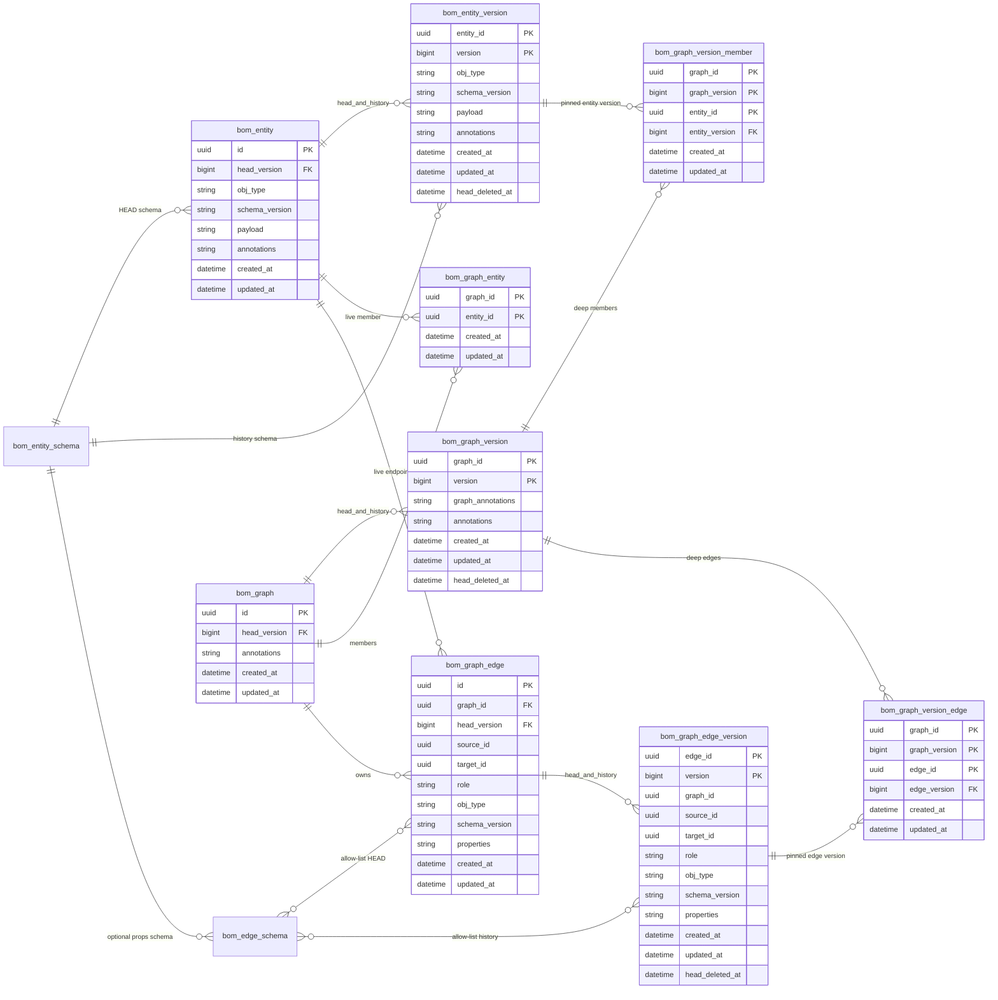

# Database model (as-built)

**Status:** C-18 shipped schema  
**Source of truth:** Flyway SQL + JPA in `objs-core`, not the story [`ER.md`](../../workitems/completed/20260819-versions-and-snapshots/ER.md) (that file is the historical lock).  
**Vendors:** PostgreSQL (JSONB + GIN) and H2 (JSON, no GIN). Same tables.  
**Greenfield only.** Recreate the database (drop `bom_*` and both Flyway histories). No data migration.

Objs Flyway: `classpath:org/poc/objs/core/db/migration/{vendor}` into `flyway_schema_history_objs`.

| Version | File | What |
|---------|------|------|
| V1 | `V1__bom_schema.sql` | Pool, graphs, membership, edges, catalog, seed ledger |
| V2 | `V2__catalog_metadata.sql` | Catalog envelope tags/attributes/verbs |
| V3 | `V3__audit_clocks.sql` | `created_at` / `updated_at` on HEAD tables that lacked them |
| V4 | `V4__version_store.sql` | `*_version` tables, nullable `head_version`, deep-freeze pins |

Live GET never joins `*_version`. Default persist is in-place HEAD (`ExplicitOnlyVersioningStrategy`). Capture is `createDeepGraphVersion` (Composer **Create version**). `clone()` copies HEAD into new ids and does not copy `*_version`.

## Diagram

SQL column `type` is drawn as `obj_type` (`type` breaks Mermaid ER).

## HEAD vs history vs pins

| Kind | Tables | Read path |
|------|--------|-----------|
| Live HEAD | `bom_entity`, `bom_graph`, `bom_graph_entity`, `bom_graph_edge` | Graph GET / pool GET |
| History | `bom_entity_version`, `bom_graph_version`, `bom_graph_edge_version` | Capture + reconstruct |
| Deep freeze children | `bom_graph_version_member`, `bom_graph_version_edge` | Pins original entity/edge **ids** + `version` |

`head_version` is nullable. NULL means never captured. When set, composite FK `(id, head_version) → *_version(parent_id, version)` (MATCH SIMPLE: NULL skips the check).

Version PK is `(parent_id, version BIGINT)`. `version` is **not** globally unique. `nextVersion(prev) = max(epochMillis, (prev ?: 0) + 1)`.

Version parent ids have **no** FK back to HEAD. After DELETE HEAD, reconstruct still works.

V4 drops `bom_graph_edge` FKs to `bom_entity` (source/target) so deleting HEAD entities does not `RESTRICT` on live edges; pins remain on `*_version`.

## Clocks

Every `bom_*` table has `created_at` / `updated_at` `TIMESTAMP NOT NULL`. Persist owns values; client JSON is ignored. Version-row `updated_at` equals `created_at` (append-only). Graph HEAD `updated_at` also bumps on live membership/edge change.

## Indexes

- `bom_entity (type, schema_version)`
- `bom_graph_entity (entity_id)`
- `bom_graph_edge (graph_id)`, `(source_id)`, `(target_id)`, `(role)`, `(graph_id, source_id)`, `(graph_id, target_id)`
- PostgreSQL GIN `jsonb_path_ops` on `bom_entity.annotations` and `bom_graph.annotations`
- `bom_seed_ledger (last_attempt_status)`

## Catalog / seed (unchanged shape)

`bom_entity_schema` PK `(type, version)`; V2 adds `tags`, `attributes`.  
`bom_edge_schema` PK `(source_type, role, target_type)`; V2 adds description, verbs, tags, attributes.  
`bom_seed_ledger` PK `seed_key`.

## Versioning SPI

`BomVersioningStrategy.shouldCapture(ctx)`. C-18 bean: `ExplicitOnlyVersioningStrategy` — always false on ordinary persist. `createDeepGraphVersion` always captures regardless.

## Provenance

Deep pins keep the **original** `entity_id` / `edge_id` plus a version. Freeze does not allocate new pool identities. `clone()` does allocate new ids and starts with `head_version` NULL.

## App tables

SBOM/AR Flyway is a separate history (`flyway_schema_history`). SBOM fingerprints store `(graph_id, graph_version)` on `sbom_application_fingerprint` (app Flyway V2).
