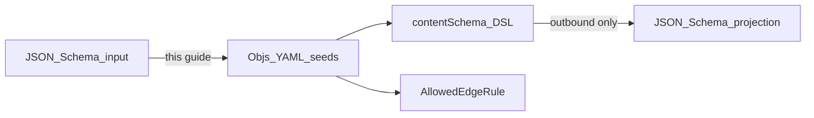

# JSON Schema to YAML seeds

**Status:** implemented (documentation)  
**Audience:** JSON Schema practitioners who need to produce objs multi-document YAML seeds  
**Related:** [object-schema-dsl.md](object-schema-dsl.md) (authoritative DSL), [seeds.md](seeds.md) (seed envelope and kinds), [model.md](model.md) (entities and edges)

Practical guide: map familiar **JSON Schema 2020-12** constructs to **objs seed YAML**.

Objs does **not** author schemas as JSON Schema. The authoritative form is a small typed DSL
(`contentSchema`) inside Mill-style seed documents. The product can **project** DSL → JSON Schema
2020-12 for validators and codegen. There is intentionally **no** JSON Schema → DSL import in the
product — you emit seeds yourself (by hand or with a generator).



---

## Three surfaces (do not conflate)

| Surface | What it is | Format | Role |
|---------|------------|--------|------|
| **Objs DSL** | `type` + `version` + `usage` + `contentSchema` | YAML or JSON serialization of the same tree | Authoritative definition stored in PostgreSQL |
| **Seed `ObjectSchema`** | Same DSL wrapped in Mill seed envelope | Multi-doc YAML (`apiVersion` + `kind: ObjectSchema`) | Portable catalog import/export |
| **JSON Schema 2020-12** | Deterministic projection of the DSL | Draft 2020-12 JSON | Validators, OpenAPI, codegen — **not** source of truth |

Workbench “YAML” / “JSON” tabs edit the **DSL**. The “JSON Schema” tab (and
`GET …/json-schema` / `export?format=json-schema`) shows the **projection**.

Seed `AllowedEdgeRule` and `Graph` documents have **no** JSON Schema equivalent as authoring
forms. Full-catalog JSON Schema export may *synthesize* relation properties for codegen; those
are not how relations are stored or seeded (see [Part B](#part-b--relations-and-edges)).

---

## Part A — Payload / attribute schemas

### Mental model

| JSON Schema idea | Objs target |
|------------------|-------------|
| One object type / `$id` / title | `ObjectSchema.type` + `version`; root `contentSchema` is always `OBJECT` |
| `properties` map | Ordered `contentSchema.fields[]` |
| Top-level `required: ["a","b"]` | Per-field `required: true\|false` (DSL has **no** OBJECT-level `required` list; projection re-derives `"required"`) |
| Nested object / array | Recursive `OBJECT` / `ARRAY` nodes |
| `enum` on a string | First-class `ENUM` node with `values[{value, description}]` |
| Entity vs edge attributes | `usage: ENTITY` (default) vs `usage: EDGE_PROPERTIES` |
| Identity / search hints | Field flags `identifier`, `searchable` → `x-objs-*` in projection |
| Envelope `id` / `type` on instances | `BoMEntity.id` / `.type` — **not** payload fields |

### Field-by-field mapping

| Typical JSON Schema (2020-12) | Objs DSL / seed `contentSchema` | Notes |
|-------------------------------|----------------------------------|-------|
| `"type": "object"` | `type: OBJECT` + `fields: […]` | Root must be `OBJECT` |
| `"type": "array"` + `items` | `type: ARRAY` + `items: {…}` | `items` required |
| `"type": "string"` | `type: STRING` | |
| `"type": "number"` | `type: NUMBER` | |
| `"type": "integer"` | `type: INTEGER` | First-class in objs |
| `"type": "boolean"` | `type: BOOLEAN` | |
| `"enum": ["A","B"]` | `type: ENUM` + `values: [{value, description}, …]` | Every value needs a nonblank description |
| `"format": "…"` | `format` on `STRING` only | Allow-list: `date`, `date-time`, `email`, `uri`, `uuid`, `hostname`, `ipv4`, `ipv6` |
| `"title"` / `"description"` | `title` / `description` on **every** node | Required after normalization (nonblank) |
| `"default"` | `default` | Hint only; does not mutate stored payloads |
| `"required": ["name"]` on object | Field `required: true` on `name` | Properties **not** listed in JSON Schema `required` → emit **`required: false`** (DSL default is **true** if omitted) |
| `"additionalProperties": false` | *(unsupported)* | Projection always emits `additionalProperties: true` |
| `$ref` / `$defs` | *(unsupported in DSL)* | Inline / flatten into nested `OBJECT`/`ARRAY` |
| `oneOf` / `anyOf` / `allOf` | *(unsupported)* | Pick one concrete shape or split types |
| `type: ["string","null"]` / nullable | *(unsupported)* | No `NULL` type; optional = omit field (`required: false`) |
| `minLength` / `maxLength` / `pattern` | *(unsupported)* | Drop or enforce outside objs |
| `minimum` / `maximum` / `multipleOf` | *(unsupported)* | Drop or enforce outside objs |
| `minItems` / `maxItems` / `uniqueItems` | *(unsupported)* | Drop or enforce outside objs |
| `const` | Approximate with single-value `ENUM` | Prefer modeling as fixed enum |
| OpenAPI-style `nullable` | *(unsupported)* | Same as null unions |

### Objs-only authoring flags (no JSON Schema counterpart as keywords)

| DSL field | Meaning | Projection |
|-----------|---------|------------|
| `usage: ENTITY` \| `EDGE_PROPERTIES` | Schema applies to entity payload or edge properties | Catalog metadata; not a JSON Schema keyword |
| `identifier: true` | Scalar leaf in identity map | `x-objs-identifier: true` |
| `searchable: true` | Scalar leaf searchable metadata | `x-objs-searchable: true` |
| `stereotype: […]` | UI presentation hints | `x-objs-stereotype` |

`identifier` / `searchable` are allowed only on scalar leaves (`STRING` | `NUMBER` | `INTEGER` |
`BOOLEAN` | `ENUM`), not on `OBJECT`/`ARRAY` fields themselves, and not under `ARRAY` item paths.

### Side-by-side example (attributes only)

**JSON Schema:**

```json
{
  "$schema": "https://json-schema.org/draft/2020-12/schema",
  "type": "object",
  "title": "Component",
  "description": "Software component",
  "properties": {
    "name": { "type": "string", "title": "Name", "description": "Display name" },
    "version": { "type": "string", "title": "Version", "description": "Version string" },
    "tags": {
      "type": "array",
      "title": "Tags",
      "description": "Labels",
      "items": { "type": "string" }
    }
  },
  "required": ["name"],
  "additionalProperties": false
}
```

**Equivalent objs seed document:**

```yaml
apiVersion: objs.poc.org/v1
kind: ObjectSchema
type: Component
version: 1.0.0
contentSchema:
  type: OBJECT
  title: Component
  description: Software component
  fields:
    - name: name
      schema:
        type: STRING
        title: Name
        description: Display name
      required: true
    - name: version
      schema:
        type: STRING
        title: Version
        description: Version string
      required: false
    - name: tags
      schema:
        type: ARRAY
        title: Tags
        description: Labels
        items:
          type: STRING
          title: Tag
          description: One tag
      required: false
```

Notes:

- `additionalProperties: false` was dropped (objs objects are open).
- ARRAY `items` gained required `title` / `description`.
- Optional `version` / `tags` are explicit `required: false`.

### Lossy outbound extras (do not reverse-engineer seeds from export)

When objs projects DSL → JSON Schema it may add:

- `$schema` dialect URI and `x-objs-type` / `x-objs-version`
- `x-objs-enumDescriptions`, `x-objs-identifier`, `x-objs-searchable`, `x-objs-stereotype`
- Always `additionalProperties: true`
- Full-catalog export: `$defs`, synthetic relation properties, `x-objs-export`, options echo

Round-tripping **objs’ own** JSON Schema export back into seeds will lose or invent structure.
Treat product JSON Schema as a **consumer** format; author seeds from your source JSON Schema using
this guide.

---

## Part B — Relations and edges

JSON Schema has **no first-class directed edge**. Patterns that encode links as nested `$ref`
properties, foreign-key strings, or arrays of related objects must be remodeled outside the
payload schema.

Objs splits relations into two layers:

| Layer | Seed kind / type | Purpose |
|-------|------------------|---------|
| **Ontology allow-list** | `kind: AllowedEdgeRule` | Which `(sourceType, role, targetType)` triples are legal; optional property schema + cardinality metadata |
| **Instance edges** | `kind: Graph` → `edges[]` / `BoMEdge` | Actual links between entities in a graph |

Attribute schemas (`ObjectSchema` / `contentSchema`) describe **payloads** only. Do **not** put
relation endpoints inside `fields` when emitting catalog ontology seeds.

### Allow-list triple

```yaml
apiVersion: objs.poc.org/v1
kind: AllowedEdgeRule
sourceType: Product
role: CONTAINS
targetType: Component
propertiesPolicy: SCHEMA
propertiesSchemaType: CanonicalEdge
propertiesSchemaVersion: "1.0.0"
emptyPropertiesAllowed: true
cardinality: "1:*"
```

| Concern | Objs behaviour |
|---------|----------------|
| Direction | Always directed: source → target with `role` |
| Wildcards | `sourceType`, `role`, or `targetType` may be `*` |
| Edge attributes | Separate `ObjectSchema` with `usage: EDGE_PROPERTIES`, referenced by the rule |
| Cardinality | `UNSPECIFIED` / `1:1` / `1:*` — metadata for UI/codegen, **not** enforced at persist |
| Identity | Upsert by `(sourceType, role, targetType)` |

### Before / after: nested JSON Schema relation vs seeds

**Anti-pattern (do not emit this as objs `contentSchema`):**

```json
{
  "type": "object",
  "title": "Product",
  "properties": {
    "name": { "type": "string" },
    "containsComponent": {
      "type": "array",
      "items": { "$ref": "#/$defs/Component" }
    }
  }
}
```

**Correct objs catalog seeds:**

```yaml
---
apiVersion: objs.poc.org/v1
kind: ObjectSchema
type: Product
version: 1.0.0
contentSchema:
  type: OBJECT
  title: Product
  description: Product payload
  fields:
    - name: name
      schema:
        type: STRING
        title: Name
        description: Product name
      required: true
---
apiVersion: objs.poc.org/v1
kind: ObjectSchema
type: Component
version: 1.0.0
contentSchema:
  type: OBJECT
  title: Component
  description: Component payload
  fields:
    - name: name
      schema:
        type: STRING
        title: Name
        description: Component name
      required: true
---
apiVersion: objs.poc.org/v1
kind: ObjectSchema
type: CanonicalEdge
version: 1.0.0
usage: EDGE_PROPERTIES
contentSchema:
  type: OBJECT
  title: Canonical edge
  description: Shared edge properties
  fields: []
---
apiVersion: objs.poc.org/v1
kind: AllowedEdgeRule
sourceType: Product
role: CONTAINS
targetType: Component
propertiesPolicy: SCHEMA
propertiesSchemaType: CanonicalEdge
propertiesSchemaVersion: "1.0.0"
emptyPropertiesAllowed: true
cardinality: "1:*"
```

Instance graphs use `kind: Graph` with edge rows whose `source` / `target` are **entity keys**,
not UUIDs — see [seeds.md](seeds.md).

### Full-catalog JSON Schema relation props (codegen only)

`GET /api/v1/objs/registry/export?format=json-schema` may add **synthetic** properties on ENTITY
`$defs` for codegen convenience:

- Outbound name ≈ camelCase(`role` + PascalCase(`targetType`)) e.g. `containsDataset`
- Optional inverse when `includeEdges=linked`
- Cardinality drives singular vs array `$ref`
- Wildcard rules are omitted from the export
- Edge-property schemas may appear as separate `$defs`

**Do not mirror these synthetic properties in `ObjectSchema.contentSchema`.** Encode relations as
`AllowedEdgeRule` documents. The export shape is a codegen view, not the authoring model.

---

## Part C — Producing catalog seeds from JSON Schema

### Document → kind mapping

| JSON Schema / ontology input | Seed output |
|------------------------------|-------------|
| One object / entity type schema | One `kind: ObjectSchema` (`type`, `version`, `contentSchema`) |
| `properties` + `required` | `contentSchema.fields` with per-field `required` |
| Nested `$ref` to an object shape | Inline nested `OBJECT` (or a separate `ObjectSchema` type if it is a first-class entity) |
| `enum` | `ENUM` node with `values[{value, description}]` |
| Relation / link between types | One `kind: AllowedEdgeRule` per `(sourceType, role, targetType)` |
| Shared edge property object | `ObjectSchema` with `usage: EDGE_PROPERTIES`, referenced by rules |
| Instance documents (objects + links) | `kind: Graph` — see [seeds.md](seeds.md); keep in a **separate** file from catalog seeds |

### Emission rules

1. Multi-document YAML; `apiVersion: objs.poc.org/v1` on every document.
2. **Catalog file only** for registry import (`ObjectSchema` + `AllowedEdgeRule`).
3. Prefer one file for the whole ontology (order free; importer sorts by kind).
4. Emit explicit `required: false` for optional attributes.
5. Supply nonblank `title` and `description` on every schema node.
6. Quote type names with spaces; keep `version` as a string.
7. Stable names for MERGE identity — changing `type`/`role` creates a new catalog row.

### Validation strategy

| Step | How |
|------|-----|
| Structural | Import via `POST /api/v1/objs/registry/import?format=seeds` |
| DSL rules | Failures surface as seed parse / `SCHEMA_DEFINITION_INVALID` (normalizer) |
| Golden compare | Diff against export `GET …/registry/export?format=seeds` after import |
| Automated tests | Feed generated YAML through `SeedImporter` / handlers in JVM tests |

Do not validate seed output by checking equality with `format=json-schema` export.

### Non-goals

- Round-trip from objs JSON Schema export back to seeds
- Encoding relations as nested `$ref` / FK fields inside `contentSchema`
- MERGE deletes (omitting a type from a re-import does not remove the catalog entry)
- Product runtime accepting JSON Schema as ontology input

### Further reading

| Doc | Use when |
|-----|----------|
| [seeds.md](seeds.md) | Envelope, field matrices, packaging, generation checklist |
| [object-schema-dsl.md](object-schema-dsl.md) | Full DSL grammar, projection rules, deliberate limits |
| [model.md](model.md) | Entity / edge runtime model |
| [validation.md](validation.md) | Persist-time validation vs allow-list |
| SBOM ontology seed | [`sbom-ontology.yaml`](../../../objs-sbom-example/src/main/resources/seeds/sbom-ontology.yaml) — worked catalog example |
| SBOM graph seed | [`sbom-demo-graph.yaml`](../../../objs-sbom-example/src/main/resources/seeds/sbom-demo-graph.yaml) — instance example |

---

## Python nano-framework (`tools/objs_seed.py`)

Pasteable **stdlib-only** helper for export projects: define catalog seeds as Python objects and
emit multi-document YAML. Mapping from Excel / other sources stays in your project; this file only
owns the objs seed model and serialization.

| Artifact | Role |
|----------|------|
| [`tools/objs_seed.py`](../../../tools/objs_seed.py) | Nano-framework (copy into any project) |
| [`tools/objs_seed_example.py`](../../../tools/objs_seed_example.py) | Runnable walkthrough (entities + edges) |

### Setup

From the objs repo:

```bash
python tools/objs_seed_example.py
python tools/objs_seed_example.py --out ontology.seeds.yaml
```

In an export project: copy `objs_seed.py` next to your script and `from objs_seed import …`.
No third-party packages required.

### Core types

| Symbol | Seed kind / role |
|--------|------------------|
| `Catalog` | Ordered bag; `add` / `extend` / `dumps()` / `write(path)` |
| `ObjectSchema(type, version, title=…, description=…, fields=…, usage=ENTITY\|EDGE_PROPERTIES)` | `kind: ObjectSchema` |
| `EdgeRule(source, role, target, …)` | `kind: AllowedEdgeRule` |
| `string` / `integer` / `number` / `boolean` / `enum` / `obj` / `array` | Field helpers |
| `string_node` | Leaf node for `array(..., items=…)` |
| `EDGE_PROPERTIES` | Usage constant for edge property schemas |

`required` defaults to **`True`** (objs seed default). Pass `required=False` for optional fields.

### Field flags

On **scalar** helpers only (`string`, `integer`, `number`, `boolean`, `enum`):

| Flag | Default | Emit |
|------|---------|------|
| `required` | `True` | always |
| `identifier` | `False` | only when `True` |
| `searchable` | `False` | only when `True` |

Do **not** put `identifier` / `searchable` on `obj` / `array` fields — mark nested scalar leaves
instead (objs forbids those flags on OBJECT/ARRAY and under ARRAY item paths).

```python
string(
    "name",
    title="Name",
    description="Display name",
    required=True,
    identifier=True,
    searchable=True,
)
```

### Edges

Relations are **`EdgeRule` documents**, not nested `$ref` fields on entity schemas.

**Bare edge (`NONE`):**

```python
EdgeRule("Product", "OWNS", "Component", properties_policy="NONE", cardinality="1:*")
```

**Schema-governed edge (`SCHEMA`):**

```python
# First register an EDGE_PROPERTIES ObjectSchema, then:
EdgeRule(
    "Product",
    "CONTAINS",
    "Component",
    properties_policy="SCHEMA",
    properties_schema=("CanonicalEdge", "1.0.0"),
    empty_properties_allowed=True,
    cardinality="1:*",
)
```

**Cardinality** wire values: `UNSPECIFIED` (default), `1:1`, `1:*`. Metadata for UI/codegen;
not persist-enforced.

**Wildcards** are allowed on `source_type` / `role` / `target_type` (e.g. `target_type="*"`).

### Emit and import

```python
cat = Catalog()
# … add ObjectSchema / EdgeRule …
yaml_text = cat.dumps()
cat.write("ontology.seeds.yaml")
```

Output is **catalog-only** multi-doc YAML (`ObjectSchema` + `AllowedEdgeRule`). Import with
`POST /api/v1/objs/registry/import?format=seeds`. Do not mix `kind: Graph` into this file.

### Walkthrough

[`tools/objs_seed_example.py`](../../../tools/objs_seed_example.py) builds:

- ENTITY schemas: `Product`, `Component`, `Container Image` (space in type name)
- `CanonicalEdge` with `usage: EDGE_PROPERTIES`
- Edge rules: bare `OWNS`, `SCHEMA`+`1:*` `CONTAINS`, `SCHEMA`+`1:1` `PRIMARY_IMAGE`, wildcard `RELATED_TO`

Abbreviated output shape:

```yaml
---
apiVersion: objs.poc.org/v1
kind: ObjectSchema
type: Product
version: "1.0.0"
contentSchema:
  type: OBJECT
  # …
  fields:
    - name: name
      # …
      identifier: true
      searchable: true
---
apiVersion: objs.poc.org/v1
kind: ObjectSchema
type: CanonicalEdge
version: "1.0.0"
usage: EDGE_PROPERTIES
contentSchema:
  type: OBJECT
  # …
---
apiVersion: objs.poc.org/v1
kind: AllowedEdgeRule
sourceType: Product
role: CONTAINS
targetType: Component
propertiesPolicy: SCHEMA
emptyPropertiesAllowed: true
cardinality: "1:*"
propertiesSchemaType: CanonicalEdge
propertiesSchemaVersion: "1.0.0"
```

### Limits

- No `kind: Graph` (instance data) — see [seeds.md](seeds.md)
- No Excel / spreadsheet readers
- Lightweight checks only; full validation is on objs import (`BoMSchemaNormalizer`)
- Not a pip package — the single file **is** the deliverable
