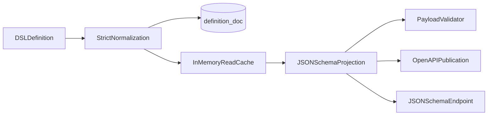

# Object-schema DSL

**Status:** implemented
**Parent:** [README.md](README.md)
**Inspired by:** qpointz metadata facet payload schemas; Objs does not implement facets

## Purpose

Objs schemas are authored as a small, typed, recursive DSL instead of raw JSON Schema maps.
The DSL is the authoritative definition stored in PostgreSQL and exposed by the registry API.
A deterministic JSON Schema 2020-12 projection is generated for:

- entity payload and edge-property validation;
- OpenAPI publication;
- external tools that consume JSON Schema;
- `GET /api/v1/objs/registry/schemas/{type}/{version}/json-schema`.

This keeps authoring predictable and ordered while retaining standards-based runtime validation.
There is intentionally no JSON Schema-to-DSL conversion.

## Definition envelope

Every catalog entry is identified by `type + version` and contains one root `contentSchema`
plus a required scalar `usage`:

```yaml
type: Component
version: 1.0.0
usage: ENTITY
contentSchema:
  type: OBJECT
  title: Component
  description: Canonical SBOM component payload
  fields: []
```

The root must be `OBJECT`, because `BoMEntity.payload` and schema-governed
`BoMEdge.properties` are JSON objects.

| Field | Required | Meaning |
|-------|----------|---------|
| `type` | yes | Stable catalog type name; trimmed, nonblank |
| `version` | yes | Opaque schema version; trimmed, nonblank |
| `usage` | yes | Exactly one of `ENTITY` or `EDGE_PROPERTIES` |
| `contentSchema` | yes | Root recursive schema node; must be `OBJECT` |

`ENTITY` schemas describe entity payloads. `EDGE_PROPERTIES` schemas describe edge property
objects. A schema applies to exactly one kind; dual usage is not allowed.

## Schema node

Every node has the same base shape:

```yaml
type: STRING
title: Homepage
description: Public product homepage
format: uri
default: https://example.invalid
```

| Field | Applies to | Meaning |
|-------|------------|---------|
| `type` | all | One of the node types below |
| `title` | all | Nonblank display name |
| `description` | all | Nonblank human-readable semantics |
| `fields` | `OBJECT` | Ordered object fields; required even when empty |
| `items` | `ARRAY` | Schema of every array item |
| `values` | `ENUM` | Ordered, nonempty string enum values |
| `format` | `STRING` | Standard string format hint |
| `required` | `OBJECT` | Derived during normalization from field flags; do not author separately |
| `default` | all | Optional default hint; it does not mutate stored payloads |

Properties that do not apply to a node type are rejected rather than ignored.

## Node types

| DSL type | JSON Schema type | Type-specific requirements |
|----------|------------------|----------------------------|
| `OBJECT` | `object` | `fields` must be present; objects are open (`additionalProperties: true`) |
| `ARRAY` | `array` | `items` must be present |
| `STRING` | `string` | Optional supported `format` |
| `NUMBER` | `number` | Any JSON number |
| `INTEGER` | `integer` | Objs extension for integral SBOM values such as byte sizes and replica counts |
| `BOOLEAN` | `boolean` | JSON boolean |
| `ENUM` | `string` + `enum` | Nonempty ordered string values with descriptions |

Supported string formats are:

- `date`
- `date-time`
- `email`
- `uri`
- `uuid`
- `hostname`
- `ipv4`
- `ipv6`

Formats are validation/tooling hints. Their exact assertion behavior follows the configured JSON
Schema validator.

## Object fields

Object properties use an ordered field list:

```yaml
fields:
  - name: name
    schema:
      type: STRING
      title: Name
      description: Component name
    required: true
  - name: labels
    schema:
      type: ARRAY
      title: Labels
      description: Search and grouping labels
      items:
        type: STRING
        title: Label
        description: One label
    required: false
    stereotype:
      - tags
```

| Field | Required | Default | Meaning |
|-------|----------|---------|---------|
| `name` | yes | — | Unique, nonblank property name within the containing object |
| `schema` | yes | — | Recursive value schema |
| `required` | no | `true` | Whether the property name appears in generated JSON Schema `required` |
| `stereotype` | no | absent | Ordered presentation hints; ignored by server validation |

Stereotypes are trimmed, empty entries are removed, and duplicates are collapsed. They are
projected as `x-objs-stereotype`.

`required` means the property must be present. It does not add nullability: the DSL has no `NULL`
type, so a present value must conform to its node type.

## Enums

Enums are string-valued and attach a description to every value:

```yaml
type: ENUM
title: Severity
description: Vulnerability severity
values:
  - value: LOW
    description: Limited impact
  - value: HIGH
    description: Serious impact
default: LOW
```

Values must be nonblank and unique; descriptions must be nonblank. JSON Schema receives the
literal list as `enum` and the descriptions as `x-objs-enumDescriptions`.

## Recursive example

```yaml
type: BuildReport
version: 1.0.0
contentSchema:
  type: OBJECT
  title: Build report
  description: Build output and produced artifacts
  fields:
    - name: buildNumber
      schema:
        type: INTEGER
        title: Build number
        description: Monotonic CI build number
      required: true
    - name: createdAt
      schema:
        type: STRING
        title: Created at
        description: Build completion timestamp
        format: date-time
      required: true
    - name: artifacts
      schema:
        type: ARRAY
        title: Artifacts
        description: Files produced by the build
        items:
          type: OBJECT
          title: Artifact
          description: One produced file
          fields:
            - name: name
              schema:
                type: STRING
                title: Name
                description: File name
              required: true
            - name: size
              schema:
                type: INTEGER
                title: Size
                description: File size in bytes
              required: true
      required: false
```

## JSON Schema projection

The example above projects deterministically to the following shape (abbreviated):

```json
{
  "$schema": "https://json-schema.org/draft/2020-12/schema",
  "x-objs-type": "BuildReport",
  "x-objs-version": "1.0.0",
  "type": "object",
  "title": "Build report",
  "description": "Build output and produced artifacts",
  "properties": {
    "buildNumber": {
      "type": "integer",
      "title": "Build number",
      "description": "Monotonic CI build number"
    },
    "createdAt": {
      "type": "string",
      "format": "date-time",
      "title": "Created at",
      "description": "Build completion timestamp"
    },
    "artifacts": {
      "type": "array",
      "items": {
        "type": "object",
        "properties": {
          "name": { "type": "string" },
          "size": { "type": "integer" }
        },
        "required": ["name", "size"],
        "additionalProperties": true
      }
    }
  },
  "required": ["buildNumber", "createdAt"],
  "additionalProperties": true
}
```

Projection rules:

1. Preserve field and enum declaration order.
2. Derive object `required` arrays from `BoMSchemaField.required`.
3. Emit `additionalProperties: true` for every object.
4. Emit enum and stereotype metadata under `x-objs-*` extension keywords.
5. Preserve titles, descriptions, formats, and defaults.
6. Add the JSON Schema 2020-12 dialect and catalog identity at the root.

## Normalization and rejection

Definitions are normalized before entering either the in-memory or JPA catalog:

- trim type, version, titles, descriptions, field names, enum values, and stereotypes;
- derive object-level `required` from field flags;
- reject duplicate field names and enum values;
- reject blank titles/descriptions/names;
- require `fields`, `items`, or `values` where dictated by the node type;
- reject fields that are invalid for the selected node type;
- reject unsupported string formats;
- require an `OBJECT` root.

Invalid definitions fail registration with `BoMSchemaDefinitionException`. REST maps this to
`SCHEMA_DEFINITION_INVALID`.

## Persistence and runtime flow



- PostgreSQL `bom_graph_entity_schema.definition_doc` stores only the normalized DSL `contentSchema`.
- `bom_entity_schema.usage` stores the scalar usage (`ENTITY` / `EDGE_PROPERTIES`).
- `(type, version)` remain relational key columns.
- Startup hydrates typed definitions from PostgreSQL before registry consumers run.
- Registration writes the definition first, then updates the in-memory cache.
- JSON Schema is generated on demand and is not an authoritative persisted copy.

Because this format was introduced before seed v1 shipped, existing raw-JSON-Schema development
rows are not migrated. Recreate the development database and let built-in definitions repopulate
the catalog.

## Registry API

| Method | Path | Result |
|--------|------|--------|
| `GET` | `/api/v1/objs/registry/schemas?usage=` | DSL envelopes; optional `ENTITY` / `EDGE_PROPERTIES` filter |
| `GET` | `/api/v1/objs/registry/schemas/{type}/{version}` | One DSL definition envelope |
| `PUT` | `/api/v1/objs/registry/schemas/{type}/{version}` | Update/create exact version (`contentSchema` + optional `usage`) |
| `POST` | `/api/v1/objs/registry/schemas/{type}/{version}/lint` | Normalize/lint without persistence |
| `POST` | `/api/v1/objs/registry/schemas/{type}/versions/next-major` | Create next major version (`4` → `5`, `4.2.1` → `5.0.0`) |
| `DELETE` | `/api/v1/objs/registry/schemas/{type}` | Remove all versions + incident allow-list rules |
| `GET` | `/api/v1/objs/registry/schemas/{type}/{version}/json-schema` | Generated JSON Schema (one type/version) |
| `GET` | `/api/v1/objs/registry/export?format=json-schema` | Full-catalog JSON Schema (latest ENTITY + optional relations; see options below) |
| `GET` | `/api/v1/objs/registry/schemas/{type}/{version}/edges` | Relations using an edge-property schema |
| `PUT` | `/api/v1/objs/registry/schemas/{type}/{version}/edges` | Replace relations using an edge-property schema |
| `GET` | `/api/v1/objs/registry/types/{type}/edges` | Incoming/outgoing allow-list rules including wildcards |
| `DELETE` | `/api/v1/objs/registry/schemas/{type}/{version}` | Remove the definition |
| `POST` | `/api/v1/objs/registry/import?format=seeds` | Catalog seed MERGE |
| `GET` | `/api/v1/objs/registry/export?format=seeds` | Catalog seed YAML |

`PUT` updates the opened version. `POST .../versions/next-major` never overwrites; it inspects all
existing versions of the type and creates the next major only.

### Full-catalog JSON Schema

`GET /api/v1/objs/registry/export?format=json-schema` returns one JSON Schema document for codegen
of an object model. Programmatic API: `FullCatalogJsonSchemaExporter.export(options)` with
`BoMJsonSchemaExportOptions`.

Optional query params (defaults match historical outbound export):

| Param | Values | Default | Meaning |
|-------|--------|---------|---------|
| `dialect` | `2020-12` | `2020-12` | `$schema` dialect URI |
| `includeEdges` | `none` \| `outbound` \| `linked` | `outbound` | Relation props on `$defs` |
| `includeEdgePropertySchemas` | `true` \| `false` | `true` | Include edge-property schemas in `$defs` when edges are included |

Document shape:

- `$defs` entry per **ENTITY** type at the **latest** version (lexicographic max among versions);
- payload fields from the per-schema projection;
- directed allow-list edges as optional properties on the **source** type (when `includeEdges` is
  `outbound` or `linked`):
  - property name = camelCase(`role` + PascalCase(`targetType`)) (e.g. `containsDataset`);
  - `1:1` → singular `$ref`; `1:*` and `UNSPECIFIED` → array of `$ref`;
  - rules with `*` endpoints are omitted;
  - `x-objs-direction: outbound`;
- when `includeEdges` is `linked`, also emit **inverse** props on the **target** type:
  - property name = camelCase(`role` + `"From"` + PascalCase(`sourceType`)) (e.g. `containsFromDatabase`);
  - inverse of `1:*` / `UNSPECIFIED` → singular `$ref`; inverse of `1:1` → array of `$ref`;
  - `x-objs-direction: inbound`;
- root markers: `x-objs-export: full-catalog`, `x-objs-json-schema-options` (echo of applied options).

An `EDGE_PROPERTIES` schema owns a property definition and may be referenced by many directed
allowed-edge rules. Each rule retains its own `(sourceType, role, targetType)` identity and stores
the property-schema type/version reference. The edge editor manages that one-to-many association;
source, role, and target are not embedded in the reusable object-schema DSL.

## Seed representation

Seed v1 uses this same DSL without introducing a second schema language:

```yaml
apiVersion: objs.poc.org/v1
kind: ObjectSchema
type: Component
version: 1.0.0
contentSchema:
  type: OBJECT
  title: Component
  description: Canonical component payload
  fields: []
```

The seed handler parses `contentSchema` directly into `BoMSchemaNode`, applies strict
normalization, and registers `BoMSchema(type, version, contentSchema)`. Kind-specific fields are
flat at the document root, matching Mill seed resources.

## Deliberate limits

The v1 DSL does not expose arbitrary JSON Schema keywords. It currently has no:

- references (`$ref`, `$defs`) or composition (`oneOf`, `anyOf`, `allOf`);
- nullable/union types;
- string lengths or regular expressions;
- numeric bounds or multiples;
- array size or uniqueness constraints;
- closed objects or typed additional properties;
- conditional or cross-field constraints;
- JSON Schema-to-DSL reverse conversion.

These capabilities require explicit DSL evolution rather than raw keyword escape hatches. New
node fields must preserve deterministic projection and canonical seed serialization.
