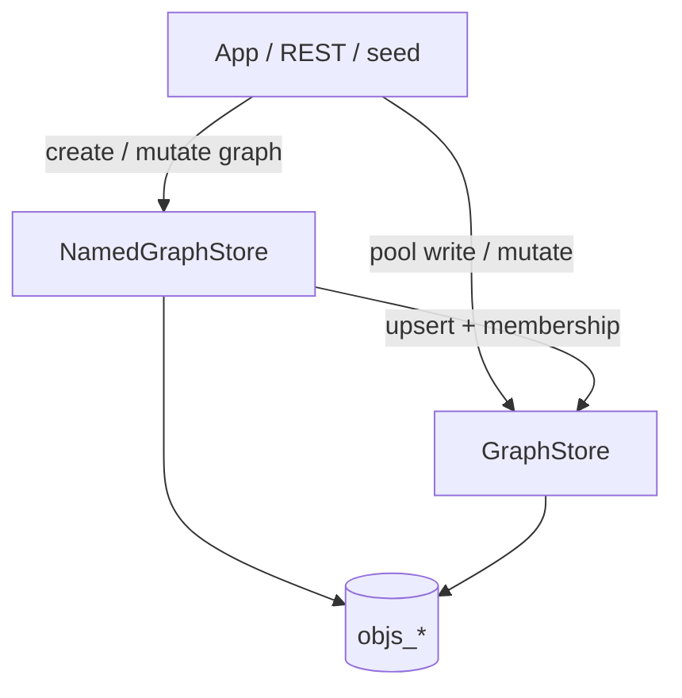

# Persist sketch — create graph, mutate, write

**Status:** living sketch (developer-oriented)  
**Parent:** [README.md](README.md)  
**Modules:** `:objs-api` (types + `graphMutation` DSL) · `:objs-persistence` (`GraphStore`, `NamedGraphStore`) · Boot via `:objs-autoconfigure`  
**Related:** [persistence.md](persistence.md) (schema / Flyway) · [validation.md](validation.md) · [rest-api.md](../service/rest-api.md)

This is the **write path** in plain order: what to call, what gets stored, what the gate checks. Schema DDL and Flyway live in [persistence.md](persistence.md).

## Two stores

| Facade | Owns | Typical writes |
|--------|------|----------------|
| `GraphStore` | **Pool** — `objs_entity` / graph-local edges when writing a bag | `write(Graph)`, `mutate(GraphMutation)` (MERGE only) |
| `NamedGraphStore` | **Named graphs** — header + membership + graph-scoped edges | `create(GraphSpec)`, `mutate(graphId, GraphMutation)`, `replace` / `copyGraph` / `mergeGraph` |

Pool entities can belong to **0..n** graphs. Deleting a graph does **not** delete pool entities. Edges are **graph-local** (`graph_id` NOT NULL).



Boot apps inject the beans from `:objs-autoconfigure`. Transactions are internal (UoW); callers do not open TX themselves.

## Create a graph

`NamedGraphStore.create(GraphSpec)` creates a **header** and optional **membership** of **already-persisted** entity/edge ids.

```kotlin
// Empty shell (then fill with mutate)
val g = namedGraphs.create(
    GraphSpec(annotations = mapOf("kind" to "draft")),
)

// Soft-link existing pool members (ids must already exist)
val g2 = namedGraphs.create(
    GraphSpec(
        annotations = mapOf("pack" to "p1"),
        entityIds = setOf(entityA, entityB),
        // edgeIds only if those edges already exist and endpoints are members
    ),
)
```

Rules of thumb:

- Missing entity id → `GRAPH_ENTITY_MISSING`.
- Edge whose endpoints are not members → `GRAPH_EDGE_ENDPOINTS`.
- `create` does **not** invent payloads; use **mutate** (or pool `write`) for new entities/edges.
- Id-only membership swap later: `replace(id, GraphSpec)` — not the same as REPLACE mutate.

## Build a mutation

Kind-first body: `entities` / `edges` × `set` / `unset`. Kotlin DSL:

```kotlin
val mutation = graphMutation {
    // mode(MutationMode.MERGE) // default
    entities {
        set(
            Entity(
                // id omitted → create at persist; id present → update or client-supplied create
                type = "Person",
                schemaVersion = "1",
                payload = mutableMapOf("name" to "Ada"),
                annotations = mutableMapOf("t" to "1"),
            ),
        )
        // unset(existingId)  // MERGE: detach from this graph (named) or hard-delete (pool)
    }
    edges {
        set(Edge(source = adaId, target = bobId, role = "knows"))
        // unset(edgeId)
    }
}
```

JSON shape (REST / Java builders):

```json
{
  "entities": { "set": [ /* Entity */ ], "unset": [ /* uuid */ ] },
  "edges": { "set": [ /* Edge */ ], "unset": [ /* uuid */ ] },
  "mode": "MERGE"
}
```

Helpers:

- `GraphMutation.of(graph)` — set-only bag (seeds, simple upserts).
- `GraphStore.write(graph)` — shorthand for `mutate(GraphMutation.of(graph))`.
- Generated typed builders (codegen) emit the same `GraphMutation`.

## Persist

### Named graph (usual app path)

```kotlin
val graph = namedGraphs.create(GraphSpec(annotations = mapOf("app" to "demo")))
val ada = UUID.randomUUID()
val bob = UUID.randomUUID()

val result = namedGraphs.mutate(
    graph.id,
    graphMutation {
        entities {
            set(
                Entity(id = ada, type = "Person", schemaVersion = "1", payload = mutableMapOf("name" to "Ada")),
                Entity(id = bob, type = "Person", schemaVersion = "1", payload = mutableMapOf("name" to "Bob")),
            )
        }
        edges {
            // endpoints must be members after this mutation's projected membership
            set(Edge(source = ada, target = bob, role = "knows"))
        }
    },
)
check(result.isValid) { result.issues.joinToString() }
```

What `NamedGraphStore.mutate` does on success:

1. **Validate** (persist gate) — see [validation.md](validation.md).
2. Apply **MERGE** or **REPLACE**.
3. **Upsert** set entities into the pool and **attach** membership; upsert graph-local edges (stamps `graphId`).
4. Touch graph `updated_at`.

| Mode | Behaviour |
|------|-----------|
| **MERGE** (default; REST `PATCH`) | `set` upserts; `unset` detaches members / drops edges; omission keeps |
| **REPLACE** (REST `PUT`) | `*.set` = full desired membership + edges; prune extras; non-empty `unset` rejected |

Dry-run: `validateMutate(graphId, mutation)` — same checks, no write (may assign temporary ids on set items).

### Pool only

```kotlin
val result = graphStore.write(
    Graph(
        entities = mutableListOf(/* … */),
        edges = mutableListOf(/* … */), // only if already graph-scoped / rare for pool bag
    ),
)
// or graphStore.mutate(graphMutation { … })  // MERGE only; entity unset = hard-delete + cascade edges
```

Pool mutate does **not** create a named graph. Use it to seed the pool, then `create(GraphSpec(entityIds = …))`, or prefer named-graph mutate which upserts + attaches in one TX.

## Persist order (MERGE)

1. Validate projected state (entities vs schema, edges vs allow-list, membership for named graphs).
2. Edge **unsets**.
3. Entity **unsets** (named: detach membership; pool: delete entity + incident edges).
4. **Sets** (upsert). Same id in unset and set → **set wins**.

Invalid mutations return `ValidationResult` with issues — **nothing is written**.

## Do not confuse

| Call | Means |
|------|--------|
| `mutate(…, MERGE)` | Patch one graph (or pool) |
| `mutate(…, REPLACE)` | Overwrite one graph’s contents from `*.set` |
| `replace(id, GraphSpec)` | Id-set membership / edge ids only (no payloads) |
| `mergeGraph(sourceIds, …)` | **New** graph = union of sources |
| `copyGraph` / `clone` | New graph (soft copy vs deep clone semantics differ) |
| `createDeepGraphVersion` | Explicit history pin — default persist is **HEAD only** |

REST glossary: [rest-api.md](../service/rest-api.md#mutate-glossary).

## Minimal end-to-end

```text
1. Catalogs ready (schemas + allowed edges) — seeds or registry
2. namedGraphs.create(GraphSpec(annotations = …))     → graph id
3. namedGraphs.mutate(id, graphMutation { entities { set(…) }; edges { set(…) } })
4. namedGraphs.get(id)                                  → ResolvedGraph (HEAD)
5. optional: createDeepGraphVersion(id, …)              → pin history
```

## Where details live

| Topic | Doc |
|-------|-----|
| Tables, Flyway, clocks, versions | [persistence.md](persistence.md) |
| Gate rules, create vs update by id | [validation.md](validation.md) |
| Matchers / select (reads) | [annotations-and-matchers.md](annotations-and-matchers.md) |
| HTTP PATCH/PUT | [rest-api.md](../service/rest-api.md) |
| Future backends | [../core/persistence-backends.md](../core/persistence-backends.md) |
