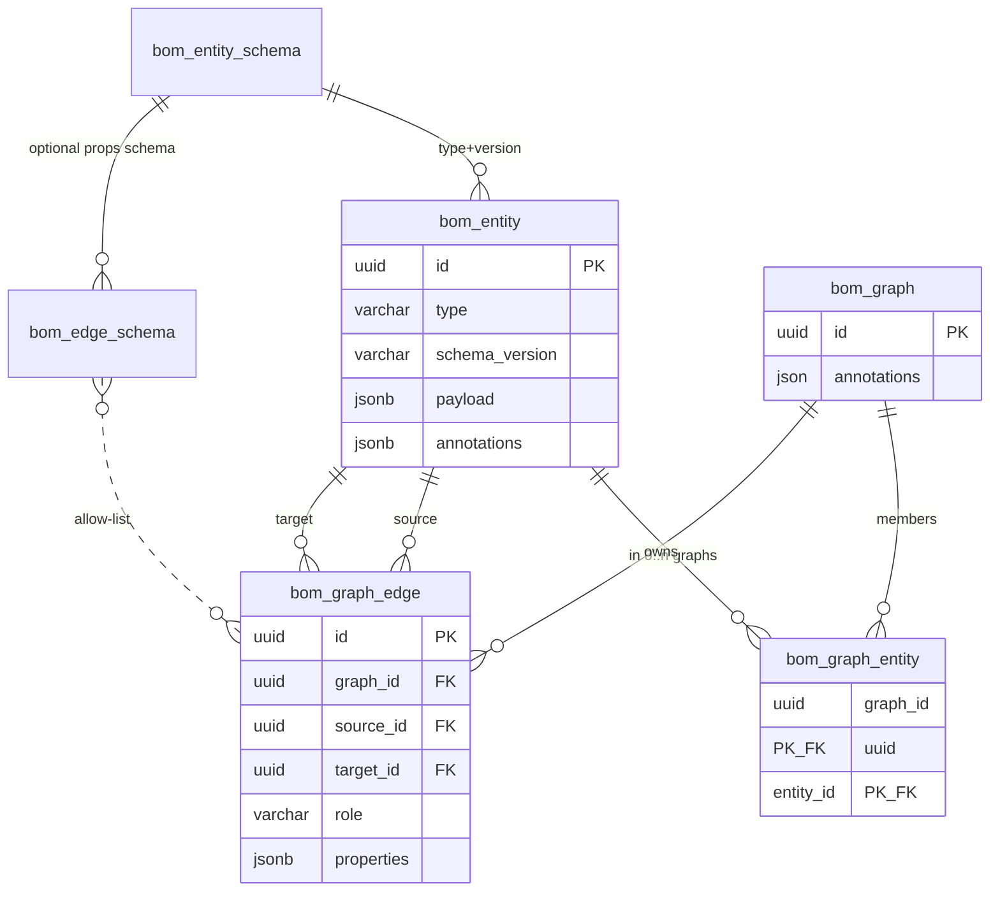

# Persistence

**Status:** early design  
**Parent:** [README.md](README.md)

## Database

- **Primary database: PostgreSQL.**
- Access from Java today: Spring Data **JPA** in `objs-core` (mapping details TBD).
- Package root for domain/persistence types (target): `org.poc.objs…`.

## Pool vs graphs

No global graph: an entity **pool** (`bom_entity`) shared by many **graphs** (`bom_graph`). See
[model.md](model.md) and [annotations-and-matchers.md](annotations-and-matchers.md).

| Table | Role |
|-------|------|
| `bom_entity` | Global entity pool — payload + annotations. Membership in 0..n graphs (orphans OK). |
| `bom_graph` | Graph header: **`id` + `annotations` only** — no `parent_graph_id` / `kind` |
| `bom_graph_entity` | Membership M2M `(graph_id, entity_id)` |
| `bom_graph_edge` | Graph-local edge; **`graph_id` NOT NULL** — always owned by exactly one graph |
| `bom_entity_schema` | Entity/payload schema catalog `(type, version)` + envelope `tags` / `attributes` |
| `bom_edge_schema` | Edge allow-list `(source_type, role, target_type)` + properties policy + cardinality + description/verbs/tags/attributes |
| `bom_seed_ledger` | Startup seed fingerprints |

**Flyway (objs line):** objs-core ships vendor SQL `V1__bom_schema.sql` under
`classpath:org/poc/objs/core/db/migration/{vendor}` (`postgresql`, `h2` — Spring Boot
`DatabaseDriver` id from the JDBC URL, not JDBC `databaseProductName`). Autoconfig
(`ObjsFlywayAutoConfiguration`) applies it into `flyway_schema_history_objs` **before** Boot
Flyway and JPA `ddl-auto: validate`. PostgreSQL uses JSONB (+ GIN on entity **and** graph-header
annotations); H2 uses JSON.

**Flyway (derived app):** a **separate** Boot Flyway (`flyway_schema_history`) owns only app
tables. Locations are `classpath:db/migration` or `classpath:db/migration/{vendor}` — never objs
paths. Both lines may use `V1`. Autoconfig sets Boot `baselineOnMigrate` with `baselineVersion` `0`
so the app `V1` still runs after `bom_*` exist. Process lock:
[`docs/workitems/RULES.md`](../../workitems/RULES.md) **Flyway (library + derived apps)**.

Greenfield only: recreate the DB or drop **both** history tables plus domain tables if an older
merged `flyway_schema_history` (or pre-split V1–V6) is present.

### Embedder `application.yml`

App **with** its own SQL (SBOM uses `{vendor}` for `TEXT[]` vs `VARCHAR ARRAY`; asset repository
uses a single dialect-neutral `V1`):

```yaml
spring:
  jpa:
    hibernate:
      ddl-auto: validate
  flyway:
    enabled: true
    locations: classpath:db/migration/{vendor}   # or classpath:db/migration
    # table: flyway_schema_history   # Boot default; app line V1..Vn
# objs.flyway defaults: enabled, table flyway_schema_history_objs
```

Workbench runner **without** app DDL (`:objs-service-app`):

```yaml
spring:
  flyway:
    enabled: false   # objs autoconfig still creates bom_*
```



**Invariant:** edge endpoints must be members of `edge.graph_id`.

## Entity storage

- Entities live in **relational tables** that expose only **generic / high-level attributes** (type, schema reference, **id**, …).
- **Primary key / identity: `UUID`** (Java `UUID.randomUUID()`, PostgreSQL `uuid`).
- Domain-specific fields from the informational model are **not** first-class columns.
- Entity **payload** and **annotations** are **JSONB** on PostgreSQL; edge **properties** likewise.
- GIN index on `bom_entity.annotations` uses `jsonb_path_ops` for containment (`@>`) sources.
  Pushdown predicate is `WHERE annotations @> $filter::jsonb` (no cast on the column) so the planner can use GIN; `SELECT` may still cast columns to `text` for JDBC without affecting index use.
- GIN index on `bom_graph.annotations` (same `jsonb_path_ops`) supports `graph-expr` `==`/`&&`
  containment; `!=` / `||` use SQL `->>` / DNF OR (may not use GIN)
  pushdown (`a.key == '…'` / `id == '…'`) in open-graph search and cross-graph `select`. Non-lowerable
  expressions and free-text `q` still evaluate headers in memory.
- Composite indexes `(graph_id, source_id)` / `(graph_id, target_id)` on `bom_graph_edge` complement
  the single-column endpoint indexes for graph-scoped adjacency.
- H2 remains acceptable for non-pushdown unit smoke only; **graph-query SQL pushdown assumes PostgreSQL**.

### Graph read path

- Filtered reads use a dedicated JDBC reader with fetch sizing rather than `findAll()` hydration, scoped to the pool (`obj-expr`) or to graph headers (`graph-expr`).
- Selection plans (`BoMEntitySelectionPlan` / `BoMEntityColumnProjection`) omit unused JSON columns during matching (payload is selected when filters include `obj-expr`); survivors hydrate deferred columns before domain mapping.
- JSON that is loaded stays as raw strings in `LazyJsonMap` until accessed; equality filters can use tree checks without building a full `MutableMap`.
- Graph-scoped queries enter through `POST /api/v1/objs/graphs/{id}/query`; cross-graph queries through `POST /api/v1/objs/graphs/query` — both take the matcher DSL (`graph-expr` / `obj-expr` / chained).
- Selection is **candidate source → filters → induced/stored edges**. A source-capable first stage (`graph-expr` over headers, or lowerable `obj-expr`) may supply a Postgres candidate source; otherwise the reader uses an all-members source and applies `matches` in order (**local eval**).
- In an ordered matcher chain, only the first matcher may provide a source. Later matchers filter retained candidates in memory.
- When the entity source is annotation containment, edges load via SQL joins on the same `@>` predicate bounded to the active graph scope, then retain edges among survivors. `graph-expr` sources instead project the graph's **stored** edges directly (no re-induction). Local-eval falls back to id-bounded `IN` induced-edge queries.
- Filter-only matchers and non-PostgreSQL backends scan raw rows in memory using the same lazy maps.

**API response shape** (pagination, result caps, sparse projection) is **out of scope** for this execution-plan work; track as a compensating follow-up if backend gains are insufficient.

Local benchmark (pre-C-13 rename; pool then called `bom_graph_entity`) against ~85,656 entities / ~71,380 edges selected 6,001 entities / 5,000 edges (~3.0 MB JSON) by an annotation-containment filter equivalent to today's `obj-expr: "a.appVersion == '1.0.0'"`. Captured through the former GET transport (measurement baseline; not re-run after the C-13 rename — 2026-08-05).

| Run | Total | TTFB |
|-----|-------|------|
| Before (full `findAll` hydration) | ~60 s (reported) | n/a |
| After annotation-containment source + lazy JSON (cold) | ~0.86 s | ~0.65 s |
| After annotation-containment source + lazy JSON (warm) | ~0.40–0.46 s | ~0.35–0.37 s |

Remaining time is dominated by selected-row transfer and HTTP JSON serialization of the matched result, not full-table materialization.

## Seed ledger

Table `bom_seed_ledger` (created by `V1__bom_schema`) stores startup seed fingerprints.
See [`seeds.md`](seeds.md).

## Edges

- **Graph-local**: every edge row carries `graph_id` NOT NULL — there is no shared/global edge pool. An edge is owned by exactly one graph.
- **Source** / **target** reference entity ids as **`UUID`**, and both must already be members of `graph_id` (enforced at persist).
- Edges have their **own** UUID id.
- Edge properties use JSONB when properties are present (bare edges may store null/empty).
- Deleting a graph CASCADEs its `bom_graph_edge` rows; deleting a pool entity cascades its incident edges and its `bom_graph_entity` membership rows across every graph.

## Validation gate

Persistence is the **enforcement** point for payload schema and allowed edges — see [validation.md](validation.md). The entity SDK must be usable without hitting that gate until save/persist.

## Schema and edge-rule catalogs

- `bom_entity_schema` stores `(type, version)`, authoritative DSL in `definition_doc`
  (the `contentSchema` node, including field `tags` / `attributes`), schema `usage`
  (`ENTITY` / `EDGE_PROPERTIES`), and envelope `tags` / `attributes` as JSON columns.
  See [object-schema-dsl.md](object-schema-dsl.md).
- Generated JSON Schema is not persisted. It is projected from the DSL for validation and tooling.
  Envelope/field tags and attributes are **not** copied into JSON Schema.
  Entity envelope `attributes.color` (`#rrggbb` or `nocolor`) is the graph node accent.
- `bom_edge_schema` stores directed allow-list rules, property policies, nullable
  `properties_schema_type + properties_schema_version` references, **cardinality**
  (`UNSPECIFIED` / `1:1` / `1:*`, column default `UNSPECIFIED`), plus optional `description`,
  `source_verb`, `target_verb`, `tags`, and `attributes`. One property schema may be shared by
  many source–role–target rules. Identity remains `(source_type, role, target_type)`.
- PostgreSQL is authoritative; application memory is a hydrated read cache.
- Registry writes persist first and then update the cache.
- Schema/edge-rule catalogs are **not** graphs — they are global allow-lists, unaffected by the pool/graph split.

## Testing

- Foundation story tests use **H2** (G-11).
- **Primary runtime database remains PostgreSQL**; document H2 vs JSONB/dialect limitations if any appear during implementation.

- **Flyway from day one** — migrations are the source of truth for PostgreSQL DDL. objs `bom_*`
  and derived-app tables are **two Flyway lines** (two history tables); do not merge locations.
- Do **not** rely on Hibernate `ddl-auto` to invent/evolve production schema (dev may use validate / none against migrated DB).

## Open

- Exact DDL / column lists beyond **UUID** identity
- Whether a GIN (or other) index on **payload** is warranted for future payload pushdown
- Whether annotations JSON storage should ever move to normalized tables
- Pushdown of `obj-expr` / `graph-expr` beyond `==`/`!=` + `&&`/`||` (comparisons, functions)
  — inequality, comparisons, functions, OR/DNF
