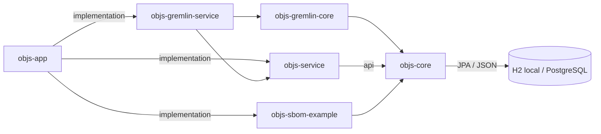

# Objs — platform overview

**Status:** early design (scaffold + domain direction)  
**Coordinates (target):** Maven group / packages under `org.poc.objs.*`  
**Coordinates (scaffold today):** group `io.qpointz.poc.objs`, packages `io.qpointz.poc.objs.*` — rename planned

## Product intent

Objs is a **new** PoC (not a Mill fork) for an **entity store / graph** application.
Process and technology choices intentionally mirror Mill (agent RULES, Gradle multi-module,
Spring Boot, Java toolchain), but the product domain is independent.

Domain: independent **entities** (typed JSON payloads), **edges** (role + properties),
**annotations** for subgraph selection, validation at persistence, PostgreSQL storage.
See [`../graph/README.md`](../graph/README.md).

## Technology stack

| Concern | Choice |
|---------|--------|
| Language | Kotlin |
| JDK | Toolchain **21** |
| Build | Gradle **9.4** (Kotlin DSL), multi-module |
| Versions | Root [`VERSION`](../../../VERSION) file; override `-PprojectVersion=` |
| Catalog | Root [`libs.versions.toml`](../../../libs.versions.toml) |
| Framework | Spring Boot **4.0.x** (BOM via `spring-boot-dependencies`) |
| Persistence | Spring Data JPA (`objs-core`); **PostgreSQL** primary DB; JSONB for payloads |
| HTTP | Spring WebMVC (`objs-service`) |
| Libraries | Lombok, Jackson 3, JUnit Jupiter, Mockito, AssertJ |
| Packaging style | Publishable **libraries** (no runnable fat app yet) |

No custom Gradle convention plugins (`build-logic` was deliberately omitted). Shared
group/version/toolchain live in the root [`build.gradle.kts`](../../../build.gradle.kts).

## Module map

| Module | Gradle path | Responsibility |
|--------|-------------|----------------|
| **objs-core** | `:objs-core` | Entity SDK, core types, **JPA / PostgreSQL persistence** |
| **objs-service** | `:objs-service` | Spring **REST** + Boot **autoconfiguration** + workbench SPA |
| **objs-gremlin-core** | `:objs-gremlin-core` | BoM → TinkerGraph materialization + gremlin-lang eval |
| **objs-gremlin-service** | `:objs-gremlin-service` | Gremlin traverse REST + Boot autoconfig |
| **objs-sbom-example** | `:objs-sbom-example` | Canonical SBOM ontology + example API |
| **objs-app** | `:objs-app` | Runnable assembly — see [`app.md`](app.md) |

Dependency rule: Gremlin and service libraries depend on core; app wires service + gremlin-service + example. Core must not depend on service/app/gremlin.

## Process alignment with Mill

- Work items / stories: [`docs/workitems/RULES.md`](../../workitems/RULES.md)
- Agent guidelines: [`AGENTS.md`](../../../AGENTS.md)
- Branching: story branches from `dev`, per-WI commits, bracketed commit prefixes
- Design docs by component under `docs/design/` (this tree)

## Explicitly out of scope (current scaffold)

- Security / OAuth
- UI
- GitLab CI / Maven Central publishing credentials

**Persistence migrations:** **Flyway** for domain tables (G-10).

## Open questions

Capture answers under `graph/` when decided; remaining highlights:

1. Entity identity — plain **`UUID`** (resolved); type/schema registry — **in-memory** this story, **PostgreSQL tables later**
2. Annotation shape; confirm JSON storage/indexing
3. Allowed-edge rule model; edge table / property schema
4. Whether edges may carry annotations later (half-open)
5. Public HTTP API shape beyond `/api/v1/objs/status` (deferred past foundation story)
6. Whether autoconfig should also pull in JPA entity scanning from core
7. Apply package/group rename leftovers / docs that still mention `io.qpointz.poc.objs`
