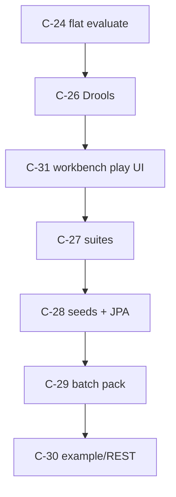

# Policy evaluation (foundation)

**Status:** C-24 S1 **shipped**; C-26 Drools adapter **shipped** (`:objs-policy-drools`, opt-in)  
**Family:** `objs-policy*` — not “assessment”  
**Packages:** `org.poc.objs.policy.api` / `org.poc.objs.policy.core` / `org.poc.objs.policy.drools`  
**Audience:** foundation embedders, example-app authors  
**Not this folder:** product compliance UX, regulatory catalogs, SBOM Application workflows, suite product content  

**Stories:** [`policy-evaluate-core`](../../workitems/completed/20260904-policy-evaluate-core/STORY.md) · [`policy-drools`](../../workitems/completed/20260904-policy-drools/STORY.md) · **Order:** [`SEQUENCE.md` § Policy family](../../workitems/SEQUENCE.md#policy-family-c-24c-31--normative-order)

---

## What this is

Foundation **policy evaluation**: store executable policy artefacts, run them against any **`GraphFragment`**, and return **engine-agnostic** per-policy outcomes (including **`NOT_APPLICABLE`**) with optional **findings** bound to nodes/edges.

**One-line (S1):** resolve → **PolicyContextWiring** → **`evaluate` (applicability bound in)** → per-policy results (+ optional flat aggregate helper).

---

## Documents in this folder

| Doc | Contents |
|-----|----------|
| [**README.md**](README.md) | This index |
| [**overview.md**](overview.md) | Vision, boundaries, full-family roadmap, deferred stories |
| [**model.md**](model.md) | Policy artefact: identity, versioning, body, engineKind, applicability fields |
| [**pipeline.md**](pipeline.md) | Resolve → PolicyContextWiring → gated evaluate / applicability preview |
| [**evaluation-sequences.md**](evaluation-sequences.md) | **Sequence diagrams** for implement + documenting pass |
| [**modules.md**](modules.md) | `:objs-policy-api` vs `:objs-policy-core` responsibilities |
| [**results.md**](results.md) | Outcomes, findings, ERROR vs FAIL, aggregate helper |
| [**repository.md**](repository.md) | In-memory `PolicyRepository` (S1); persistence later |
| [**drools.md**](drools.md) | C-26 Drools adapter locks (facts, deps, KB cache) |

Normative S1 decisions: [`GAPS.md`](../../workitems/completed/20260904-policy-evaluate-core/GAPS.md) · Story: [`STORY.md`](../../workitems/completed/20260904-policy-evaluate-core/STORY.md) · Scenarios: [`EXAMPLES.md`](../../workitems/completed/20260904-policy-evaluate-core/EXAMPLES.md)  
C-26 gaps: [`policy-drools/GAPS.md`](../../workitems/completed/20260904-policy-drools/GAPS.md)

---

## Story sequence (Before → Next)

| Step | Id | Story | Status |
|------|----|--------|--------|
| 1 | C-24 | [`policy-evaluate-core`](../../workitems/completed/20260904-policy-evaluate-core/STORY.md) | **done** (archived) |
| 2 | C-26 | [`policy-drools`](../../workitems/completed/20260904-policy-drools/STORY.md) | **done** (archived) |
| 3 | C-31 | [`policy-workbench`](../../workitems/planned/policy-workbench/STORY.md) | planned |
| 4 | C-27 | [`policy-suites`](../../workitems/planned/policy-suites/STORY.md) | planned |
| 5 | C-28 | [`policy-seeds-persistence`](../../workitems/planned/policy-seeds-persistence/STORY.md) | planned |
| 6 | C-29 | [`policy-batch`](../../workitems/planned/policy-batch/STORY.md) | planned |
| 7 | C-30 | [`policy-consumer`](../../workitems/planned/policy-consumer/STORY.md) | planned (gated) |

---

## Related elsewhere

| Doc | Why |
|-----|-----|
| [`../graph/fragments-and-analysis.md`](../graph/fragments-and-analysis.md) | `GraphFragment` / resolve — same input class as Gremlin/JGraphT |
| [`../graph/apps-vs-foundation.md`](../graph/apps-vs-foundation.md) | Foundation vs example apps |
| [`../graph/seeds.md`](../graph/seeds.md) | Seed envelope (policy kinds = C-28) |
| [`../graph/validation.md`](../graph/validation.md) | Persist gate — orthogonal to policy evaluate |
