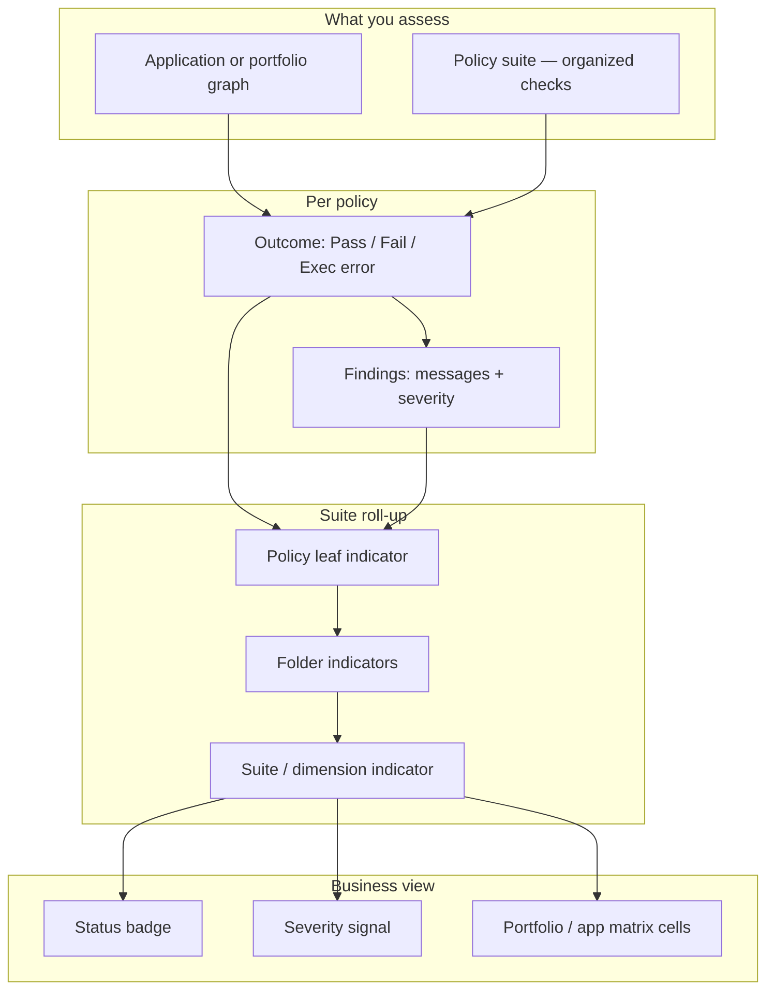
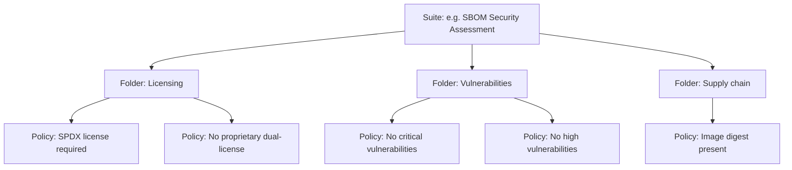
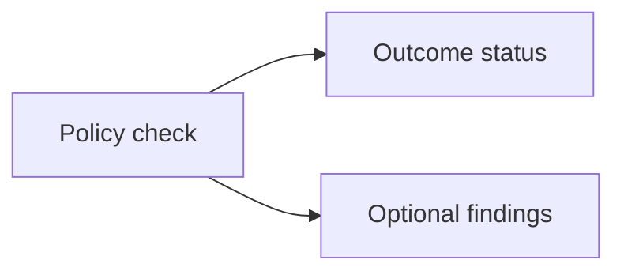
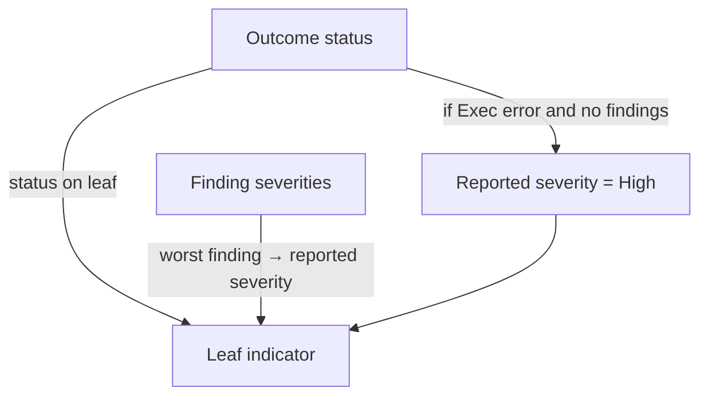
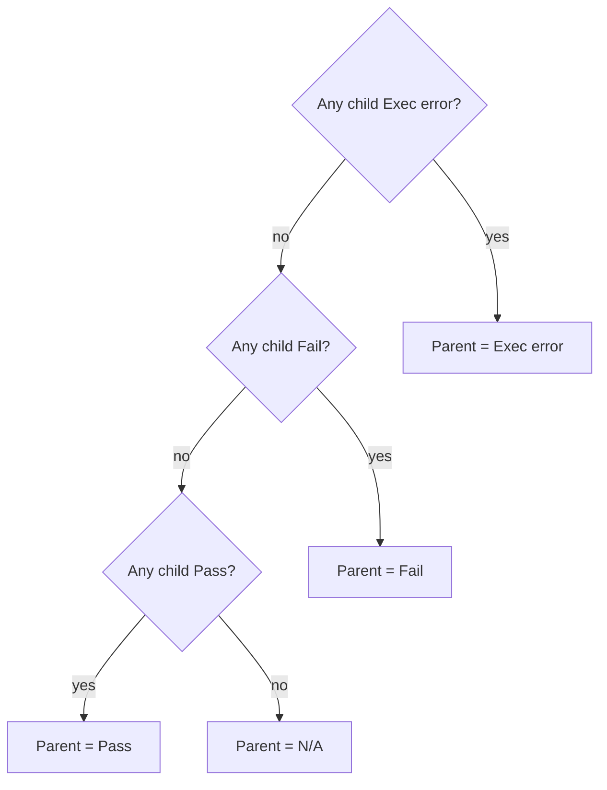
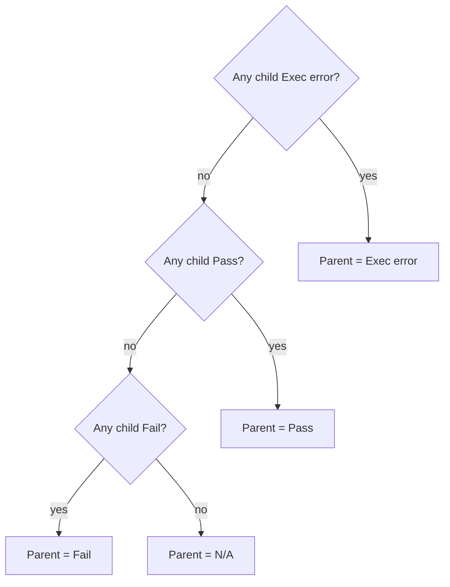
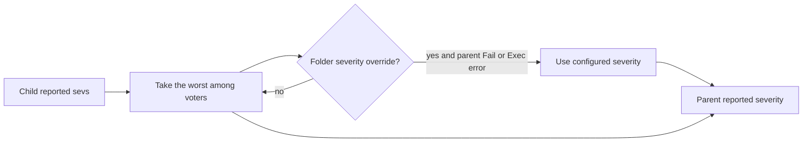
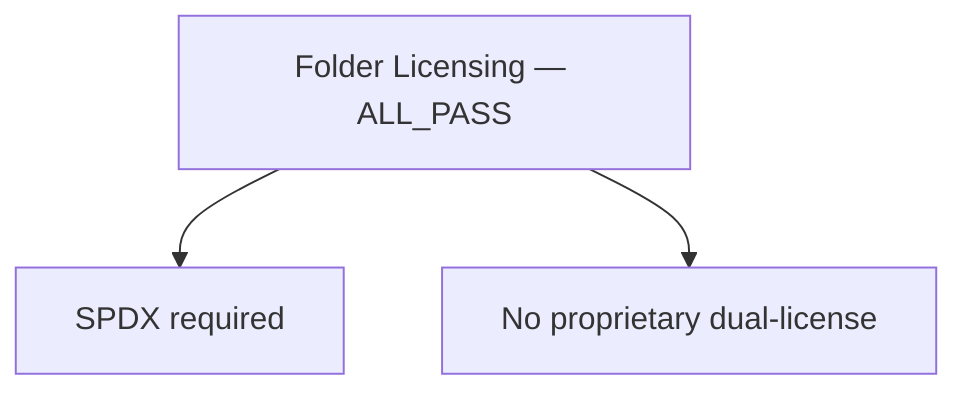
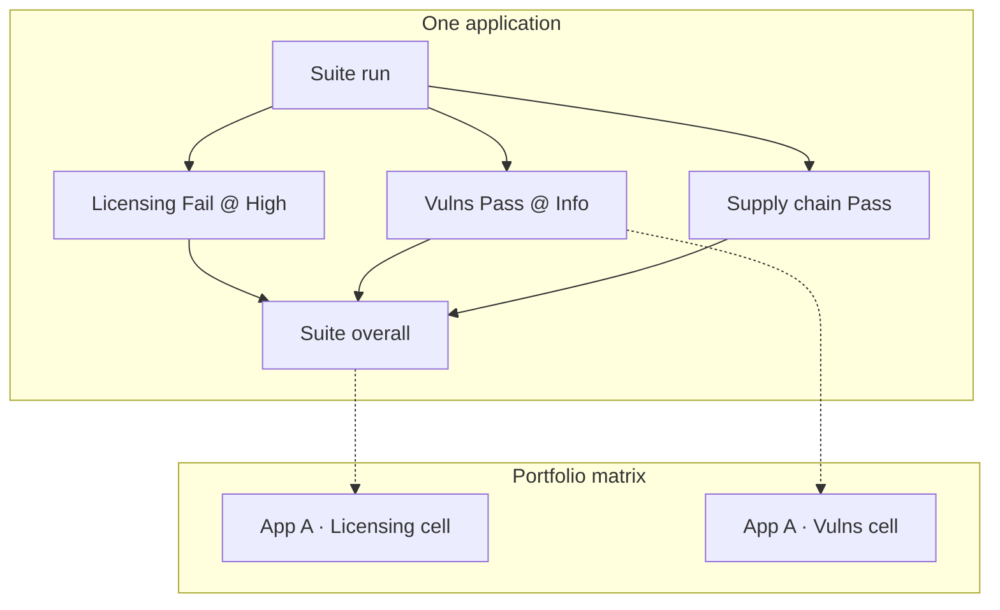

# How policy results become business indicators

**Audience:** product owners, compliance leads, risk / assessment operators  
**Purpose:** Explain — without API jargon — how **policies**, **findings**, and **suite folders** turn into the **Pass / Fail / Exec error** badges and **Critical…Info** severity signals you see on applications and portfolios.  
**Technical detail (implementers):** [`suite-strategy-implementers.md`](suite-strategy-implementers.md) · [`results.md`](results.md) · [`suites.md`](suites.md) · [VOCAB-MATRIX §10 UI labels](../../workitems/in-progress/policy-status-severity-vocab/VOCAB-MATRIX.md#10-ui-presentation-normative-for-wi-002--consumers)

---

## 1. The idea in one picture

You assess a **graph** (for example an application’s bill of materials) against a **suite** of checks. Each check is a **policy**. Results climb a **folder tree** until you get a small set of **business indicators**: overall health (status) and how serious the issues are (severity).



**Two questions, kept separate on purpose:**

| Business question | Signal | Example labels |
|-------------------|--------|----------------|
| Did the check succeed? | **Outcome status** | Pass, Fail, Exec error, N/A |
| How serious are the issues? | **Severity** | Critical, High, Medium, Low, Info *(or none)* |

A **Fail** means “the rule was not satisfied.” An **Exec error** means “we could not run the rule correctly” (broken policy body, engine fault). Those are different management actions — do not treat Exec error as a compliance Fail.

---

## 2. Structure you author (suite → folders → policies)

Think of a suite as a **compliance pack** or **assessment dimension tree**.



| Concept | Business meaning |
|---------|------------------|
| **Suite** | The pack you run (one assessment definition) |
| **Folder** | A **dimension** or chapter (Licensing, Vulns, …). Has its own roll-up rule |
| **Policy** | One check (one rule) |
| **Finding** | An explanation under a policy (“Component X has CVE-…”), optionally tagged Critical…Info and pointed at graph nodes |

Folders can nest. Only **enabled** folders **vote** into their parent. Disabled folders are skipped; ignored folders still show local results but do not affect the parent indicator.

---

## 3. What one policy produces

When a policy runs against the graph:



### Outcome status (the “did it pass?” indicator)

| Status | Business reading | Typical action |
|--------|------------------|----------------|
| **Pass** | In scope and satisfied | None / monitor |
| **Fail** | In scope and **not** satisfied | Remediate content / process |
| **Exec error** | Could **not** execute the check | Fix policy / data / engine — not a “failed audit” by itself |
| **Not applicable** | Out of scope for this subject | Hidden from suite leaves (does not vote) |

### Findings (the “what and how bad?” detail)

Findings are optional notes under an outcome. Each may carry a **severity**:

```text
Critical > High > Medium > Low > Info > (none)
```

| Severity | Business reading |
|----------|------------------|
| **Critical** | Highest urgency among messages |
| **High** | Serious issue |
| **Medium** | Material issue |
| **Low** | Minor issue |
| **Info** | Informational note |
| *(none)* | Message without a ranked severity |

Findings never replace outcome status. A policy can **Fail** with zero findings, or **Pass** with Info findings (“Pass with notes”).

---

## 4. From one policy to a leaf indicator

The suite first builds a **leaf** for each policy that ran (N/A policies are dropped).



**Reported severity on the leaf** (Builtin suite):

1. If there are findings with severity → take the **worst** (Critical beats High, and so on).  
2. Else if status is **Exec error** → treat reported severity as **High** (so execution problems still surface as a serious signal).  
3. Else → **no** reported severity (clean Pass/Fail without a severity badge).

UI shows status and severity as **separate** chrome (Pass/Fail/Exec error vs Critical…Info). Status is never painted as if it were a severity label.

---

## 5. How folders aggregate (roll-up)

Each folder has a **mode** that answers: “How do children vote into this dimension?”

### 5.1 Status roll-up (Pass / Fail / Exec error)

**ALL_PASS** (strict — default): every voting child must Pass.



**ANY_PASS** (lenient): one Pass is enough (unless Exec error escalates).



**Rule of thumb:** Exec error always escalates to the parent. Fail vs Pass depends on whether the folder is strict (ALL_PASS) or lenient (ANY_PASS).

### 5.2 Severity roll-up (Critical…Info)

Reported severity climbs independently of “who failed”:



| Parent status | Reported severity |
|---------------|-------------------|
| **Fail** or **Exec error** | Override if set; otherwise **worst** child reported severity |
| **Pass** | Worst child reported severity (may be empty = clean Pass, or non-empty = “Pass with warning”) |
| **N/A** | None |

So you can read **Fail @ High** as “dimension failed; worst signal is High,” or **Pass @ Medium** as “dimension passed overall but still carries Medium findings” (e.g. ANY_PASS with a failing sibling that still contributes severity).

---

## 6. Worked example (Licensing dimension)



| Policy | Outcome | Findings | Leaf reported severity |
|--------|---------|----------|------------------------|
| SPDX required | **Fail** | “Component A missing SPDX” @ **High** | High |
| No proprietary dual-license | **Pass** | *(none)* | *(none)* |

**Folder (ALL_PASS):**

- Status → **Fail** (because SPDX failed).  
- Severity → **High** (worst voting child).

**Business reading:** Licensing dimension **failed**, urgency **High**.

Change the SPDX finding to Medium → folder becomes **Fail @ Medium**.  
If both policies Pass and one has Info → folder **Pass @ Info** (“passed with notes”).

---

## 7. Suite root and portfolio indicators

Bottom-up roll-up continues to the suite root (or to each assessment **measure** folder used as a matrix column).



| Indicator placement | What it shows |
|---------------------|---------------|
| **Suite / dimension cell** | Folder (or root) **status** + **reported severity** after roll-up |
| **Finding list** | Individual messages (status of owning policy + finding severity) |
| **Entity on the graph** | Worst finding severity bound to that component (when findings cite nodes) |

Products (e.g. SBOM Assessment) typically map:

- matrix **cell status** ← folder outcome status  
- matrix **cell severity** ← folder reported severity  
- row/column summaries ← same rules at the next aggregation layer the product defines  

Foundation stops at suite tree + flat outcomes; the product decides how cells are laid out.

---

## 8. Reading the UI (labels)

| API / system token | What you see |
|--------------------|--------------|
| `PASS` | Pass |
| `FAIL` | Fail |
| `EXEC_ERROR` | Exec error |
| `NOT_APPLICABLE` | N/A *(usually omitted from suite leaves)* |
| `CRITICAL` … `INFO` | Critical … Info |
| *(no severity)* | No severity pill |

Do **not** interpret “Error” on a severity chip — severity never uses that word. Execution problems use **Exec error** on the **status** badge.

---

## 9. Decision cheat-sheet for stakeholders

| You see | Prefer to ask |
|---------|----------------|
| **Fail** @ Critical/High | What findings? Which components? Owner remediates content |
| **Fail** @ *(no sev)* | Policy failed without ranked findings — open outcome message / policy definition |
| **Pass** @ Medium/Info | Passed the gate but notes remain — track as residual risk |
| **Pass** @ *(no sev)* | Clean for that dimension |
| **Exec error** @ High *(typical)* | Assessment infrastructure / policy authoring problem — not “app failed the control” |
| Dimension N/A or empty | No voting children / out of scope |

---

## 10. What this document is not

- Not a programming API guide (see [`modules.md`](modules.md), [`pipeline.md`](pipeline.md)).  
- Not a regulatory framework catalog — suites and policies are **your** content.  
- Not a promise that every product screen uses every field; products choose which indicators to surface.

For normative engineering locks, prefer [`suites.md`](suites.md) and [`results.md`](results.md).
