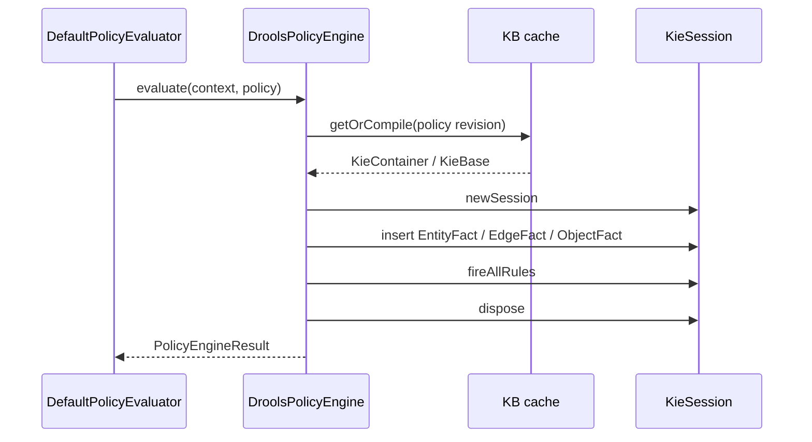
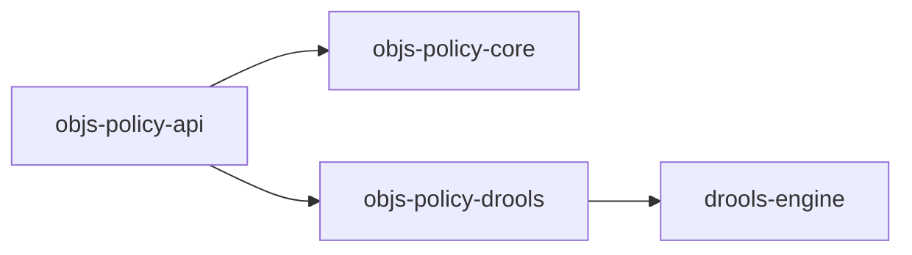

# Drools PolicyEngine adapter (C-26)

**Status:** C-26 **shipped** (`:objs-policy-drools`) — story archived [`20260904-policy-drools`](../../workitems/completed/20260904-policy-drools/STORY.md)  
**Normative:** [`GAPS.md`](../../workitems/completed/20260904-policy-drools/GAPS.md)  
**Module:** `:objs-policy-drools` → `org.poc.objs.policy.drools`  
**Depends on:** `:objs-policy-api` only (not core); Drools **not** on api/core classpaths

**Shipped entry points:** `DroolsPolicyEngine`, `PolicyKnowledgeBaseCache`, `EntityFact`, `EdgeFact`, `ObjectFact`, `DroolsEvaluationScratch`.

---

## Locked (C-26)

| Topic | Lock |
|-------|------|
| Fact model (G-P18) | **`EntityFact` / `EdgeFact`** from resolved fragment (metadata: `type`, `schema`, `schemaVersion`, `annotations` + payload/properties). Wired bag → **`ObjectFact`**. `schema` = catalog `type` when projecting from domain. |
| Version & deps (G-P19) | Pin `org.drools:drools-bom` from Maven Central at implement time (polled **10.2.0**). Declared deps: `platform(drools-bom)` + **`drools-engine`** + **`drools-xml-support`** (needed for programmatic `KieModuleModel`). Do not add classic / mvel / ruleunits / kie-ci unless proven needed. |
| Isolation (G-P20) | New `KieSession` per `PolicyEngine.evaluate`; dispose after. **KB cache** keyed by **single policy revision** (`id` or `(name, version)`). No multi-policy composite KBs in this story. |
| Content | Fixture DRL in tests / examples only — no regulatory packs in foundation jars (G-P38). |
| `engineKind` | `DROOLS` string constant on api; adapter registers under that kind. |

---

## Pipeline fit

Orchestrator still owns resolve → PolicyContextWiring → applicability. Drools runs only for in-scope policies with `engineKind=DROOLS`.

---

## Fact insertion

| Source | Inserted as |
|--------|-------------|
| Fragment entities | `EntityFact` (`type`, `schema`, `schemaVersion`, `annotations`, `payload`) |
| Fragment edges | `EdgeFact` (`role`, `type`/`schema`/`schemaVersion`, `annotations`, `properties`) |
| `context.facts` entries | `ObjectFact(name, values)` |

Example DRL match: `EntityFact( type == "Component", annotations["severity"] == "CRITICAL" )`.

---

## Result convention (fixture)

Engine-owned scratch / global collected during fire:

- Default **PASS** if session completes without FAIL/ERROR
- Rules call into scratch to **fail** / **error** and optionally add findings
- Compile failures → **ERROR** (not FAIL)

Exact scratch type is an implementation detail of `:objs-policy-drools`.

---

## Classpath boundary

Consumers that need Drools **opt in** by depending on `:objs-policy-drools` and registering the engine on `DefaultPolicyEvaluator`.
