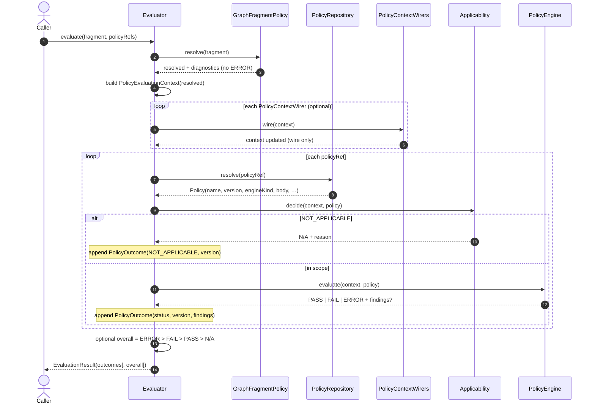
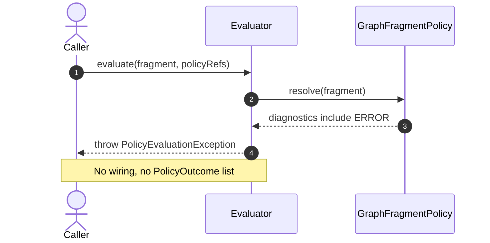
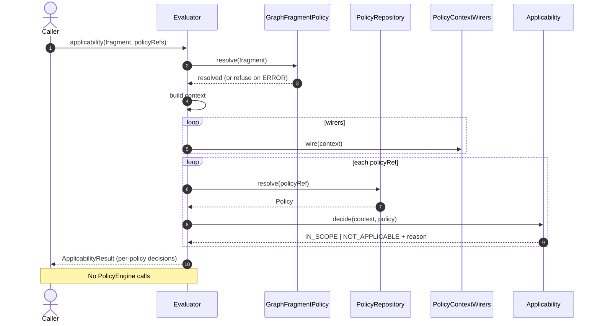
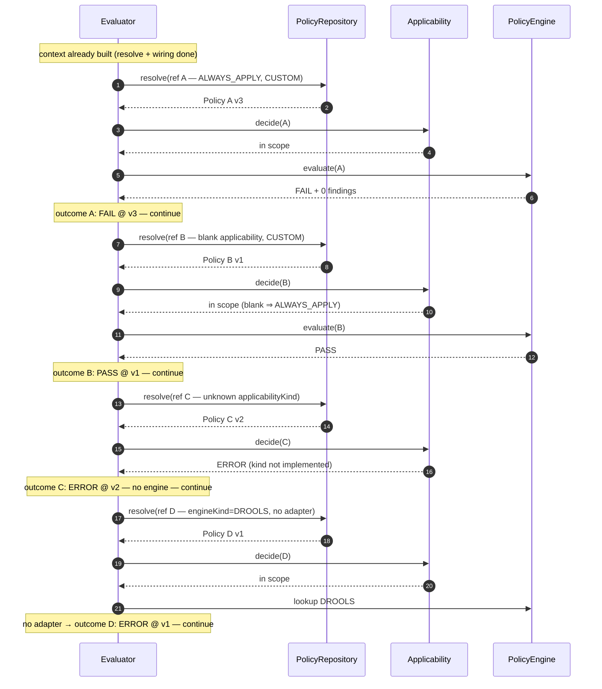
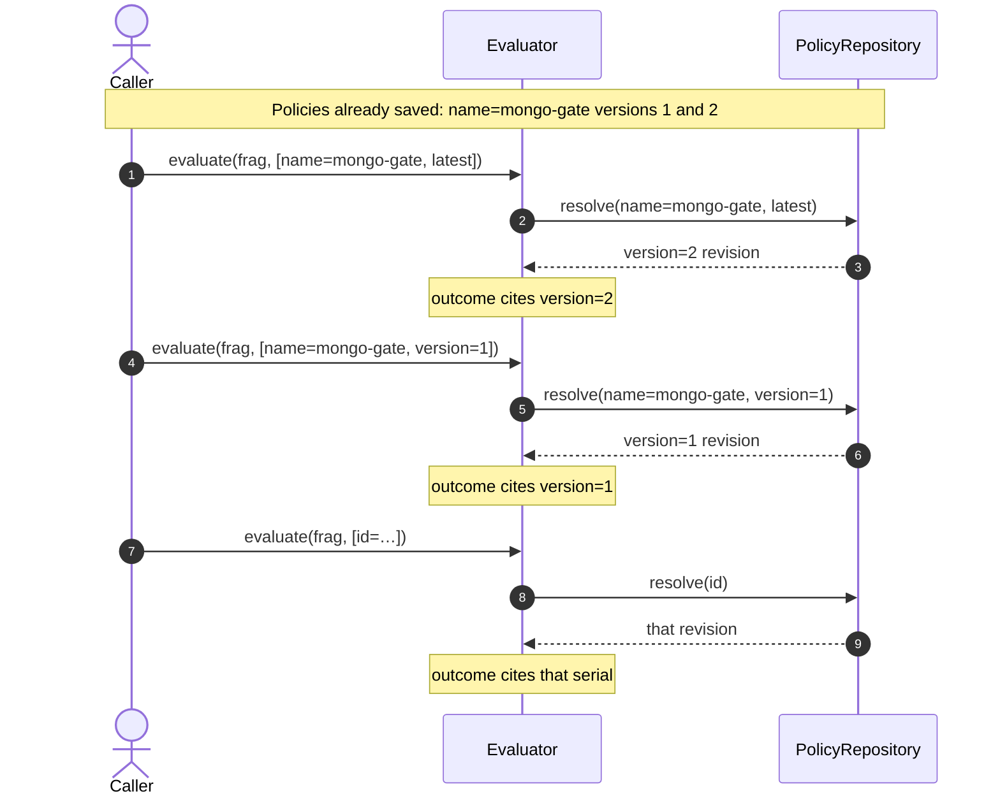
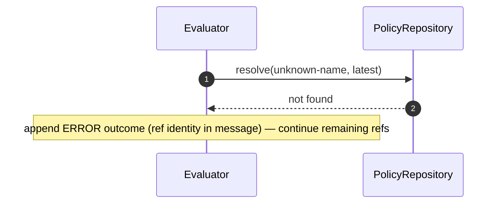
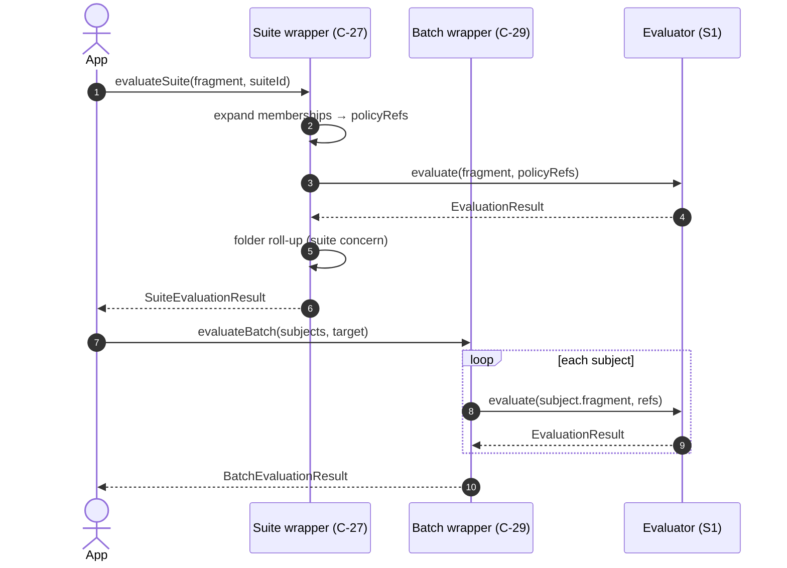

# Evaluation sequence diagrams (S1)

**Audience:** WI-002+ implementers and the living-docs / documenting pass  
**Normative:** C-24 WI-001 · [`pipeline.md`](pipeline.md) · [`GAPS.md`](../../workitems/completed/20260904-policy-evaluate-core/GAPS.md)  
**Shipped types:** `DefaultPolicyEvaluator`, `InMemoryPolicyRepository`, `AlwaysApplyApplicabilitySelector`, `CustomPolicyEngine`

Use these sequences as the **behavioural checklist**. They match the shipped orchestrator; prefer updating this page if behaviour is clarified further.

---

## Participants (shared legend)

| Alias | Role |
|-------|------|
| Caller | App, test, or later wrapper (suite/batch) |
| Evaluator | `DefaultPolicyEvaluator` (`:objs-policy-core`) |
| Resolve | `GraphFragmentPolicy` (from `:objs-api`) |
| Repo | `InMemoryPolicyRepository` / `PolicyRepository` |
| Wirer | `PolicyContextWirer` chain (0..n) — PolicyContextWiring |
| Gate | `ApplicabilitySelector` (default `AlwaysApplyApplicabilitySelector`) |
| Engine | `PolicyEngine` map (default `CUSTOM` → `CustomPolicyEngine`) |

---

## 1. Happy path — `evaluate(fragment, policyRefs)`

Multi-policy run: resolve once, wire context once, then **per ref** resolve policy → gate → engine. Failures on one policy **do not** stop others.

**Implement / document:**

- Outcomes **must** cite executed **name + serial version**.  
- Overall status is **optional convenience** only ([`results.md`](results.md)).  
- Empty wirer list is valid.

---

## 2. Fragment resolve ERROR — refuse evaluate

Do **not** run PolicyContextWiring, resolve policies, or call engines when fragment resolve reports ERROR diagnostics.

Same refuse rule applies to **`applicability(...)`** if it shares the resolve preamble (recommended).

---

## 3. Applicability preview — `applicability(fragment, policyRefs)`

Same resolve → PolicyContextWiring → gate path as evaluate; **no** engine invocation and **no** evaluation side effects.

---

## 4. Per-policy branches inside one evaluate

Shows continue-after-FAIL/ERROR and S1 gate/engineKind behaviour in one run.

---

## 5. Repository resolve during evaluate

How `latest` / pinned version / id affect the cited outcome version.

See [`repository.md`](repository.md) · [`model.md`](model.md).

---

## 6. Missing / unresolvable policy ref

If a ref cannot be resolved, record a per-ref **ERROR** outcome (or refuse — **prefer ERROR + continue** so one bad ref does not discard other outcomes). Confirm exact shape in WI-002; do not abort the whole batch unless product locks otherwise.

---

## 7. Wrapper → fixed contract (later stories)

Suite / batch **must not** invent a second evaluate pipeline; they reduce to `(fragment, policyRefs)`.

---

## Implementation checklist (map to tests)

| Sequence § | Assert |
|------------|--------|
| §1 | Order: resolve → wire → per-policy gate → engine |
| §2 | Fragment ERROR → exception; zero outcomes |
| §3 | Preview never calls engine |
| §4 | FAIL/ERROR continue; unknown kind/engine → ERROR |
| §5 | Outcome version matches resolved revision |
| §6 | Unresolvable ref → ERROR (continue) |
| §7 | Wrappers only call fixed `evaluate` |

Scenarios: [`EXAMPLES.md`](../../workitems/completed/20260904-policy-evaluate-core/EXAMPLES.md).
