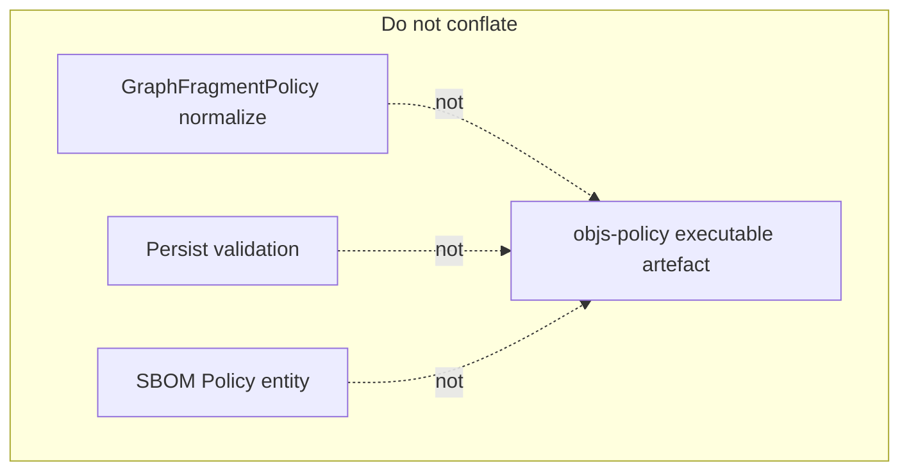
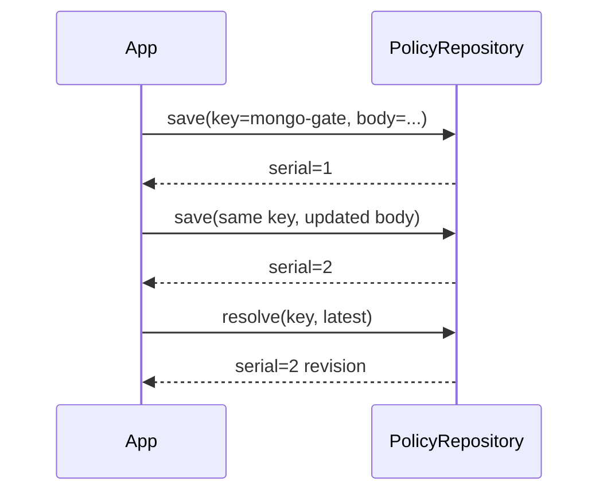
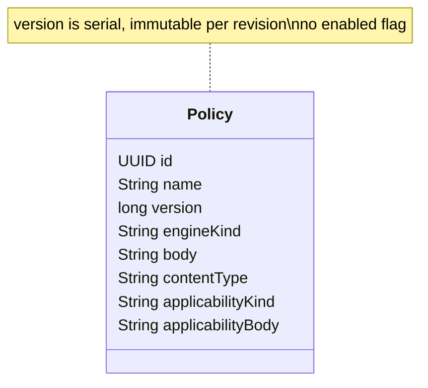

# Policy model (S1 locked)

**Normative:** C-24 WI-001 · [`GAPS.md`](../../workitems/completed/20260904-policy-evaluate-core/GAPS.md)  
**Package (target):** `org.poc.objs.policy.api`

---

## Intent

A **Policy** is a foundation artefact: metadata + which engine runs it + opaque evaluation body (+ optional applicability fields). It is **not**:

- an SBOM ontology entity type `Policy` / `COMPLIES_WITH`
- a `GraphFragmentPolicy` (fragment **normalization**)
- persist-gate JSON Schema validation
- a product regulation text hard-coded in objs jars

---

## Identity and versioning (G-P3 + C-28 G-P36seed)

| Concept | Lock |
|---------|------|
| Logical identity | **`key`** (string; shared field name with Category / PolicySuite) |
| Display label | **`name`** (UI; not MERGE identity) |
| Revision | **serial** — allocated on every **create** and every **update** |
| Enabled flag | **None** on Policy — enablement belongs to **suites** (C-27) |
| Default resolve | **`latest`** serial for that **key** |
| Traceability | Outcomes cite executed policy **key** + serial |
| Suite refs | May pin `latest` or a **specific** serial |

**Contrast with free-form version strings:** callers do not invent the serial; the repository does on write. User-managed `version` (major.minor) remains separate (C-32).

---

## Fields (logical)

| Field | Role |
|-------|------|
| `id` | Stable UUID for this revision row (implementation detail OK) |
| `name` | Logical policy name |
| `serial` | Timestamp-style identity revision (object head-version rule) |
| `version` | User-managed major.minor string (C-32) |
| `categoryId` | Required UUID → managed category (C-32) |
| `tags` | Non-empty normalized list (C-32) |
| `annotations` | Objs-shaped map (C-32) |
| `engineKind` | **String** (no enum) — which adapter runs the body. S1 implements **`CUSTOM`** only |
| `body` | Opaque UTF-8 **String** — engine-agnostic payload |
| `contentType` | Optional **encoding** hint for body (not the engine name) |
| `applicabilityKind` | Optional String — gate kind; S1: blank or **`ALWAYS_APPLY`** |
| `applicabilityBody` | Optional opaque String — reserved for later kinds; ignored for ALWAYS_APPLY |

---

## engineKind vs contentType (G-P4, G-P5)

| Field | Answers | Example |
|-------|---------|---------|
| `engineKind` | **Which adapter?** | `CUSTOM`, later `DROOLS`, `OPA` |
| `contentType` | **How is body encoded?** | `text/plain`, DRL media type, … |
| `body` | **What to run?** | Opaque text |

Unknown / unimplemented `engineKind` at evaluate time → per-policy **ERROR** (continue others).

---

## Applicability fields (G-P6)

Forward-looking mini-gate on the same artefact:

- Missing/`ALWAYS_APPLY` → always in scope (body unused in S1)
- Other kinds → extensible later (research); unimplemented → **ERROR** unless a later lock softens this

Applicability is **not** a separate public pipeline stage — see [`pipeline.md`](pipeline.md).

---

## PolicyRef

Resolve inputs for evaluate:

- by **id**, or
- by **name** + **`latest`** | specific **version**

Suites/batch wrappers later map richer inputs onto lists of refs ([`modules.md`](modules.md)).
