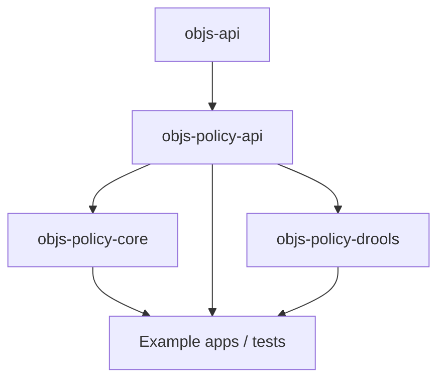
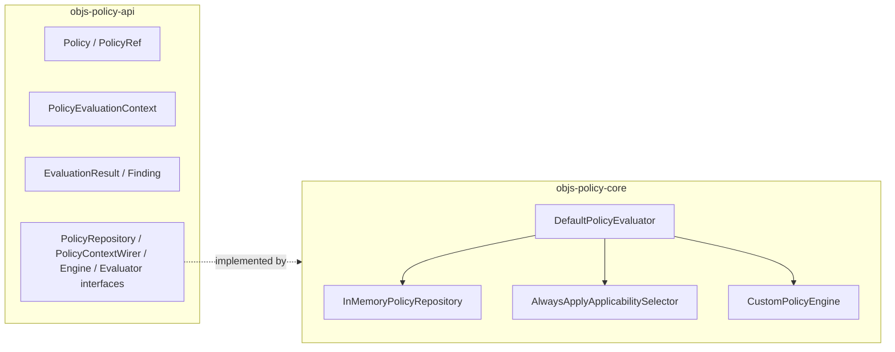

# Policy modules (S1 shipped)

**Normative:** G-P1, G-P2, G-P25 · [`GAPS.md`](../../workitems/completed/20260904-policy-evaluate-core/GAPS.md)

---

## Module map

| Module | Responsibility | Depends on |
|--------|----------------|------------|
| `:objs-policy-api` | Model, refs, context **types**, result DTOs, SPI **interfaces**, exceptions | `:objs-api` |
| `:objs-policy-core` | In-memory repo, PolicyContextWiring, orchestrator, ALWAYS_APPLY gate, CUSTOM stub | `:objs-policy-api` |
| `:objs-policy-drools` | Drools `PolicyEngine` (`EntityFact`/`EdgeFact`/`ObjectFact`; fixture DRL) | `:objs-policy-api` + Drools BOM |

**Packages:** `org.poc.objs.policy.api.*` / `org.poc.objs.policy.core.*` / `org.poc.objs.policy.drools.*`  
**Settings:** api, core, drools included in root `settings.gradle.kts`.

**S1 shipped without:** `:objs-policy-service`, suite modules, JPA. Drools is C-26 — see [`drools.md`](drools.md).

### Shipped types (C-24 + C-26)

| Layer | Types |
|-------|--------|
| api | `Policy`, `PolicyWrite`, `PolicyRef`, `PolicyEvaluationContext`, `PolicyOutcome` / `EvaluationResult`, `Finding`, `aggregateOverall`, `PolicyContextWirer`, `ApplicabilitySelector`, `PolicyEngine`, `PolicyRepository`, `PolicyEvaluator`, `PolicyEvaluationException`; `PolicyEngineKinds.CUSTOM` / `DROOLS` |
| core | `InMemoryPolicyRepository`, `DefaultPolicyEvaluator`, `AlwaysApplyApplicabilitySelector`, `CustomPolicyEngine` |
| drools | `DroolsPolicyEngine`, `PolicyKnowledgeBaseCache`, `EntityFact`, `EdgeFact`, `ObjectFact`, `DroolsEvaluationScratch` |

---

## What lives where

### `:objs-policy-api`

- Policy artefact + PolicyRef  
- `PolicyEvaluationContext`  
- `EvaluationResult`, per-policy outcome, `Finding`  
- Optional aggregate helper **function** (`aggregateOverall`) — see [`results.md`](results.md)  
- Ports: repository, PolicyContextWirer, engine, evaluator  
- `PolicyEvaluationException` (fragment refuse, etc.)

### `:objs-policy-core`

- `InMemoryPolicyRepository` (serial versions)  
- Orchestrator: resolve → PolicyContextWiring → gated evaluate  
- Default ALWAYS_APPLY behaviour  
- CUSTOM stub for tests (`PASS`/`FAIL`/`ERROR` body + optional `FINDING|…` lines)  
- No Spring; no Drools on classpath  

---

## Classpath / product boundary (G-P38, G-P39)

| Rule | Meaning |
|------|---------|
| No product rules in foundation | Concrete DRL / “IT Governance” packs live in examples/apps |
| Not on `:objs-service` by default | HTTP lives in `:objs-policy-service`; wire from `:objs-service-app` (C-31), like gremlin |

---

## Later modules (roadmap)

| Module / story | When |
|----------------|------|
| `:objs-policy-drools` | C-26 — shipped ([`drools.md`](drools.md)) |
| `:objs-policy-service` + workbench UI | C-31 — [`workbench.md`](workbench.md) |
| Suites | C-27 (may stay in api/core types + core orchestration) |
| JPA + seeds | C-28 |
| Batch pack | C-29 |
| Example/REST extras | C-30 |
