# Policy evaluation — detailed design draft

**Status:** draft (planned **C-24** [`objs-policy`](../../workitems/planned/objs-policy/STORY.md))  
**Normative locks:** story **WI-001**; until then this document is **provisional**.  
**Audience:** foundation embedders, design-lock reviewers, example-app authors  
**Index:** [`README.md`](README.md) · **Gaps:** [`GAPS.md`](../../workitems/planned/objs-policy/GAPS.md) · **Scenarios:** [`EXAMPLES.md`](../../workitems/planned/objs-policy/EXAMPLES.md)

This draft records the philosophy and contracts discussed for foundation policy evaluation: artefacts, suites, applicability, engines, findings, seeds, unified results, and a **thin batch / result pack** (matrix views stay in product). Open field-level choices remain in GAPS; do not treat draft guesses below as locked.

---

## 1. Problem and intent

Graphs in objs already represent applications and their composition (e.g. SBOM Combined BOM). Operators need to **assess** those graphs against **user-defined** rules: version gates, banned technologies, registration requirements, governance packs, and so on.

The foundation must not embed those rules. It must provide:

1. A place to **store** executable policy artefacts and **suite** taxonomies  
2. A **pipeline** that takes any graph fragment, selects what applies, evaluates with pluggable engines, and returns a **unified** result  
3. **Findings** that can point at **0..n nodes** and **0..n edges**  
4. A **seed format** so policy packs are authored like ontology/graph seeds  
5. A **thin batch / result pack** so products can fan out many subjects without foundation owning matrices  

“Assessment” is an optional product word for a run or result. The module family is **`objs-policy`**.

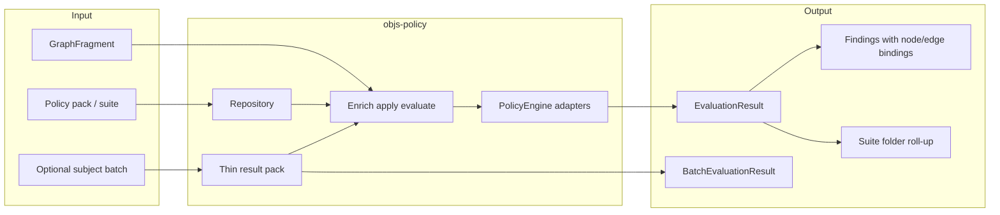

---

## 2. Naming and non-conflation

| Term | Means | Does **not** mean |
|------|--------|-------------------|
| **Policy** (foundation) | Executable artefact: metadata + `engineKind` + body (+ optional applicability) | SBOM ontology entity type `Policy` / `COMPLIES_WITH` |
| **PolicySuite** | Hierarchical taxonomy of folders referencing policies | SBOM **Portfolio** / subject-area tables |
| **GraphFragmentPolicy** | Fragment **normalization** (identity, duplicates, dangling ends) | Business / governance rules |
| **Persist validation** | JSON Schema + allow-list at write | Compliance scoring |
| **Assessment** | Product/UX label for a run or result | Module or package name |

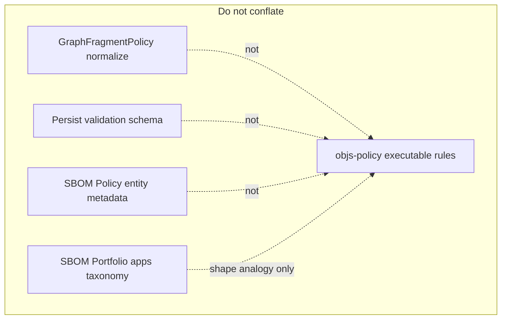

---

## 3. Foundation vs product boundary

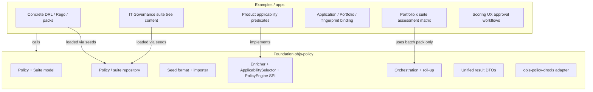

| Foundation owns | Product / examples own |
|-----------------|-------------------------|
| Data model, repository, seeds **format** | Seed **content** (PCI, Mongo gates, “IT Governance” tree) |
| Applicability **SPI** | “Has Database” / Apigee predicates |
| Drools **adapter** | Production DRL text |
| Folder **roll-up algorithm** (within one suite run) | When to run which suite against which app |
| **Thin batch / result pack** (opaque subjectKey) | **Assessment matrix** layout and axes |

---

## 4. Module map (planned)

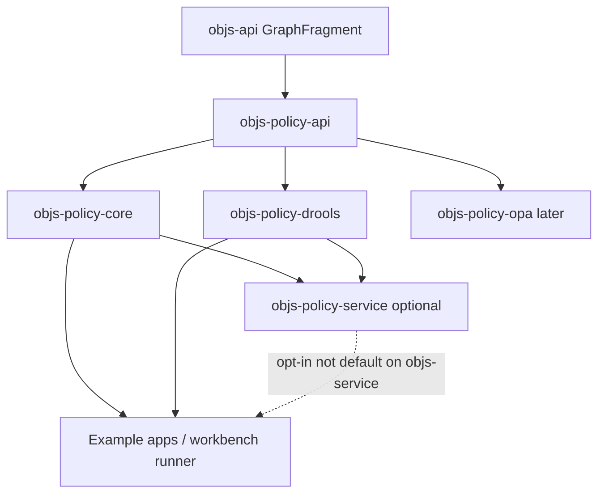

| Module | Responsibility |
|--------|----------------|
| `:objs-policy-api` | Spring-free contracts: Policy, Suite, SPIs, findings, results |
| `:objs-policy-core` | Repository, seed import, enrich → apply → evaluate, suite roll-up |
| `:objs-policy-drools` | First `PolicyEngine` |
| `:objs-policy-opa` | Later |
| `:objs-policy-service` | Optional REST (jgrapht-service pattern); **not** on `:objs-service` by default |

Exact split / packages / Flyway home: open GAPS (`G-P1`, `G-P2`, `G-P13`, `G-P25`).

---

## 5. Conceptual data model

### 5.1 Entities (logical ER)

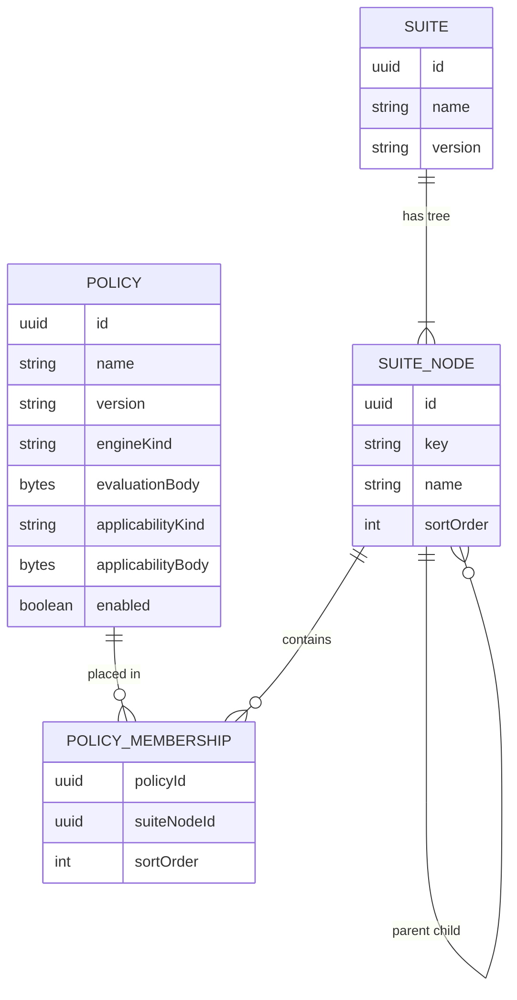

**Many-to-many:** one policy may appear under many suite nodes (across one or many suites). One suite node may list many policies.

**Hierarchy:** suite nodes form a tree (cycles forbidden — validation gap `G-P40seed`). Analogy: SBOM portfolio → subject areas; here suite → folders → **policy refs**, not applications.

### 5.2 Policy artefact (draft fields)

| Field | Role | Notes / GAPS |
|-------|------|----------------|
| Identity | Stable id and/or `(name, version)` | `G-P3`, `G-P36seed` |
| `engineKind` | `DROOLS` \| `OPA` \| `CUSTOM` \| … | `G-P5` |
| Evaluation body | Opaque engine payload (e.g. DRL) | `G-P4`, `G-P37seed` |
| Optional applicability artefact | Gate metadata/body separate from evaluation body | `G-P6` |
| Metadata | description, tags, enabled, timestamps | — |

Policies are **not** rows in `bom_entity`. They live in a dedicated policy store (`G-P13`, `G-P41`).

### 5.3 Suite tree (illustrative product content)

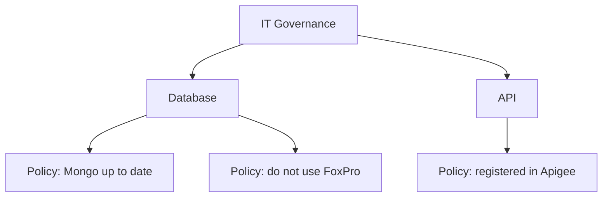

After a suite run (example outcomes):

| Node / policy | Status |
|---------------|--------|
| Mongo up to date | PASS |
| do not use FoxPro | PASS |
| Database | **OK** |
| registered in Apigee | FAIL |
| API | **FAIL** |
| IT Governance | **FAIL** |

---

## 6. Graph input

Any producer of `GraphFragment` is valid input:

- Full named graph select  
- Matcher selection / Explore-scope fragment  
- Multi-graph union (e.g. SBOM Combined)  
- Builder / codegen fragment  

Always normalize first with existing **`GraphFragmentPolicy.resolve`** ([`fragments-and-analysis.md`](../graph/fragments-and-analysis.md)):

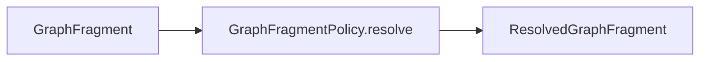

**Draft default (`G-P17`):** if resolved fragment carries **ERROR** diagnostics, refuse evaluation (same spirit as Gremlin/JGraphT materializers), rather than evaluating a broken topology.

---

## 7. Evaluation pipelines

### 7.1 Flat policy collection

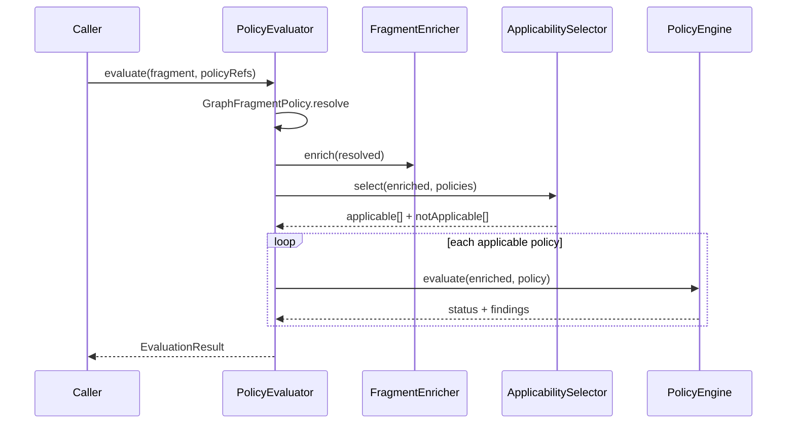

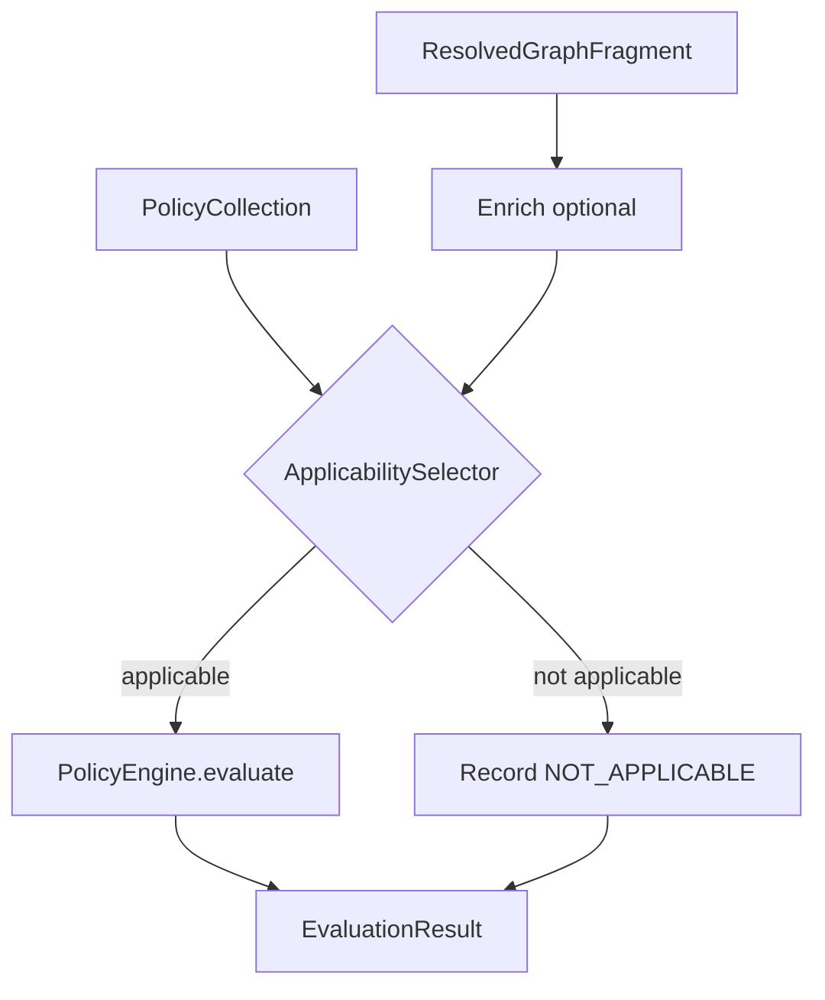

### 7.2 Suite execution

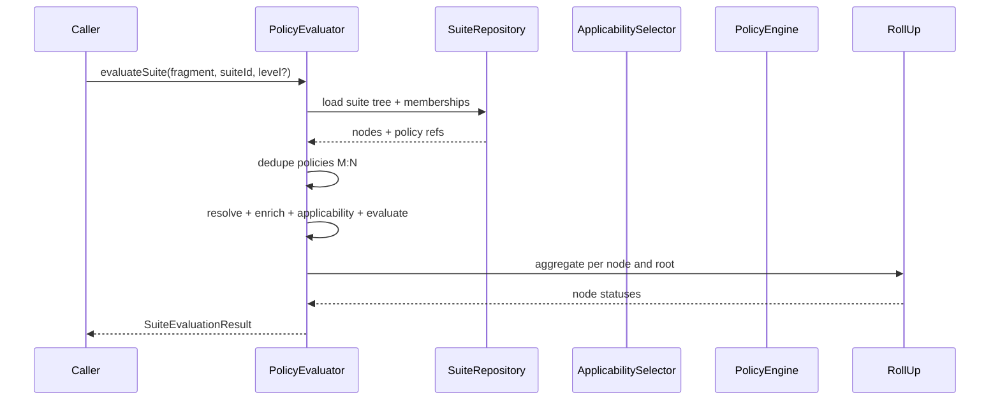

**Collect → evaluate → roll up.** Flat evaluate remains supported without a suite.

**Execute scope (`G-P28s`):** whole suite vs selected level/subtree (portfolio MI “level” analogy) — open.

**Dedupe (`G-P30s`):** if the same policy is attached to two nodes, evaluate **once** per run (draft); attach outcome to each placement for display — open.

---

## 8. Applicability (first-class)

Applicability answers: *is this policy in scope for this fragment?* It is **not** pass/fail.

**Example:** “PostgreSQL must be version > 16.5”

| Fragment | Applicability | Evaluation |
|----------|---------------|------------|
| Has Postgres 16.4 | yes | FAIL + finding on component entity |
| Libraries only, no DB | no | **NOT_APPLICABLE** (not pass, not fail) |

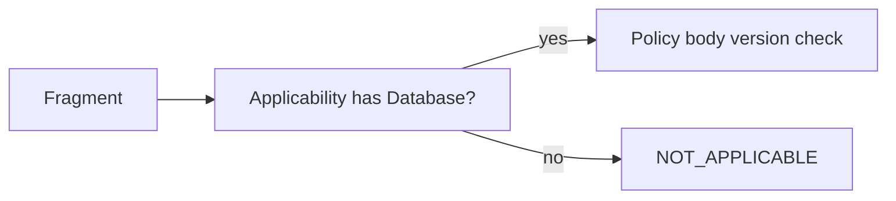

**Contract requirements (provisional):**

- Explicit pipeline step + implementer **`ApplicabilitySelector`** SPI (`G-P7`, `G-P8`)  
- Optional per-policy applicability artefact (`G-P6`)  
- Must **not** rely only on Drools `when` for N/A visibility across engines  
- Primary gate is **per-policy**; suite/node-level applicability is `G-P33`

---

## 9. Engines

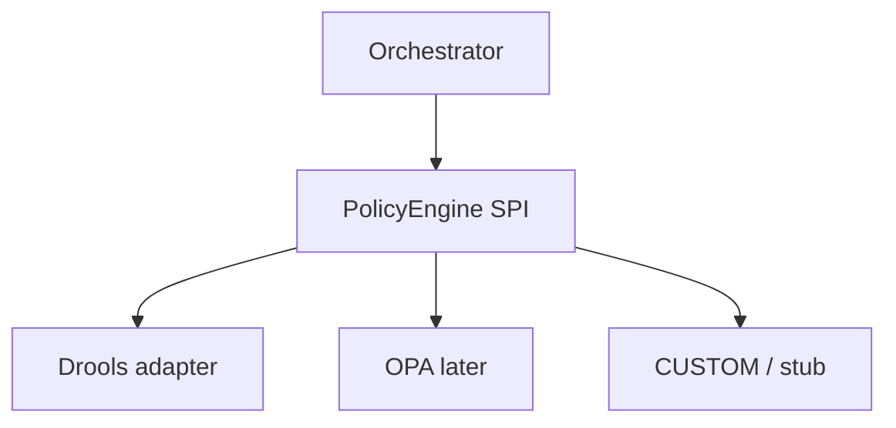

| Kind | Module | Role |
|------|--------|------|
| `DROOLS` | `:objs-policy-drools` | First real adapter; facts from enriched fragment; body = DRL (or locked format) |
| `OPA` | later | Deferred |
| `CUSTOM` | tests / apps | Stub or app-specific |

Engine receives **already-applicable** policies only. Fact mapping, session lifecycle, BOM versions: `G-P18`…`G-P20`.

Foundation must not ship regulatory DRL in `src/main` — fixtures and example packs only.

---

## 10. Findings and evidence bindings

A policy outcome may include **0..n findings**.

Each finding binds:

- **`entities`:** `List<UUID>` — **0..n** fragment entity ids  
- **`edges`:** `List<UUID>` — **0..n** fragment edge ids  

Empty lists are valid (policy-level statement with no graph locus).

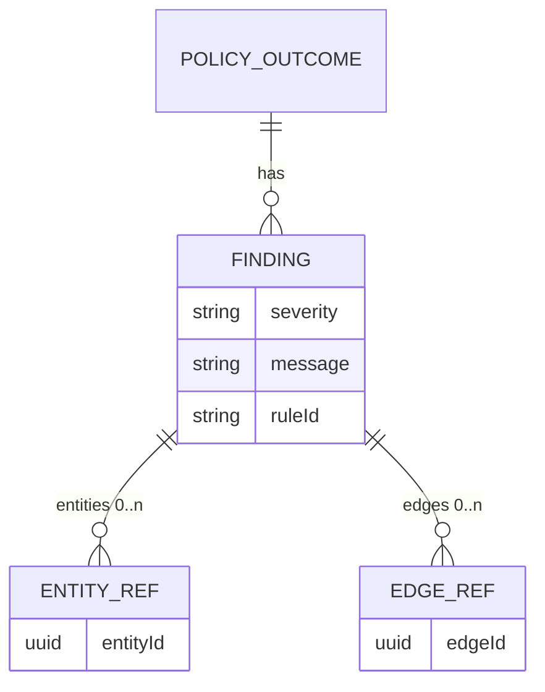

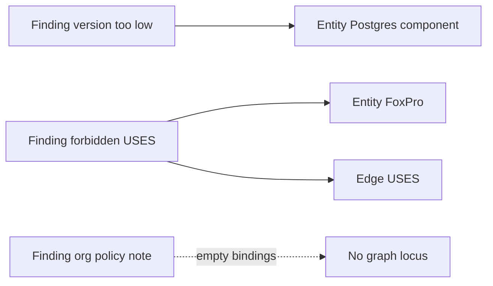

Same spirit as `GraphFragmentDiagnostic` node/edge lists, but for **evaluation**, not fragment normalization.

Open: exact fields, severity enum, whether FAIL must carry ≥1 finding, whether PASS may carry warnings (`G-P11f`, `G-P12f`).

---

## 11. Status and suite roll-up

### 11.1 Per-policy status (draft)

| Status | Meaning |
|--------|---------|
| `PASS` | Applicable and satisfied |
| `FAIL` | Applicable and violated |
| `ERROR` | Engine/policy execution failure (bad body, crash) |
| `NOT_APPLICABLE` | Out of scope for this fragment |

**Draft aggregation (`G-P12`, `G-P16`, `G-P29s`):**

- `ERROR` dominates when present  
- Else `FAIL` if any FAIL among considered children  
- `NOT_APPLICABLE` does **not** count as failure  
- All-N/A / empty folder behavior still open  

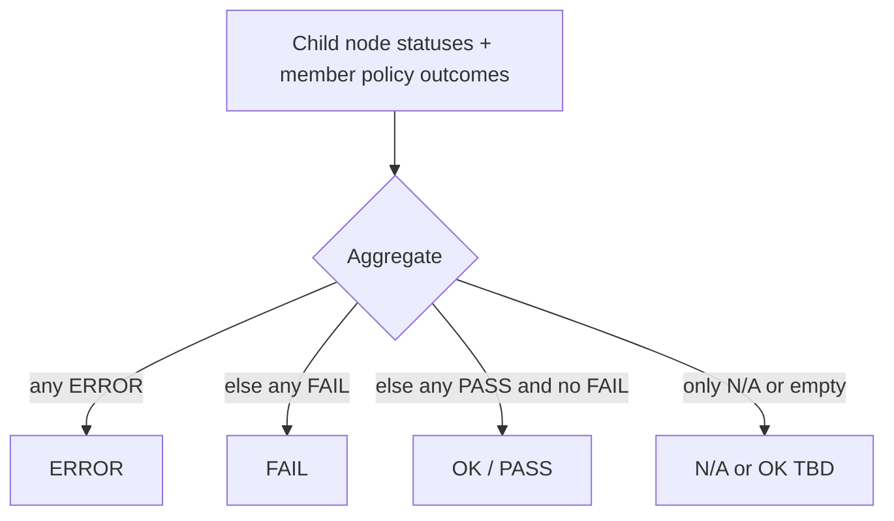

### 11.2 Roll-up on the IT Governance example

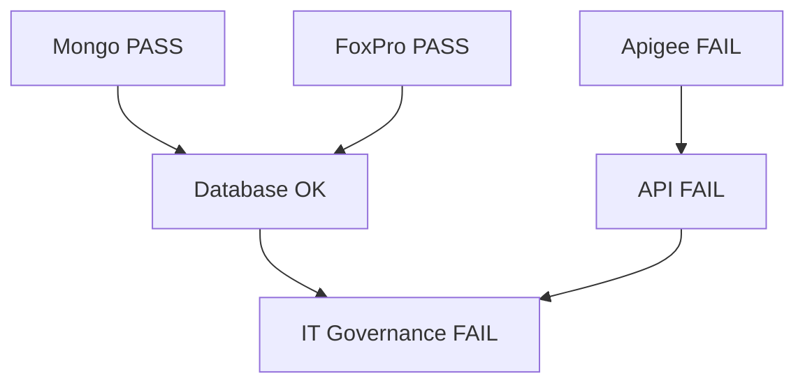

---

## 12. Seeds

Policies and suites **must** have a portable seed format (graph-seeds family).

**Draft envelope** (align with [`seeds.md`](../graph/seeds.md) unless `G-P34seed` chooses otherwise):

```yaml
apiVersion: objs.poc.org/v1
kind: Policy
name: mongo-up-to-date
version: "1"
engineKind: DROOLS
body: |
  # product DRL — not foundation content
---
apiVersion: objs.poc.org/v1
kind: PolicySuite
name: it-governance
nodes:
  - key: root
    name: IT Governance
    children: [database, api]
  - key: database
    name: Database
    policies: [mongo-up-to-date, no-foxpro]
  - key: api
    name: API
    policies: [registered-in-apigee]
```

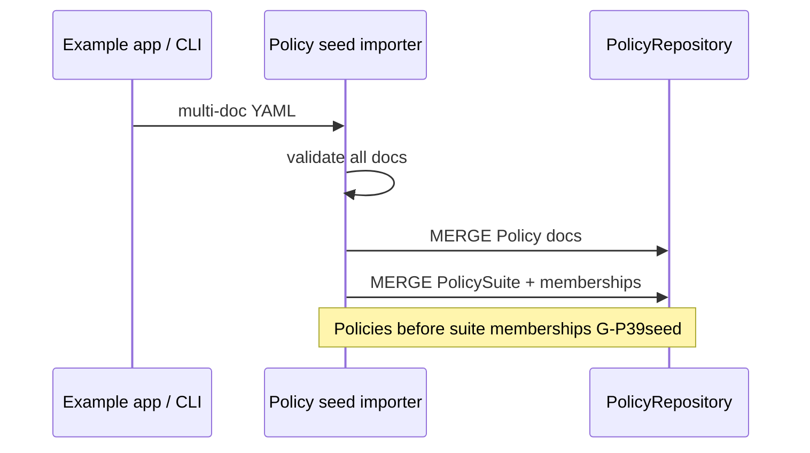

| Concern | Gap |
|---------|-----|
| Envelope / kinds / nesting | `G-P34seed`, `G-P35seed` |
| MERGE identity keys | `G-P36seed` |
| Inline body vs file ref | `G-P37seed` |
| `SeedDocumentHandler` vs dedicated importer | `G-P38seed` |
| Apply order / validation | `G-P39seed`, `G-P40seed` |

**Content** (real governance packs) lives under examples/apps. Foundation owns format + importer only.

---

## 13. Enrichment

Optional **`FragmentEnricher`** SPI runs after resolve (and, by draft default, before applicability) so selectors/engines can see derived signals without baking product logic into core.

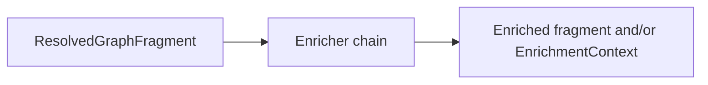

Open: return new fragment vs sidecar facts bag; enrich-all vs enrich-applicable-only (`G-P9`, `G-P10`).

---

## 14. Repository and orchestration API (draft)

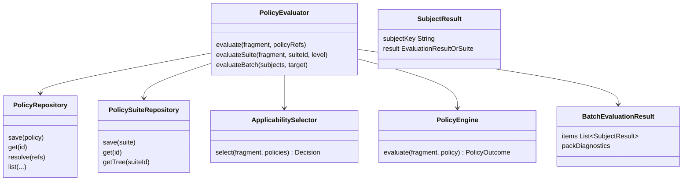

Whether suite APIs live on one facade or two repositories: `G-P31s`. Public method names: `G-P15`. Batch shape: `G-P41b`…`G-P43b`.

---

## 15. Thin batch / result pack (foundation) vs matrix (product)

**Provisional lock:** foundation includes a **thin** batch facility so products can build multi-dimensional assessment views. The **matrix itself** (portfolio × suite, heatmaps, cross-subject scores) stays in the app.

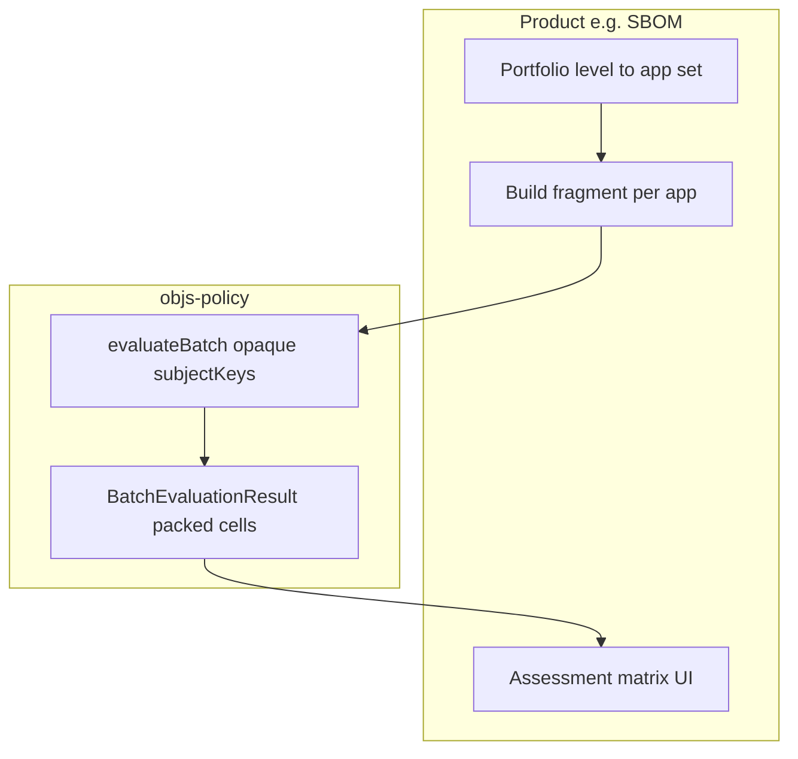

```mermaid
sequenceDiagram
  participant Sbom as SBOM app
  participant Pol as PolicyEvaluator
  Sbom->>Sbom: portfolio level to apps A B C
  Sbom->>Pol: evaluateBatch([{A,fragA},{B,fragB},{C,fragC}], suite)
  Pol-->>Sbom: pack keyed by subjectKey
  Sbom->>Sbom: render matrix apps x suite folders
```

| In foundation | Out of foundation |
|---------------|-------------------|
| Many `{ subjectKey, fragment }` × one suite or policy collection | Named axes (portfolio, MI report) |
| Packed ordered list of per-subject results | Grid layout / joins of two taxonomies |
| Optional pack-level diagnostics only | Cross-subject roll-up or portfolio score |
| Opaque `subjectKey` (caller interprets) | Assuming subjects are Applications |

Single-fragment evaluate/suite remains the core; batch is a convenience on the same orchestrator.

---

## 16. Motivating end-to-end (SBOM-shaped)

```mermaid
sequenceDiagram
  participant Op as Operator
  participant Sbom as SBOM app
  participant Store as GraphStore
  participant Pol as objs-policy
  Op->>Sbom: Assess app version with suite IT Governance
  Sbom->>Store: select Combined SBOM fragment
  Store-->>Sbom: GraphContents
  Sbom->>Pol: evaluateSuite(fragment, it-governance)
  Note over Sbom,Pol: App supplies ApplicabilitySelector
  Pol-->>Sbom: SuiteEvaluationResult + findings
  Sbom-->>Op: Tree statuses + highlight nodes/edges
```

For portfolio-level management views, the app loops subjects (or calls **batch**) and owns the matrix — see **§15** and story [`EXAMPLES.md` E8](../../workitems/planned/objs-policy/EXAMPLES.md).

SBOM Application / Portfolio binding stays in the app. Foundation never requires SBOM types.

---

## 17. Non-goals

- OPA adapter in the first implementation story (follow-up)  
- Hard-coded regulatory catalogs or “IT Governance” content in foundation jars  
- Treating `NOT_APPLICABLE` as PASS or FAIL  
- Replacing persist-gate validation  
- Storing suites in SBOM portfolio tables  
- Default dependency from `:objs-service` on policy modules  
- Full compliance scoring / approval product UX  
- **Portfolio × suite assessment matrix** (or any multi-axis grid) inside foundation — product only; use thin batch pack  

---

## 18. Open decisions

All field-level and SPI-shape decisions:  
[`docs/workitems/planned/objs-policy/GAPS.md`](../../workitems/planned/objs-policy/GAPS.md)

Do not implement `:objs-policy-*` modules until WI-001 closes every `open` row.

---

## 19. Related documents

| Doc | Why |
|-----|-----|
| [`README.md`](README.md) | Short index for this folder |
| [`STORY.md`](../../workitems/planned/objs-policy/STORY.md) | Delivery plan, stages, WIs |
| [`EXAMPLES.md`](../../workitems/planned/objs-policy/EXAMPLES.md) | Motivating scenarios E1–E8 |
| [`fragments-and-analysis.md`](../graph/fragments-and-analysis.md) | Fragment resolve contract |
| [`seeds.md`](../graph/seeds.md) | Graph seed envelope to align with |
| [`apps-vs-foundation.md`](../graph/apps-vs-foundation.md) | Foundation vs examples |
| [`validation.md`](../graph/validation.md) | Persist gate — orthogonal |
| [`sbom/example.md`](../sbom/example.md) | Portfolio shape analogy only |
