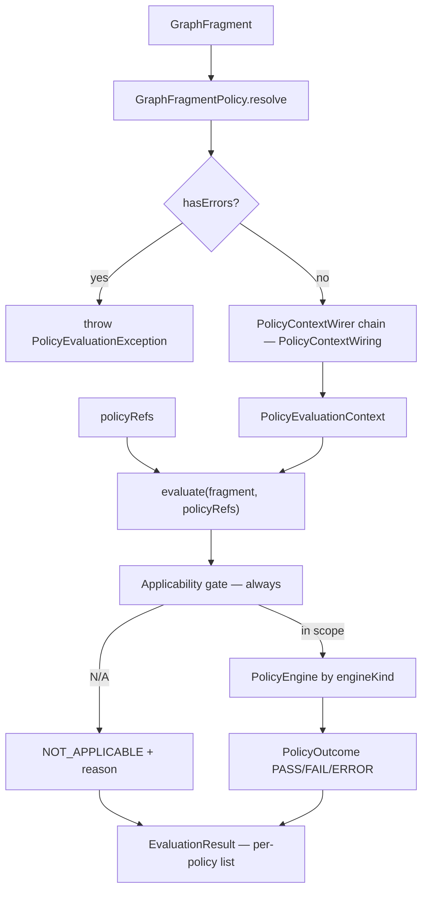
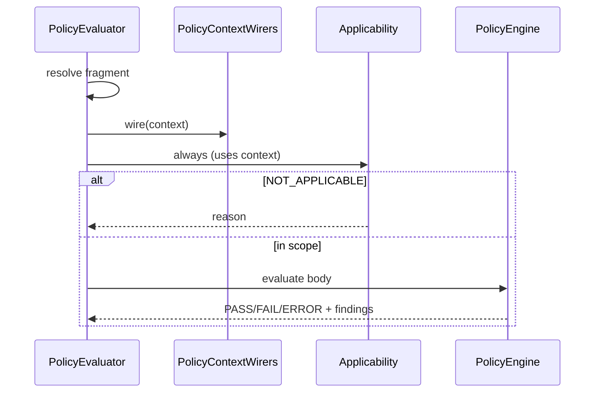

# Policy evaluation pipeline (S1 locked)

**Normative:** C-24 WI-001 · [`GAPS.md`](../../workitems/in-progress/policy-evaluate-core/GAPS.md)

**Implement / document with sequences:** full call-level diagrams (happy path, refuse, preview, per-policy branches, repo resolve, wrappers) live in [`evaluation-sequences.md`](evaluation-sequences.md). Keep this page as the compact contract; keep sequences in sync when behaviour is clarified in code.

---

## End-to-end



**Order (normative):**

1. **Resolve** fragment (`GraphFragmentPolicy`)  
2. If ERROR diagnostics → **refuse** (do not evaluate)  
3. **PolicyContextWiring** (optional `PolicyContextWirer` chain) — first behavioural step that fills `PolicyEvaluationContext`  
4. **`evaluate`** — **always** runs applicability, then engine for in-scope policies  

Optional: **`applicability(...)`** preview — same gate, no engine side effects.

There is **no** “evaluate without applicability.”

**Naming:** SPI = **`PolicyContextWirer`**; concept = **PolicyContextWiring**. Do **not** use Enricher (reserved elsewhere in the product).

---

## Fixed orchestrator contract (G-P15)

Core API (names illustrative):

| Method | Role |
|--------|------|
| `evaluate(fragment, policyRefs)` | Full gated run → `EvaluationResult` |
| `applicability(fragment, policyRefs)` | Preview gate only |

**No** parameterless `evaluate()`.

Suite / batch / other shapes = **wrappers** that resolve to `(fragment, policyRefs)` and call this contract (C-27+, C-29+).

```mermaid
flowchart LR
  subgraph wrappers [Later / apps]
    SuiteW[suite wrapper]
    BatchW[batch wrapper]
    Fn[(fragment, refs) => result]
  end
  subgraph core [S1 core]
    Orch[PolicyEvaluator fixed contract]
  end
  SuiteW --> Fn
  BatchW --> Fn
  Fn --> Orch
```

---

## PolicyEvaluationContext (G-P9)

| Piece | Role |
|-------|------|
| Resolved fragment | Topology after resolve |
| Sidecar bag | Mutable map (or equivalent) for wired facts |

S1 **`PolicyContextWirer`**s **only wire values into context** — no built-in wirers, no topology rewrite, no product predicates in foundation.

Illustrative method: `wire(context: PolicyEvaluationContext)`.

---

## Wiring before applicability (G-P10)

PolicyContextWiring runs at the **very beginning** after resolve so **applicability can use** wired facts.

Compact view (full multi-policy / refuse / preview sequences → [`evaluation-sequences.md`](evaluation-sequences.md)):



---

## Applicability bound to evaluate (G-P7, G-P8, G-P35)

| Kind | S1 behaviour |
|------|----------------|
| blank / missing | Treat as **`ALWAYS_APPLY`** |
| `ALWAYS_APPLY` | In scope; body ignored |
| other | Not implemented → per-policy **ERROR** (unless later softened) |

`NOT_APPLICABLE` is an **outcome status**, not a separate API product. N/A ≠ pass and ≠ fail for compliance meaning.

---

## Engines (S1)

Dispatch by `engineKind` string:

- **`CUSTOM`** — stub/test/app-provided adapter in core tests or caller registration  
- Others — ERROR until C-26+ registers them  

Continue remaining policies after ERROR or FAIL ([`results.md`](results.md)).
