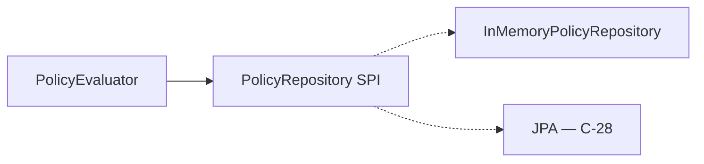
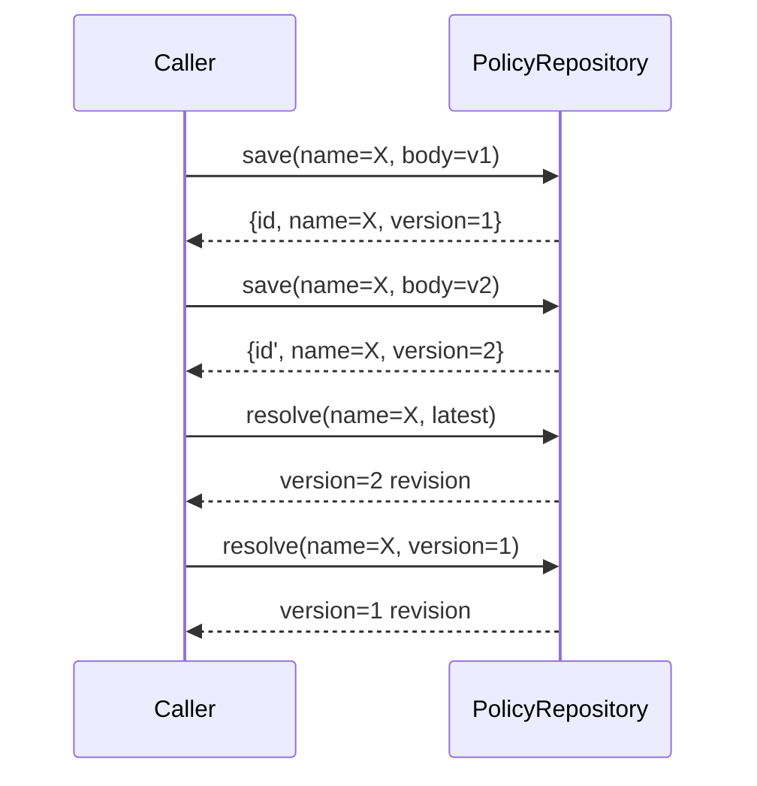

# Policy repository (S1 locked)

**Normative:** G-P19–G-P22 · [`GAPS.md`](../../workitems/completed/20260904-policy-evaluate-core/GAPS.md)

---

## Role

`PolicyRepository` is the port for **persist / load / resolve** policy revisions. S1 ships an **in-memory** implementation in `:objs-policy-core`. JPA + seeds arrive in **C-28**.

---

## Operations (logical)

| Operation | Behaviour |
|-----------|-----------|
| `save(policy)` | Create or update-by-name → allocate **new serial version**; return stored revision |
| `resolve(ref)` | By **id**, or by **name** + **`latest`**, or by **name** + **specific version** |
| `list` / `findByName` | Implementation convenience (exact API in WI-002) |
| Delete | Optional in S1; not required for MVP evaluate path |

---

## Versioning contract

- Serial version is **immutable** per stored row  
- Updates never overwrite an old serial in place (new version number)  
- `latest` = max serial for that name  
- Outcomes always cite the **resolved** version that ran  

See [`model.md`](model.md).

---

## Threading / process scope (S1)

In-memory store is **process-local**:

- Fine for unit tests and embedders that inject policies in-process  
- Not shared across JVMs  
- Not durable across restarts  

C-28 replaces/augments with JPA + seed load without changing the evaluate contract.

---

## What is not in the repository

| Concern | Where |
|---------|--------|
| Suites / membership | C-27 |
| Seed kinds / classpath packs | C-28 + [`../graph/seeds.md`](../graph/seeds.md) |
| Batch job state | C-29 |
| REST CRUD | C-30 / C-31 as needed |
