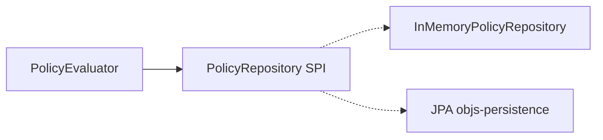
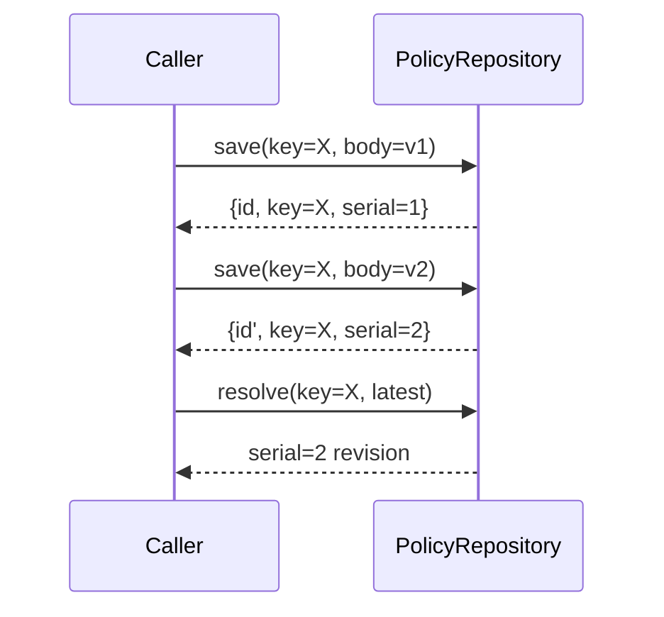

# Policy repository

**Normative:** G-P19–G-P22 · C-24 GAPS · **C-28** [`policy-seeds-persistence/GAPS.md`](../../workitems/completed/20260906-policy-seeds-persistence/GAPS.md) (G-P13p, G-P14p, G-P36seed)

---

## Role

`PolicyRepository` (and `CategoryRepository` / `SuiteRepository`) are ports for **persist / load / resolve**. In-memory impls live in `:objs-policy-core`. **C-28** adds JPA in `:objs-persistence` behind the **same ports** (G-P14p).

---

## Identity (`key` — G-P36seed)

| Artefact | Human MERGE / resolve identity | Display | Store id |
|----------|-------------------------------|---------|----------|
| Policy | **`key`** | `name` | UUID revision row |
| Category | **`key`** (replaces `slug`) | `name` / displayName | UUID |
| PolicySuite | **`key`** | `name` | UUID |
| SuiteFolder | **`key`** (unchanged) | `name` | UUID |

Policy apply/save-by-`key` still allocates a new **serial** (G-P3).

---

## Operations (logical)

| Operation | Behaviour |
|-----------|-----------|
| `save(policy)` | Create or update-by-**key** → allocate **new serial**; return stored revision |
| `resolve(ref)` | By **id**, or by **key** + **`latest`**, or by **key** + **specific serial** |
| `list` / `findByKey` / `query` | List or filter (category, tags, annotations, key/name contains) — no paging |
| Delete | By id; category delete refused while referenced (unless Drop/replace cascades in seeds) |

---

## Versioning contract

- Serial is **immutable** per stored row  
- Updates never overwrite an old serial in place  
- `latest` = max serial for that **key**  
- Outcomes cite the **resolved** serial that ran  

See [`model.md`](model.md).

---

## Persistence (C-28)

- DDL on **objs Flyway** vendor folders (`flyway_schema_history_objs`) in `:objs-persistence`  
- Not `bom_entity` / not a policy-module Flyway line  
- Play/Boot prefers JPA when DataSource present; in-memory remains for tests  

---

## What is not in the repository

| Concern | Where |
|---------|--------|
| Suites / membership | C-27 + SuiteRepository |
| Seed kinds / classpath packs | C-28 + [`../graph/seeds.md`](../graph/seeds.md) |
| Batch job state | C-29 |
| Evaluation result store | Deferred (G-P11r) |
