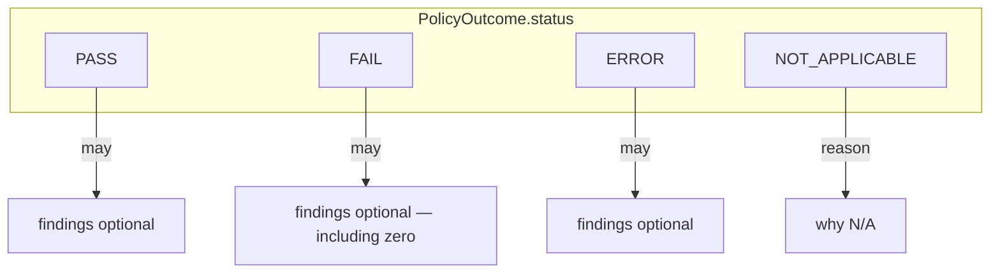
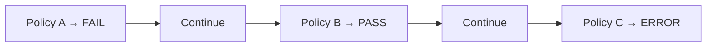
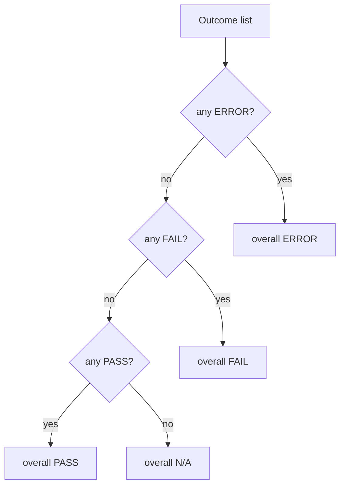
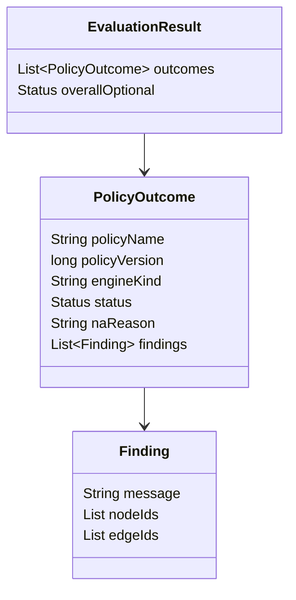

# Policy results and findings (S1 locked)

**Normative:** G-P11–G-P14, G-P16–G-P18 · [`GAPS.md`](../../workitems/completed/20260904-policy-evaluate-core/GAPS.md)

---

## Per-policy outcomes (authoritative)

Each evaluated policy produces one **outcome**. The outcome list is the **source of truth** — not any overall roll-up.



| Status | Meaning |
|--------|---------|
| **PASS** | In scope; policy satisfied |
| **FAIL** | In scope; policy **not** satisfied (compliance/content) |
| **ERROR** | Engine/body/unknown-kind/runtime failure — **not** “failed the check” |
| **NOT_APPLICABLE** | Gate said out of scope; **not** pass and **not** fail |

Every outcome **must** cite:

- policy **name**
- executed **serial version**
- `engineKind` (as resolved)
- status (+ N/A reason when applicable)

---

## ERROR vs FAIL (G-P16)

| | FAIL | ERROR |
|---|------|-------|
| Semantics | Rule said “not OK” | Could not run the rule correctly |
| Examples | Required edge missing | Bad body, unknown engineKind, adapter throw |
| Continue others? | **Yes** | **Yes** |



Fragment-level resolve ERRORs are different: they **refuse** the whole evaluate ([`pipeline.md`](pipeline.md)).

---

## Findings (G-P17, G-P18)

| Rule | Lock |
|------|------|
| Optional on **all** statuses | Including PASS / ERROR / N/A |
| FAIL may have **zero** findings | Allowed |
| Binding | Soft — node/edge ids when present; **no** hard schema validation in S1 |
| Purpose | Explain / locate; not a second status channel |

Logical shape (illustrative):

| Field | Role |
|-------|------|
| `message` | Human-readable |
| `severity` | Optional severity hint |
| `nodeIds` / `edgeIds` | Optional fragment bindings |
| `code` / extras | Optional opaque map |

---

## Overall status — optional convenience only (G-P11)

**Not** suite roll-up. **Not** authoritative.

If provided, compute from the outcome list with fixed precedence:

```text
ERROR > FAIL > PASS > NOT_APPLICABLE
```



Consumers that care about compliance must **read per-policy outcomes** (and later suite semantics in C-27). The helper is for UIs/logs that want a single badge.

---

## EvaluationResult shape (logical)



Suite-level required/optional/waive semantics are **out of S1** (C-27).
