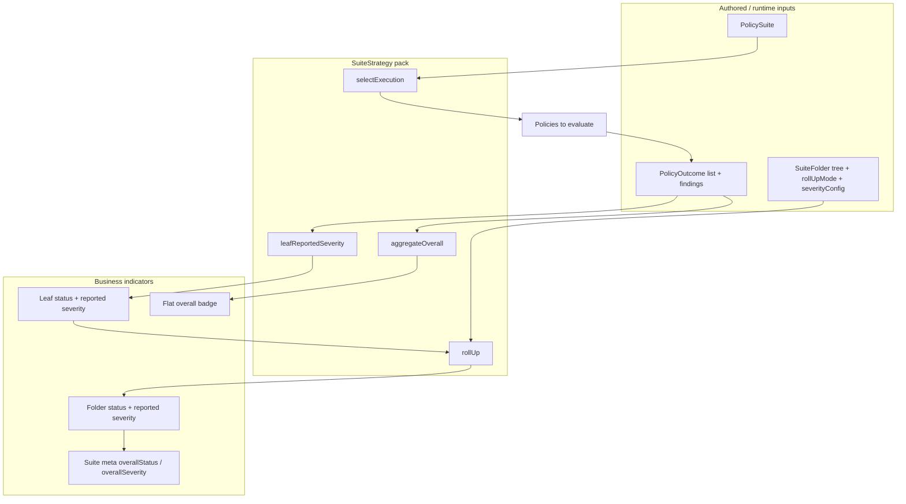
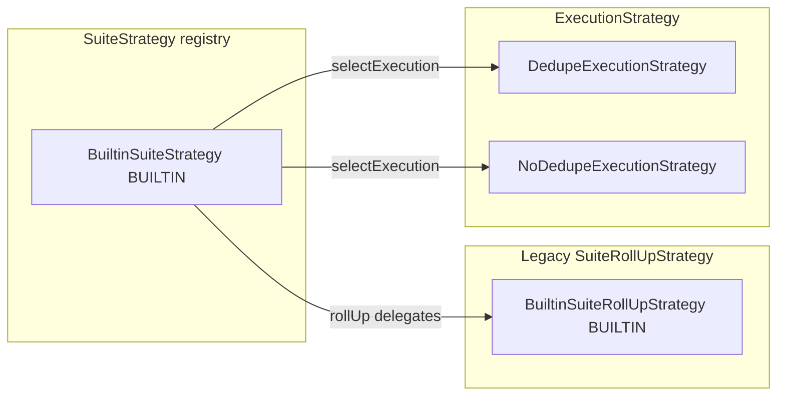
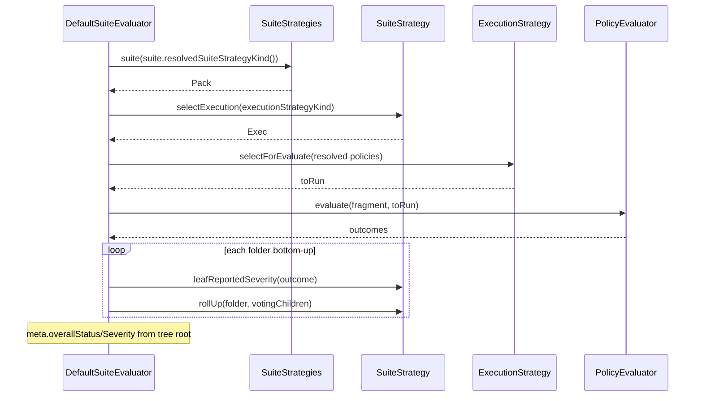
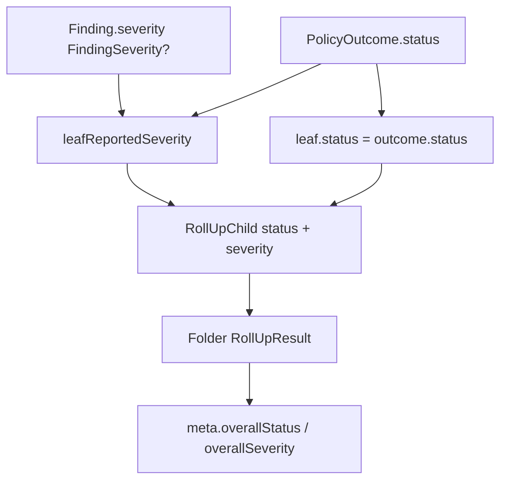

# Suite strategies for implementers and maintainers

**Audience:** engineers extending or maintaining suite compute (roll-up, severity, execution selection)  
**Purpose:** Document **which strategies exist**, **where they are applied**, and **how their outputs become the business indicators** described in [`business-indicators.md`](business-indicators.md).  
**Locks:** C-34 G-P56v · [`suites.md`](suites.md) · [`results.md`](results.md)  
**Code:** `:objs-policy-api` (`SuiteStrategy`) · `:objs-policy-core` (`BuiltinSuiteStrategy`, `SuiteStrategies`, `DefaultSuiteEvaluator`)

---

## 1. Mental model: pack → business value

Business users see **status badges** and **severity signals**. Those are not hard-coded in the evaluator. They are produced by a **`SuiteStrategy` pack** selected on the suite.



| Strategy method | Produces | Business reading ([business-indicators.md](business-indicators.md)) |
|-----------------|----------|---------------------------------------------------------------------|
| `selectExecution` | Which policy instances run (dedupe vs not) | Which checks contribute to the assessment |
| `leafReportedSeverity` | Leaf **reported severity** (axis C) | Severity chip on a single policy result |
| `rollUp` | Folder **status** + **reported severity** | Dimension / chapter indicator |
| `aggregateOverall` | Flat / convenience **overall status** | Single Pass/Fail/Exec error badge (no severity) |

**Invariant:** the evaluator (`DefaultSuiteEvaluator`) **orchestrates only**. Aggregation formulas live in the pack (or helpers the pack calls). Do not reintroduce leaf/folder math in the evaluator.

---

## 2. Strategy inventory (shipped)



| Kind / type | Module | Role |
|-------------|--------|------|
| **`SuiteStrategy`** / `SuiteStrategyKinds.BUILTIN` | api + core | **Pack** — leaf C + folder roll-up + overall + execution lookup |
| **`SuiteRollUpStrategy`** / `SuiteRollUpStrategyKinds.BUILTIN` | api + core | Folder-only SPI; **Builtin pack delegates** here for matrices |
| **`ExecutionStrategy`** / `DEDUPE` \| `NO_DEDUPE` | api + core | Which resolved policies are passed to flat `evaluate` |
| **`SeverityRank`** | core | Canonical rank for `FindingSeverity` (no soft aliases) |
| **`aggregateOverall`** (API function) | api | Status precedence; Builtin pack wraps this |

Registry: `SuiteStrategies.suite(kind)`, `.rollUp(kind)`, `.execution(kind)`.

---

## 3. Suite fields that select strategies

| Field | Selects | Notes |
|-------|---------|-------|
| `suiteStrategyKind` | `SuiteStrategy` pack | Prefer this (C-34). Default `BUILTIN`. |
| `rollUpStrategyKind` | Legacy alias / evaluation meta | `resolvedSuiteStrategyKind()` = `suiteStrategyKind` if non-blank else `rollUpStrategyKind` |
| `executionStrategyKind` | Passed into `pack.selectExecution(...)` | `DEDUPE` (default) or `NO_DEDUPE` |
| Folder `rollUpMode` | **Input** to pack `rollUp` | `ALL_PASS` \| `ANY_PASS` — not a strategy class |
| Folder `severityConfig` | **Input** to pack `rollUp` | Optional override when parent non-passing |



---

## 4. Builtin pack behavior (maps to business indicators)

### 4.1 `BuiltinSuiteStrategy.selectExecution`

Delegates to `SuiteStrategies.execution(kind)`:

| Kind | Behavior | Business effect |
|------|----------|-----------------|
| `DEDUPE` | Same policy id runs once | One leaf per policy identity |
| `NO_DEDUPE` | Every placement runs | Multiple leaves if the same policy is placed twice |

### 4.2 `BuiltinSuiteStrategy.leafReportedSeverity`

```text
max(finding.severity) by SeverityRank
else if status == EXEC_ERROR → HIGH
else → null
```

| Output | Business indicator |
|--------|-------------------|
| `CRITICAL`…`INFO` | Leaf severity chip |
| `HIGH` from bare `EXEC_ERROR` | Exec error still contributes a serious severity vote upward |
| `null` | No severity chip on that leaf |

Vocabulary must stay the closed set (`FindingSeverity`). Do not invent parallel tokens in a custom pack unless product + dual-read are updated.

### 4.3 `BuiltinSuiteStrategy.rollUp` → `BuiltinSuiteRollUpStrategy`

**Status (folder `rollUpMode`):**

| Mode | Parent status rule (voting children) | Business |
|------|--------------------------------------|----------|
| `ALL_PASS` | Any `EXEC_ERROR` → Exec error; else any `FAIL` → Fail; else any `PASS` → Pass; else N/A | Strict dimension |
| `ANY_PASS` | Any `EXEC_ERROR` → Exec error; else any `PASS` → Pass; else any `FAIL` → Fail; else N/A | Lenient dimension |

**Reported severity:**

```text
pool = max(voting children’s reported severity)
if parent in {FAIL, EXEC_ERROR}:
  reported = severityConfig ?: pool
elif parent == PASS:
  reported = pool
else:
  reported = null
```

| Output | Business indicator |
|--------|-------------------|
| Folder `status` | Dimension Pass / Fail / Exec error |
| Folder `severity` | Dimension severity (or empty) |
| `PASS` + non-null severity | “Pass with warning” |

Participation: only **ENABLED** children vote; **DISABLED** omitted; **IGNORED** evaluated but non-voting; **N/A** policies dropped before leaves.

### 4.4 `BuiltinSuiteStrategy.aggregateOverall`

```text
EXEC_ERROR > FAIL > PASS > NOT_APPLICABLE
```

Used for flat evaluate convenience and can be reused by packs. **No severity** — severity is suite-tree only.

---

## 5. Data flow: findings → business value



**Do not:**

- Map outcome status into finding severity at write time (`PASS`→`OK`, `FAIL`→`ERROR`) — forbidden (VOCAB-MATRIX §10.4).  
- Put aggregation in UI; UI only displays tokens the pack already computed.  
- Rank soft aliases (`MODERATE`, `WARNING`) in `SeverityRank` — retired.

**Do:**

- Keep axis A (status) and axis B/C (severity) separate end-to-end.  
- Emit only closed severity tokens (or null) from engines / packs.  
- Register new packs in `SuiteStrategies` and validate kind on suite save (persistence currently accepts `BUILTIN` only for suite/roll-up kinds).

---

## 6. Adding a custom `SuiteStrategy` pack

1. Implement `SuiteStrategy` in an appropriate module (usually `:objs-policy-core` or an extension module).  
2. Register in `SuiteStrategies` suite map (or a Boot-discovered registry if you add one later).  
3. Allow the kind on suite write validation (`JpaSuiteRepository.materialize` / HTTP DTOs).  
4. Document business meaning in [`business-indicators.md`](business-indicators.md) (or a product appendix) so operators know how badges change.  
5. Keep wire vocabulary for reported severity as `FindingSeverity` unless you intentionally version a breaking change.

Optional composition: a pack may still call `BuiltinSuiteRollUpStrategy` for status matrices and only override `leafReportedSeverity` or severity pooling.

Legacy: `SuiteRollUpStrategy` remains for folder-only plugins; new work should prefer the **pack** SPI so leaf + overall stay consistent.

---

## 7. Code map (maintainers)

| Concern | Location |
|---------|----------|
| Pack SPI | `objs-policy-api/.../SuiteStrategy.kt` |
| Outcome / severity types | `PolicyOutcome.kt`, `FindingSeverity.kt`, `SuiteEvaluation.kt` |
| Builtin pack + registry | `objs-policy-core/.../SuiteStrategies.kt` |
| Folder matrices | `BuiltinSuiteRollUpStrategy` in same file |
| Orchestration | `DefaultSuiteEvaluator` |
| Flat overall helper | `aggregateOverall` in `PolicyOutcome.kt` |
| Suite kind on model | `PolicySuite.suiteStrategyKind` / `resolvedSuiteStrategyKind()` |
| HTTP | `SuiteHttpDtos.PolicySuiteDto.suiteStrategyKind` |
| Persist suite | `JpaSuiteRepository` (pack kind currently aliased to roll-up column) |

---

## 8. Test expectations

When changing Builtin behavior or adding a pack:

- Unit-test `rollUp` matrices and severity pooling (`SuiteStrategiesTest`).  
- Suite evaluate tests should assert **leaf severity** and **folder status@sev** (business indicators), not only flat outcomes.  
- UI/SBOM tests should consume closed tokens (`EXEC_ERROR`, `CRITICAL`…`INFO`) — no status-as-severity synthesis.

---

## Related

| Doc | Why |
|-----|-----|
| [`business-indicators.md`](business-indicators.md) | Operator-facing meaning of the same outputs |
| [`suites.md`](suites.md) | Normative suite model + matrices |
| [`results.md`](results.md) | Outcome / finding vocabulary |
| [VOCAB-MATRIX](../../workitems/in-progress/policy-status-severity-vocab/VOCAB-MATRIX.md) | C-34 token + UI locks |
