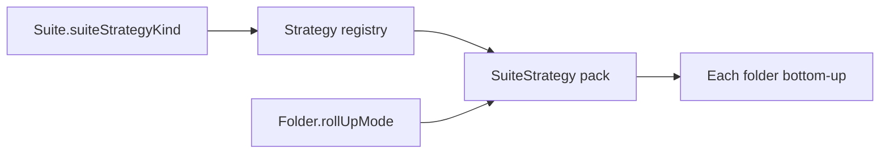

# Policy suites — folders, matchers, roll-up (C-27)

**Status:** **normative for C-27** (implemented: model, `evaluateSuite`, play HTTP, workbench Suites)  
**Story:** [`policy-suites/STORY.md`](../../workitems/completed/20260905-policy-suites/STORY.md)  
**Gaps:** [`policy-suites/GAPS.md`](../../workitems/completed/20260905-policy-suites/GAPS.md) (all resolved)  
**Results sketch:** [`RESULTS-MODEL.md`](../../workitems/completed/20260905-policy-suites/RESULTS-MODEL.md)  
**Boundary:** Suite **run configuration + result interpretation** — not C-32 catalog navigation.

This page is the living design for C-27 suites. Implementation: `:objs-policy-api` / `:objs-policy-core` (`SuiteRepository`, `DefaultSuiteEvaluator`, strategies) + `:objs-policy-service` suite HTTP + workbench **Policy > Suites**.

---

## Intent

- Suite = **tree of folders** (DAG, cycles forbidden); **leaves** = policies resolved under folders.
- Assign policies via **policy matchers** (not graph matchers; same word, different concept).
- After `evaluateSuite`, **status** (and **severity**) available at every folder and every policy leaf, via the suite’s roll-up strategy.
- Flat `evaluate(fragment, policyRefs)` unchanged; suite is a **wrapper**.

---

## Shape (**G-P26s** resolved)

| Element | Role |
|---------|------|
| Suite | Root container; selects **`rollUpStrategyKind`** (which roll-up **engine/impl** interprets the tree) |
| Folder | Node in a **tree** (DAG, **single parent**, **cycles forbidden**): child folders + matcher pipeline + **`rollUpMode`** (ALL_PASS\|ANY_PASS) + optional severity config + tags/annotations; participation flag: **ENABLED** (default) \| **DISABLED** \| **IGNORED** |
| Policy leaf | Resolved policy under a folder’s **effective** set |

- Folders may contain child folders and/or policy leaves.
- **No cycles**; each folder has at most one parent (tree ⊂ DAG). Multi-parent DAG sharing is **not** in this draft.
- Folder participation (**G-P26s** / roll-up):
  | Flag | Evaluate subtree? | Votes in parent roll-up? |
  |------|-------------------|---------------------------|
  | **ENABLED** (default) | yes | yes |
  | **DISABLED** | **no** | **no** |
  | **IGNORED** | **yes** | **no** |
- Folder **tags** and **annotations** are metadata on the taxonomy and are **applied on evaluation results** (besides the tree itself). Exact result-record attachment = open.

---

## Assigning policies (matchers) — **G-P27s** resolved

Each folder has an **ordered list of 0..N matchers**. Each matcher has mode **`include`** or **`exclude`**.

Matchers run in order; each hit set applies on top of the accumulator (include adds, exclude removes). **0 matchers** → empty matcher-derived list (folder may still have children).

### Extensibility

- **Matcher SPI is extensible** (kind + payload); new kinds can be added later without changing folder shape.
- **C-27 ships basic implementations** — **`STATIC_LIST`** and **`METADATA`**. Further kinds stay extensible via SPI.

### Kind: `STATIC_LIST` (C-27)

Up-front defined list of policy entries. Each entry:

| Field | Required | Meaning |
|-------|----------|---------|
| **`policyId`** | yes | Logical policy identity |
| **`version`** | no | Version selector (see below) |

**Version selector** (string match; modest grammar):

| Form | Example | Meaning |
|------|---------|---------|
| *(omitted / null / blank)* | — | **Latest** revision of that `policyId` |
| Exact `major.minor.serial` | `1.2.1725548123456` | Pin revision: user `version` = `major.minor`, store `serial` = third numeric component |
| Major wildcard | `1.*` | **Latest** revision whose user `version` major is `1` |

**Recommendation locked:** keep a **single match string** (no structured version object). Parse exact as three numeric segments (`major`, `minor`, `serial`); reject ambiguous forms in C-27. No `>=` / multi-globs.

### Kind: `METADATA` (C-27)

Select policies by catalog metadata (C-32 fields). **All criteria optional, but at least one must be set.**

| Criterion | Cardinality | Match rule |
|-----------|-------------|------------|
| **category** | 0..1 | Policies whose category **`slug`** equals this value |
| **tags** | 0..N | Policy must have **all** listed tags present |
| **annotations** | 0..N key=value | Policy must have **all** listed annotation pairs present |

If **more than one** criterion is specified, combine with logical **AND**.

Resolves to matching policies’ **latest**. Empty match set → empty contribution (not a missing-list failure).

### Missing policy (matcher-level) — **STATIC_LIST**

If an entry’s `policyId` (and selected version) **does not resolve**:

| Setting on matcher | Behavior |
|--------------------|----------|
| **Default** | Evaluation **`ERROR`** (hard failure — do not silently drop) |
| **Override: skip missing** | Omit unresolved entries; continue with the rest |

Configured **per matcher**.

### Identity

- **`policyId`** = today’s stable **`Policy.id`** (stable across updates that bump `serial`; not a separate column in C-27).
- Uniqueness in a folder accumulator is by **`policyId`** after every step.

### Effective set: children first, own matchers last

1. Start empty.
2. Merge each **child folder’s effective set** (children first). Child order is **not** a user guarantee; internals use **natural order by folder name**.
3. Apply this folder’s **own matchers** in list order (**highest priority**). Parent include/exclude can add or strip policies that came from children.

```text
effective(folder) = fold_unique(
  children_by_name.map(effective),
  then ownMatchers in order
)
```

### Uniqueness (per step)

- **`policyId` uniqueness after every step**: after each child merge, and after each own matcher.
- Two resolved revisions of the same `policyId` under one folder = **violation**.
- Same `policyId` may appear under **different** folders (cross-folder reuse).

---

## Execute scope (**G-P28s** resolved)

`evaluateSuite` may run under one of these scopes:

| Scope | Meaning |
|-------|---------|
| **Full** | Entire suite (root effective set / full tree roll-up) |
| **Subfolder** | One folder as root of the run (that folder’s subtree) |
| **Set of subfolders** | Multiple folders (each as a subtree root); combine per strategy / result shape (exact combine = result-shape detail under G-P11s) |
| **Subset of policies** | Explicit policy subset (bypass or narrow matcher-derived leaves for this run) |

Request shape (ids / refs) left to API design in WI-002/WI-003 within this lock.

---

## Status + severity roll-up — **SuiteStrategy pack** (G-P29s / G-P56v)

**Implementer guide:** [`suite-strategy-implementers.md`](suite-strategy-implementers.md) · **Business reading:** [`business-indicators.md`](business-indicators.md)

Suite compute uses a **composable `SuiteStrategy`** selected on the suite (`suiteStrategyKind`; legacy `rollUpStrategyKind` aliases for one release). The pack owns:

- execution strategy selection
- leaf **reported severity** (from findings, or bare `EXEC_ERROR` → `HIGH` in Builtin)
- folder **status + reported severity** roll-up
- **overall** status aggregate

```text
interface SuiteStrategy {
  leafReportedSeverity(outcome) -> FindingSeverity?
  rollUp(folder, votingChildren) -> { status, severity }
  aggregateOverall(outcomes) -> PolicyOutcomeStatus
  selectExecution(executionStrategyKind) -> ExecutionStrategy
}
```

### Two layers

| Layer | Field | Meaning |
|-------|--------|---------|
| **Suite** | `suiteStrategyKind` | Which **pack** runs suite-wide (`BUILTIN`; future packs register separately) |
| **Suite** | `rollUpStrategyKind` | Legacy alias / meta field (same token as pack for Builtin) |
| **Folder** | `rollUpMode` | Aggregation **mode**: **ALL_PASS** \| **ANY_PASS** — input to the pack |
| **Folder** | `severityConfig` | Optional severity override when non-passing |

- Folder does **not** select a different strategy class; it only supplies inputs the suite strategy reads.

- **Folder participation** (non-voting for parent):
  - **`DISABLED`** — **no evaluation** of that subtree; omitted from parent voting; no results for that subtree.
  - **`IGNORED`** — subtree **is evaluated** (results available); omitted from parent voting.
  - Strategy only sees **ENABLED** voting children.
- **N/A policies (G-P33):** same participation as **DISABLED** — no engine execution, **no** suite result leaf, **no** vote (even if flat `evaluate` would surface `NOT_APPLICABLE`; the suite wrapper drops them from suite results/voting).

### Builtin pack (`BUILTIN`)

**`BuiltinSuiteStrategy`** (delegates folder matrices to `BuiltinSuiteRollUpStrategy`): reads each folder’s `rollUpMode` and applies the matrices below (+ shared severity rules).

| Folder `rollUpMode` | Status behavior |
|---------------------|-----------------|
| **ALL_PASS** (default) | Every voting child must PASS; **EXEC_ERROR** escalates; else any FAIL → FAIL; else N/A if no voters |
| **ANY_PASS** | **EXEC_ERROR** escalates; else any PASS → PASS; else any FAIL → FAIL; else N/A |

**Reported severity** tokens: `CRITICAL` > `HIGH` > `MEDIUM` > `LOW` > `INFO` (same as finding severity). Status-agnostic **max** of voting children’s reported severities; explicit folder override when folder status is non-passing; PASS + sev = “PASS with warning”. DISABLED/IGNORED children do not contribute severity to parent. Custom packs may define their own severity behavior.



### Status matrices (folder `rollUpMode`, Builtin pack)

**ALL_PASS**

| EXEC_ERROR? | FAIL? | PASS? | Parent |
|:---:|:---:|:---:|---|
| yes | · | · | EXEC_ERROR |
| no | yes | · | FAIL |
| no | no | yes | PASS |
| no | no | no | N/A |

**ANY_PASS**

| EXEC_ERROR? | FAIL? | PASS? | Parent |
|:---:|:---:|:---:|---|
| yes | · | · | EXEC_ERROR |
| no | · | yes | PASS |
| no | yes | no | FAIL |
| no | no | no | N/A |

---

## Severity (via SuiteStrategy reported severity)

Scale (locked): `CRITICAL > HIGH > MEDIUM > LOW > INFO > ∅`

- **Leaf reported severity** = max of that outcome’s finding severities when present.
- **No findings** → Builtin: bare **`EXEC_ERROR` → `HIGH`**; otherwise ∅.
- **Folder `severityConfig`**: unset **or** explicit override.
- When folder is **non-passing** (`FAIL`/`EXEC_ERROR`):
  - **unset** → reported severity = **max of voting children’s reported severities**, **irrespective of child status**.
  - **explicit** → reported severity = configured value.
- When folder is **PASS**: override unused; reported severity = same status-agnostic child max (may be ∅). **PASS + non-empty severity** reads as **PASS with warning** (no new status enum).
- DISABLED / IGNORED folders and **N/A policies** → no severity contribution to parent (non-voting). IGNORED may still have local severity on its own result node. N/A policies have no suite result node.

```text
childSeverityPool = reported sevs of voting children (any status)
if status in {FAIL, EXEC_ERROR}:
  reported = severityConfig ?: max(childSeverityPool)
elif status == PASS:
  reported = max(childSeverityPool)   # ∅ => clean PASS; else PASS with WARNING
else:
  reported = ∅
```

### Combined examples

| Strategy | Children | Status | Sev | Reads as |
|----------|----------|--------|-----|----------|
| ALL_PASS mode | PASS@H + PASS@L | PASS | H | PASS with WARNING (H) |
| ALL_PASS mode | PASS@L + FAIL@M (unset) | FAIL | M | FAIL |
| ALL_PASS mode | FAIL@L, override=C | FAIL | C | FAIL with explicit C |
| ANY_PASS mode | PASS + FAIL@H | PASS | H | PASS with WARNING (H) |
| ANY_PASS mode | PASS@C + FAIL@L | PASS | C | PASS with WARNING (C) |
| either | EXEC_ERROR, no findings | EXEC_ERROR | H | EXEC_ERROR (synthetic HIGH) |

---

## Repositories (**G-P31s** resolved)

**Split:** dedicated **`SuiteRepository`** for suite/folder/matcher CRUD and tree load. Does **not** own or persist policies — resolves against **`PolicyRepository`** (and category metadata as needed) at evaluate / matcher-expand time. Same split spirit as C-32 `CategoryRepository`.

## Suite versioning & execution replay (**G-P32s** resolved)

- **No suite versioning** for the live suite model (in-place update by id is enough for C-27).
- **Regulatory intent:** when an execution is recorded, keep a **full config** track so the run can be **replayed** and **inspected** later — without depending on live suite/policy table history.
- **Replay-only** relative to live repos: need not retain every historical suite/policy version as first-class store rows.
- **Not first-class API in C-27:** no required public “SuiteVersion” / “ExecutionArchive” API surface now; persistence/export of the snapshot can land with results persistence (later story). C-27 locks the **intent** so model/evaluate do not assume live versioning.

---

## Applicability (**G-P33** resolved)

- **Policy-level only** — no suite- or folder-level applicability gates.
- Flat `evaluate` applicability still runs per selected policy.
- If a policy is **not applicable**: **no execution** of the engine, **no result leaf** in the suite result tree, **no vote** in folder roll-up — **same participation semantics as folder DISABLED** (no execution, no results, no voting).
- Distinct from **IGNORED** folders (those still evaluate and produce local results, but do not vote).

---

## `evaluateSuite` entry (**G-P15s** resolved)

**Wrapper** over C-24: `SuiteEvaluator.evaluateSuite(...)` (name draft) expands scope + matchers → policies/`PolicyRef`s, calls unchanged `PolicyEvaluator.evaluate(fragment, policyRefs)`, maps outcomes onto the suite tree (dropping N/A per G-P33), then applies `SuiteRollUpStrategy`. **Do not** fork a second evaluation pipeline inside core.

## Execution vs suite taxonomy (**G-P30s** resolved)

From an **execution** standpoint a suite is just a **bunch of policies**. Folder taxonomy does **not** change how policies run — it drives **selection**, **result placement**, and **roll-up** only.

- **Dedup / non-dedup** belongs to an **`ExecutionStrategy`**, not to the suite tree.
- Flow (draft): suite selects policies (matchers + scope) → build/choose **`ExecutionStrategy`** (defines whether duplicate policy identities run once or per placement, ordering, etc.) → execute against fragment(s) via flat `evaluate` → map outcomes back onto suite placements → `SuiteRollUpStrategy`.
- **C-29 resonance:** batch can reuse the same idea — `batch → one or more ExecutionStrategy → multiple fragments`. Suite and batch both produce “selected policies + how to run them”; they differ in axes (taxonomy/roll-up vs multi-fragment matrix).

Exact `ExecutionStrategy` SPI and default (dedupe-on by policy id vs always multi) can be refined in WI-002/003; C-27 locks **separation of concerns** and **reuse intent**.

---

## Suite result shape (**G-P11s** — locking for C-27)

**Indicative relational sketch (shared flat + suite; central `evaluationId`):** [`RESULTS-MODEL.md`](../../workitems/completed/20260905-policy-suites/RESULTS-MODEL.md)

**Tensions:** (1) reflect suite state at execution, (2) enough detail for policy results + inputs, (3) **replay/inspect** (G-P32s regulatory), (4) **easy reporting** (e.g. SBOM matrix / folder badges).

**Shape: one result object, layered** — reporters do not parse a replay archive.

```text
SuiteEvaluationResult
  meta          — evaluationId, suite id/name, evaluatedAt, scope, strategies, **tags**, **annotations**
  tree          — REPORTING view (easy to consume)
  outcomes      — flat PolicyOutcome list from evaluate (authoritative engine detail)
  // snapshot / input persist — NOT in C-27
```

### 1. `tree` — reporting (primary for apps)

Bottom-up mirror of the suite taxonomy **as executed**:

| Node | Fields (draft) |
|------|----------------|
| Folder | id, key/name, participation, tags, annotations, **status**, **severity**, child folders, policy placements that produced results |
| Policy leaf | policy identity + serial/version executed, placement folder id, **status**, **severity**, **ref into `outcomes`** (no embedded findings copy) |

- Omit **DISABLED** subtrees and **N/A** policies (no nodes) — G-P33.
- Include **IGNORED** folders with local results; mark non-voting.
- Apps (SBOM) walk `tree` for heatmaps / badges / drill-down; join findings via outcome refs.

### 2. `outcomes` — evaluation detail

Ordered (or keyed) **`PolicyOutcome`** list from flat `evaluate` after `ExecutionStrategy`. Tree leaves **reference** these (by stable key: e.g. policy id + serial, or outcome index). Findings live **only** on `outcomes`.

### 3. Input / snapshot persist — **C-33 axes + presets**

C-27 ships **EPHEMERAL only** (`meta` + `tree` + `outcomes`). **C-33 shipped:** `EvaluationArchive` + `PersistSpec` (content axes, filters, presets, labeling, runtime). See [`RESULTS-MODEL.md`](../../workitems/completed/20260905-policy-suites/RESULTS-MODEL.md) § Persistence API and [`policy-results-persistence`](../../workitems/completed/20260907-policy-results-persistence/STORY.md).

### Locked for C-27

1. Tree leaves **ref** `outcomes`.  
2. **No** input/snapshot persist in C-27 (EPHEMERAL only).  
3. G-P32s replay-via-full-config intent → C-33 axes (`executionContext` / `input`) + STANDARD/FULL presets.

---

## Still open (see GAPS)

All listed suite GAPS resolved (G-P29s corrected: suite engine vs folder `rollUpMode`). Living docs aligned in **WI-005**; corrective in **WI-006**.

---

## Out of scope (story)

Seeds (C-28), batch (C-29), product suite content, polished reporting. Workbench **Policy > Suites** basic UI is **in** story (WI-004; tactical). Input persist deferred. C-30 consumer extras **superseded** (play-service REST + SBOM assessment).
