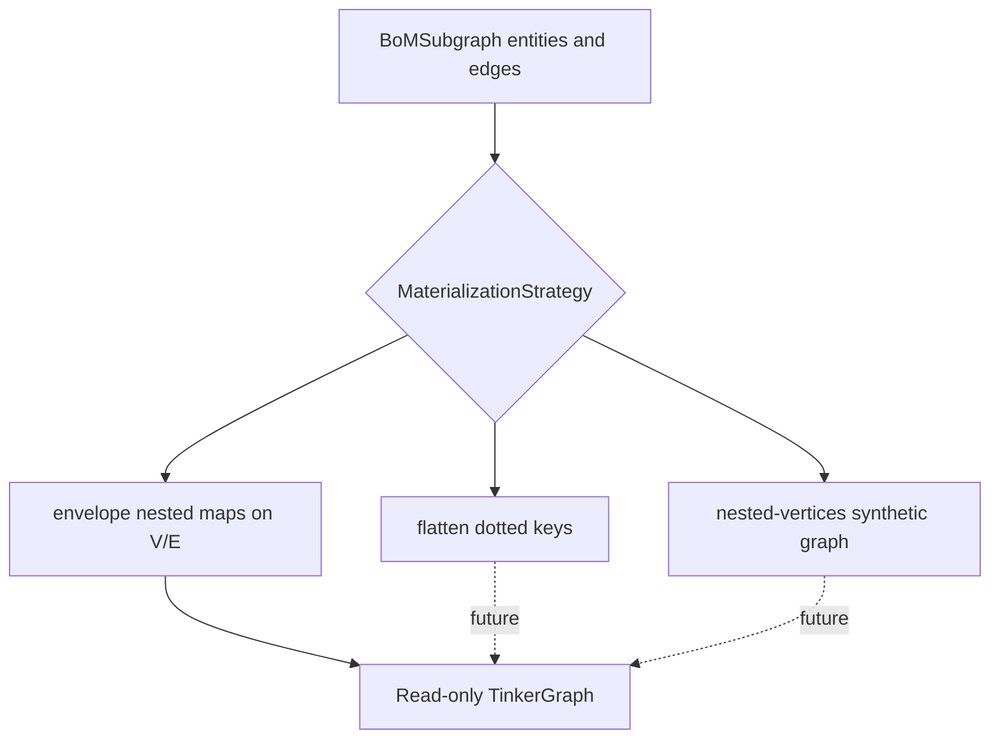
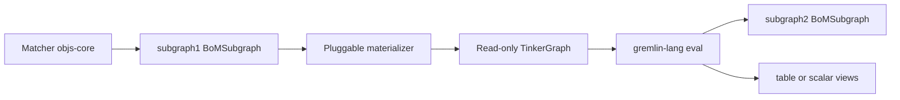

# Story: Gremlin subgraph traversal

**Slug:** `gremlin-subgraph-traversal`  
**Branch:** `gremlin-subgraph-traversal`  
**Status:** completed  
**Backlog:** C-9  
**Design:** [`docs/design/graph/gremlin.md`](../../../design/graph/gremlin.md), [`docs/design/graph/annotations-and-subgraphs.md`](../../../design/graph/annotations-and-subgraphs.md), [`docs/design/graph/object-schema-dsl.md`](../../../design/graph/object-schema-dsl.md), [`docs/design/service/rest-api.md`](../../../design/service/rest-api.md), [`docs/design/ui.md`](../../../design/ui.md)  
**Depends on:** [`matcher-query-language`](../../completed/20260729-matcher-query-language/STORY.md), [`graph-candidate-sources`](../../completed/20260805-graph-candidate-sources/STORY.md) (merged)

## Goal

Primary product path — **Gremlin stays behind the scenes** as a subgraph transform:

```text
matcher  →  subgraph1  →  traversal  →  subgraph2
              │                              │
              └─ same as Explorer/Composer    └─ BoM entities + edges
                 (any matcher)                   (Explorer-shaped)
```

1. **Select `subgraph1`** exactly as Explorer / Composer draft load: any matcher → objects + induced edges.
2. Materialize `subgraph1` as an **in-memory, read-only** TinkerGraph (objects → vertices, BoM edges → edges; hierarchical payloads via strategies, v1 `envelope`).
3. Run **gremlin-lang** on that snapshot (optional `traversalOptions`).
4. **Project the traversal result back to `subgraph2`** — a normal `BoMSubgraph` (`entities` + `edges`) whenever the result is graph-shaped — so callers and Traverse UI can treat it like Explorer output without exposing TinkerPop.

Table/scalar results remain available for analytic scripts; the **first-class** outcome for graph-oriented scripts is `subgraph2`.

Expose as: programmatic API (`:objs-gremlin-core`), REST (`:objs-gremlin-service`), Traverse UI (workbench peer view).

Existing `POST /graph/query` unchanged; matcher surface must stay full parity with Explorer/Composer.

## Confirmed decisions

| Topic | Choice |
|-------|--------|
| Engine | Apache TinkerPop **TinkerGraph** — **in-memory**, **read-only** snapshot |
| Read-only | No write-back to `BoMGraphStore`; Gremlin mutations on the snapshot are ephemeral / discouraged (docs prefer `g.V()…` reads) |
| Language | **`gremlin-lang`** script text (`GremlinLangScriptEngine`); binding `g` = `GraphTraversalSource`. **Gremlin-Groovy out of scope** |
| Traversal options | Optional `BoMGremlinTraversalOptions`: `timeoutSeconds` (default **60**), reserved `language` (default **`gremlin-lang`**; unknown → error) |
| Selection | **Same as Explorer / Composer load** — full matcher DSL → induced entities + edges (`selectAndEval` + Traverse REST). Programmatic `eval(subgraph, …)` remains for tests. |
| Topology | **Object → vertex**; **BoM edge → TinkerPop edge** |
| Identity / labels | Entity id → vertex id; entity type → vertex label; edge id → edge id; edge role → edge label |
| Hierarchical payloads | Nested `OBJECT` / `ARRAY` in DSL; **strategy-based** materialization (see below) |
| v1 strategy | **`envelope`** — store `payload`, `annotations`, and edge `properties` as nested map properties on the vertex/edge (hierarchy stays inside property values; nested objects are **not** exploded into extra vertices) |
| Strategy hook | `BoMGremlinMaterializationStrategy` (name + materialize); only `envelope` implemented in this story |
| Named future strategies | **`flatten`** (dotted keys); **`nested-vertices`** (nested `OBJECT` → child vertices + synthetic edges) — document only, not implement |
| Persistence | Snapshot only; never written back to `BoMGraphStore` |
| Gremlin Server | **Out of scope** (no separate process / WebSocket) |
| Mutate-via-Gremlin | **Out of scope** for BoM persistence |
| Security | **`gremlin-lang`** grammar limits + evaluation **timeout**; no Groovy sandbox in v1 |
| Result model | Discriminated **`BoMGremlinResult`**: kind-tagged `items` + views; **`views.graph` / `subgraph` is a full `BoMSubgraph`** when projectable (Explorer parity) |
| Subgraph2 projection | Convert traversal hits → set of objects + edges (rules below); Gremlin types never leave the engine |
| Explorer-like output | When `primary=graph` / `views.graph` present — same shape as `POST /graph/query` (`entities` + `edges`); Traverse Graph tab reuses Explorer canvas patterns |
| UI | Top-nav **Traverse**; Graph tab shows `subgraph2` like Explorer; Table / Scalar when those views exist |
| REST | `POST /api/v1/objs/graph/traverse/gremlin` with **`matcher`** (same DSL as Explorer `/graph/query`: anno / anno-expr / chained) + **`script`** (+ optional `bindings` / `strategy` / `traversalOptions`). Backend: matcher → subgraph1 → gremlin-lang → result. OpenAPI tag: **`traverse`** |
| UI matcher | Shared `MatcherQueryForm` (same modes/controls as Explorer and Composer) |
| Modules | **Separate leaf modules** — do **not** put Gremlin code in `:objs-core` / `:objs-service` |
| `:objs-gremlin-core` | Materializer, strategies, gremlin-lang engine, result types; depends on `:objs-core`; packages `org.poc.objs.gremlin.core.*` |
| TinkerPop | **`4.0.0-beta.3`** (JDK 21; G-G1) |
| `:objs-gremlin-service` | REST + Boot autoconfig for Gremlin endpoint; depends on `:objs-gremlin-core` + `:objs-service` (reuse matcher parse / graph store beans); packages `org.poc.objs.gremlin.service.*` |
| Runnable wiring | `:objs-app` gains `implementation` on `:objs-gremlin-service` so Traverse/REST are on the classpath |
| Traverse UI | Remains in `:objs-service` workbench SPA (peer view); calls Gremlin REST when `:objs-gremlin-service` is present |

## Materialization strategies (hierarchical → property graph)



| Strategy | Behaviour | This story |
|----------|-----------|------------|
| `envelope` | One vertex per entity, one edge per BoM edge; hierarchical JSON kept as nested properties | **Implement** |
| `flatten` | Scalarize nested fields to dotted / path keys on the same vertex/edge | Document only |
| `nested-vertices` | Nested `OBJECT` fields become additional vertices linked by synthetic edges | Document only |

## Pipeline: matcher → subgraph1 → traversal → subgraph2



| Layer | Owner | Notes |
|-------|--------|-------|
| Matcher | `:objs-core` | Objects + induced edges (Explorer/Composer parity) |
| Materialize | `:objs-gremlin-core` | Pluggable; v1 `envelope` → TinkerGraph |
| Traversal | `:objs-gremlin-core` | **`gremlin-lang`** script text + `traversalOptions` |
| Project | `:objs-gremlin-core` | **Public** `BoMGremlinResult`; `subgraph2` ≈ Explorer when graph-shaped |

### When is output similar to Graph Explorer?

When the script’s projected result is **graph-shaped** — i.e. it yields vertices, edges, and/or paths that can be turned into entities + edges:

| Example script intent | `primary` | Explorer-like? |
|-----------------------|-----------|----------------|
| `g.V().hasLabel('Component')` | `graph` | Yes → `subgraph2` |
| `g.V().outE('DEPENDS_ON').inV().path()` | `graph` | Yes (path elements → entities/edges) |
| `g.V().has(...).out().dedup()` | `graph` | Yes |
| `g.V().groupCount().by(label)` | `table` | No (analytic) |
| `g.E().count()` | `scalar` | No |

Callers that only care about objects/edges should read **`views.graph`** / **`subgraph`**. **Not every traversal can produce `subgraph2`** — that is expected, not a failure:

| Result kind | `subgraph` | Notes |
|-------------|------------|--------|
| Graph-shaped (V / E / path → projectable) | present | Explorer-like |
| Table / maps / `groupCount` | **absent** (`null`) | Analytic only |
| Scalar / aggregate (`count`, etc.) | **absent** | Analytic only |
| Mixed / opaque | **absent** or partial per projection rules | `primary=mixed`; use `items` |

REST still returns `200` + `BoMGremlinResult` when the script succeeds; missing `subgraph` means “no Explorer-shaped projection”, not “query failed”.

### Subgraph2 projection rules (locked)

Build `subgraph2` from the traversal result as follows:

1. Collect **entities** from every `vertex` item and every vertex appearing in a `path`.
2. Collect **edges** from every `edge` item and every edge appearing in a `path`.
3. **Induce from subgraph1:** if the result contributed **one or more vertices** and the script did **not** return any edge elements, add all edges from `subgraph1` whose **source and target are both** in the collected entity id set (same induced-edge rule as Explorer). If the script **did** return edges, use those edges only (plus path edges); do not auto-induce extra edges.
4. Dedupe entities/edges by id. Drop dangling edges whose endpoints are missing.
5. Entity/edge JSON shape matches `BoMEntity` / `BoMEdge` (Explorer / `/graph/query`).

Programmatic helper: `BoMGremlinResult.subgraphOrNull(): BoMSubgraph?` (and/or `requireSubgraph()`).

## Result representation

Gremlin scripts may return **graph elements** (vertex / edge / path), **tabular** rows (maps), or **aggregates**. Public API never returns TinkerPop types — only `BoMGremlinResult`. For graph-oriented scripts, **`views.graph` (`subgraph2`) is the main deliverable**.

### Envelope (`BoMGremlinResult`)

```json
{
  "primary": "graph",
  "items": [
    { "kind": "vertex", "value": { "id": "...", "type": "Component", "payload": {}, "annotations": {} } },
    { "kind": "edge", "value": { "id": "...", "role": "DEPENDS_ON", "source": "...", "target": "..." } },
    { "kind": "path", "value": { "labels": [], "objects": [ /* vertex|edge items */ ] } },
    { "kind": "map", "value": { "name": "foo", "count": 3 } },
    { "kind": "scalar", "value": 42 },
    { "kind": "list", "value": [ /* nested items */ ] }
  ],
  "subgraph": { "entities": [], "edges": [] },
  "views": {
    "graph": { "entities": [], "edges": [] },
    "table": { "columns": ["name", "count"], "rows": [["foo", 3]] },
    "scalar": 42
  },
  "meta": {
    "strategy": "envelope",
    "subgraph1Stats": { "entities": 10, "edges": 12 },
    "subgraph2Stats": { "entities": 4, "edges": 3 },
    "resultCount": 4,
    "durationMs": 12
  }
}
```

| Field | Role |
|-------|------|
| `items` | Ordered, kind-tagged projection of the script result (debug / mixed / non-graph) |
| `subgraph` / `views.graph` | **`subgraph2`**: Explorer-shaped `BoMSubgraph` when projectable; `null` if not graph-shaped. Prefer this field for “Gremlin as filter” callers |
| `views.table` | Map/list-of-maps / groupCount-style tabular projection |
| `views.scalar` | Single scalar / aggregate |
| `primary` | `graph` \| `table` \| `scalar` \| `list` \| `mixed` — inferred; **`graph` whenever `subgraph` is non-null** |
| `meta` | Strategy, subgraph1/2 stats, timing |

### Kind mapping (engine → item)

| Gremlin / Java result | `kind` | `value` |
|-----------------------|--------|---------|
| `Vertex` | `vertex` | BoM entity-shaped object |
| `Edge` | `edge` | BoM edge-shaped object |
| `Path` | `path` | `{ labels, objects: item[] }` |
| `Map` / `BulkSet` map-like | `map` | JSON object |
| Number / String / Boolean / null | `scalar` | JSON scalar |
| `List` / iterable of mixed | `list` or flattened into parent `items` when top-level | nested items |

Top-level script return: if `Traversal` → `toList()` then project each element into `items` (and derive `subgraph2` / views). If a single non-collection value → one `items` entry.

### UI (Traverse)

- Default tab = `primary`; when `subgraph` present, **Graph** tab is Explorer-like (same entity/edge canvas patterns)
- **Graph** → render `subgraph` / `views.graph` (`subgraph2`)
- **Table** → `views.table`
- **Scalar / JSON** → `views.scalar` or full `items`
- Optional: “Open in Explorer” / handoff using `subgraph2` JSON (nice-to-have in WI-004 if cheap)

### Non-goals for result shape

- Streaming / pagination of huge result lists (follow-up; G-G4)
- Client-supplied “force view” beyond optional request hint (optional later)
- Preserving TinkerPop-specific types (`BulkSet`, `Tree`) beyond map/list/path normalization
- Returning TinkerPop `Graph` / `Vertex` types from REST or core public API

## Stages

| Stage | Work items | Status | Exit condition |
|-------|------------|--------|----------------|
| 0 — Scaffold | WI-000 | **done** | Story folder, backlog C-9, milestone, branch |
| 1 — Core essentials | WI-001, WI-002 (`eval`) | **done** | Materializer + gremlin-lang `eval` + result projection in `:objs-gremlin-core` |
| 2 — Core selection | WI-002 (`selectAndEval`) | **done** | `selectAndEval(store, matcher→…)` using objs-core |
| 3 — Matcher REST | WI-003 | **done** | `POST /graph/traverse/gremlin` with `matcher`+`script`; wired into `:objs-app` |
| 4 — UI | WI-004 | **done** | Query peer view (`/workbench/query`) executable end-to-end |
| 5 — Docs + SBOM smoke | WI-005 | **done** | Design/REST/UI/platform docs; SBOM smoke path documented (G-G17) |

**All stages 0–5 closed.** Story archived under `completed/20260806-gremlin-subgraph-traversal/`.

### Traverse REST

```json
POST /api/v1/objs/graph/traverse/gremlin
{
  "matcher": { "anno": { "env": "test" } },
  "script": "g.V().hasLabel('Component')",
  "bindings": {},
  "strategy": "envelope",
  "traversalOptions": { "timeoutSeconds": 60, "language": "gremlin-lang" }
}
```

`matcher` is the same DSL as Explorer `POST /graph/query` (object or chained array). Backend selects induced subgraph1, materializes, runs `script`, returns `BoMGremlinResult`.

## Work Items

- [x] WI-000 — Story scaffolding (`WI-000-story-scaffold.md`)
- [x] WI-001 — `:objs-gremlin-core` module + materializer (`WI-001-gremlin-materializer.md`)
- [x] WI-002 — gremlin-lang engine + `selectAndEval` (`WI-002-gremlin-engine.md`)
- [x] WI-003 — `:objs-gremlin-service` + matcher traverse REST (`WI-003-gremlin-rest.md`)
- [x] WI-004 — Workbench Query view (`WI-004-traverse-ui.md`)
- [x] WI-005 — Design docs and SBOM smoke (`WI-005-docs-sbom.md`)

## Scope

- New Gradle modules `:objs-gremlin-core` and `:objs-gremlin-service` (settings + build files)
- Core: strategy interface + `envelope` materializer + **gremlin-lang** engine + **subgraph2 projection** + `traversalOptions`
- Service: matcher traverse REST + `:objs-app` wiring (**done**, stages 1–3)
- Query UI: `/workbench/query` — tabs Query | Matcher | Options; Structured / Raw results (**done**, stage 4)
- Design docs: `graph/gremlin.md`, platform module map, REST/UI, `AGENTS.md` (**done**, stage 5)

## Out of scope

- Adding Gremlin types or TinkerPop deps into `:objs-core` / `:objs-service` (except UI calling the API)
- Replacing or changing matcher DSL / `POST /graph/query`
- Implementing `flatten` / `nested-vertices` (document as future strategies only)
- Persistent graph DB, Gremlin Server, remote Gremlin
- Persisting Gremlin mutations back into objs
- **Gremlin-Groovy**; implementing SPARQL / GQL dialects (reserve `traversalOptions.language` only — Apache sparql-gremlin removed in TinkerPop 4)
- Production-hardened multi-tenant sandbox beyond gremlin-lang grammar + timeout
- Result pagination / hard size caps (follow-up if needed)
- Rich path canvas visualization beyond structured JSON / path list in v1 (optional reuse if cheap)

## Gaps

See [`GAPS.md`](GAPS.md).
