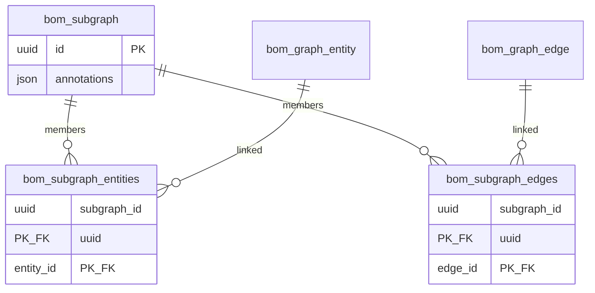

# Story: Subgraphs materialization

**Slug:** `subgraphs-materialization`  
**Branch:** `subgraphs-materialization` (track `origin/subgraphs-materialization`)  
**Status:** completed  
**Backlog:** [C-12](../../BACKLOG.md)  
**Base:** `origin/dev` (includes C-11 composer-draft-shopping)  
**Design:**  
[`annotations-and-subgraphs.md`](../../../design/graph/annotations-and-subgraphs.md),  
[`persistence.md`](../../../design/graph/persistence.md),  
[`rest-api.md`](../../../design/service/rest-api.md),  
[`ui.md`](../../../design/ui.md)  
**Process:** [`docs/workitems/RULES.md`](../../RULES.md)

## Cold start (read this first)

### What you are building

You **always create a subgraph** (header `id` + `annotations` + membership). The only product split is how members get there:

| Mode | Name | What is stored | Object identity |
|------|------|----------------|-----------------|
| **Soft** | Create / save membership | Links to **existing** entity/edge ids | Same ids; resolve is **live** (latest payloads) |
| **Hard** | Snapshot | Clone entities/edges (**new** ids) + links to those clones | New ids; **governance evidence pack** — decision-time copy; app treats as immutable (objs store can still mutate) |

Snapshot is not a different resource type — it is hard materialization that ends in the same soft-link tables pointing at the clones. The **new subgraph is required**: it is the citable evidence/decision artifact (open, query, annotate), not an optional wrapper around clones.

### What already exists (do not rebuild)

| Area | Location |
|------|----------|
| Domain `BoMEntity` / `BoMEdge` / `BoMSubgraph` | `objs-core/.../domain/BoMEntity.kt` |
| JPA `bom_graph_entity` / `bom_graph_edge` | `objs-core/.../persistence/BoMEntityRecord.kt` |
| Flyway V1–V4 | `objs-core/src/main/resources/db/migration/`, `objs-core/.../db/migration/V4__*.kt` |
| Store facade | `objs-core/.../persistence/BoMGraphStore.kt` (`write` / `mutate` / `selectSubgraph`) |
| Matcher DSL (`anno`, `anno-expr`, `obj-expr`, `ids`, chains) | `objs-core/.../match/BoMMatcherDsl.kt` |
| `ids` matcher (closest cousin) | `objs-core/.../match/BoMIdsMatcher.kt` |
| Graph REST | `objs-service/.../web/ObjsGraphController.kt` |
| Composer / draft merge | `objs-service/ui/src/ObjectLinterPage.tsx`, `graphDraft.ts`, `AddObjectsPanel.tsx` |
| Induced selection semantics | `docs/design/graph/annotations-and-subgraphs.md` |

There is **no** persisted subgraph membership today. Annotation matchers select **ephemeral** induced subgraphs.

### Agent execution rules

1. Implement **one WI at a time** in tracker order (after WI-000).
2. Mark WI `[x]` in this file **before** starting the next.
3. One commit per finished WI: code + tests + story/WI tracker updates; then `git push`.
4. Do **not** story-close / move to `completed/` / set C-12 `done` unless the user explicitly asks.
5. Prefer Kotlin in `:objs-core` / `:objs-service`; UI TypeScript in `objs-service/ui`.
6. Concrete example: **G-S10 = no** — do **not** change `:objs-sbom-example` for this story; smoke against generic APIs + existing seeded graph.

### Suggested first command after checkout

```bash
git fetch origin
git checkout subgraphs-materialization
git pull
./gradlew :objs-core:test :objs-service:test -q
```

Next executable WI: **WI-001**.

---

## Goal

```text
# Soft — create subgraph + links to existing objects (live)
POST /subgraphs { annotations, entityIds, edgeIds }
  → bom_subgraph + membership → resolve → same ids, latest payloads

# Hard — snapshot: clone then create subgraph + links to clones
POST /subgraphs/{id}/snapshot { annotations }   # required; used for new header AND cloned entities
  → clone entities/edges (new UUIDs, remap edges)
  → new bom_subgraph (header annotations := request map)
  → membership → clones; overlay request map onto each cloned entity
  → source subgraph/objects unchanged
```

**Out of this story:** Gremlin `flatten` / `nested-vertices` (deferred G-S9).

## Confirmed decisions

| Topic | Choice |
|-------|--------|
| Soft model | M2M: subgraph ↔ entities, subgraph ↔ edges |
| Header table | `bom_subgraph(id UUID PK, annotations JSON NOT NULL)` — same **shape** as entity annotations (`Map<String,String>`); **no** platform vocabulary (G-S11: free-form, app-defined); no `name`/`description` columns |
| Membership | `bom_subgraph_entities(subgraph_id, entity_id)`; `bom_subgraph_edges(subgraph_id, edge_id)` |
| Liveness | Soft links are live id pointers (G-S12) |
| Edge write rule | Edge may join a subgraph only if both endpoint entity ids are already members |
| Delete | Delete entity/edge → CASCADE membership in **all** subgraphs; delete subgraph → membership only |
| **Snapshot (hard)** | Always creates a **new** subgraph. Given source `subgraphId` + required `annotations`: clone members (new ids), remap edges, set **new header annotations := request map**, merge-overlay same map onto each **cloned entity**, link new subgraph to clones; source unchanged (G-S13–G-S15) |
| Matcher | **`subg-expr`** for UI pack discovery (Explorer/Composer); **get-by-id** domain+REST for app-held refs; optional matcher `subgraph: { id }` sugar (G-S7) |
| REST | `/api/v1/objs/graph/subgraphs` + `POST …/{id}/snapshot` |
| UI | Composer save / open (**replace** draft — G-S3) / snapshot |

### Soft vs hard (G-S15) and snapshot locks (G-S13–G-S14)

| Step | Soft create | Hard snapshot |
|------|-------------|---------------|
| Creates `bom_subgraph` | yes | yes (new id) |
| Membership targets | existing ids | **new** clone ids |
| Request `annotations` | header of that subgraph | **required**; header of **new** subgraph **and** overlay on each cloned entity |
| Source subgraph | n/a | unchanged |

| Snapshot detail | Behaviour |
|-----------------|-----------|
| Input | `subgraphId`, `annotations` (**required** field; `{}` allowed) |
| Resolve | Current soft members (live) |
| Clone entity | New UUID; copy `type`, `schemaVersion`, `payload` (deep); annotations = source ⊕ request map (overlay) |
| Clone edge | New UUID; remap `source`/`target`; copy role/type/schemaVersion/properties |
| New subgraph header | `annotations` := request map **exactly** (not source header) |
| Persist | Clones via graph write; then membership to clones |
| Unchanged | Source subgraph membership; source entity/edge rows |

Gaps detail: [`GAPS.md`](GAPS.md).

## Data model



### DDL sketch (WI-001 — adapt to next Flyway version)

```sql
CREATE TABLE bom_subgraph (
    id UUID NOT NULL PRIMARY KEY,
    annotations JSON NOT NULL
);

CREATE TABLE bom_subgraph_entities (
    subgraph_id UUID NOT NULL,
    entity_id UUID NOT NULL,
    PRIMARY KEY (subgraph_id, entity_id),
    CONSTRAINT fk_bse_subgraph FOREIGN KEY (subgraph_id) REFERENCES bom_subgraph (id) ON DELETE CASCADE,
    CONSTRAINT fk_bse_entity FOREIGN KEY (entity_id) REFERENCES bom_graph_entity (id) ON DELETE CASCADE
);

CREATE TABLE bom_subgraph_edges (
    subgraph_id UUID NOT NULL,
    edge_id UUID NOT NULL,
    PRIMARY KEY (subgraph_id, edge_id),
    CONSTRAINT fk_bsg_subgraph FOREIGN KEY (subgraph_id) REFERENCES bom_subgraph (id) ON DELETE CASCADE,
    CONSTRAINT fk_bsg_edge FOREIGN KEY (edge_id) REFERENCES bom_graph_edge (id) ON DELETE CASCADE
);

CREATE INDEX idx_bse_entity ON bom_subgraph_entities (entity_id);
CREATE INDEX idx_bsg_edge ON bom_subgraph_edges (edge_id);
```

## REST contract (v1)

| Method | Path | Body / notes |
|--------|------|----------------|
| `GET` | `/api/v1/objs/graph/subgraphs` | List `{ id, annotations, entityCount, edgeCount }[]` |
| `POST` | `/api/v1/objs/graph/subgraphs` | `{ id?, annotations, entityIds[], edgeIds[] }` → create |
| `GET` | `/api/v1/objs/graph/subgraphs/{id}` | `{ id, annotations, subgraph: BoMSubgraph }` |
| `PUT` | `/api/v1/objs/graph/subgraphs/{id}` | Replace annotations + membership |
| `DELETE` | `/api/v1/objs/graph/subgraphs/{id}` | Drop header + membership |
| `POST` | `/api/v1/objs/graph/subgraphs/{id}/snapshot` | `{ "annotations": {…} }` **required**; hard materialize → new subgraph + clones |

Errors: missing subgraph → `404`; invalid membership / validation → `400` with issues where applicable.

### Matcher DSL

```yaml
# UI pack discovery (Explorer / Composer)
subg-expr: "a.decisionId == 'D-42'"

# Optional sugar when app holds subgraphId
subgraph:
  id: "11111111-1111-1111-1111-111111111111"
```

`POST /api/v1/objs/graph/query` with either form returns **member** entities + **stored** member edges.  
**Programmatic open by id** (preferred for refs): `GET /api/v1/objs/graph/subgraphs/{id}` (domain `get`).

## Stages

| Stage | WIs | Ready when |
|-------|-----|------------|
| 0 Scaffold | WI-000 | done |
| 1 Persistence + store | WI-001, WI-002 | after WI-000 |
| 2 REST + matcher | WI-003, WI-004 | after WI-002 |
| 3 Snapshot | WI-007 | after WI-002 + WI-003 |
| 4 Composer + docs | WI-005, WI-006 | after WI-004 + WI-007 |

## Out of scope

- Automatic historization on soft links (use snapshot)
- Gremlin materialization strategies
- Membership encoded only in entity annotations
- Gremlin Server / mutate-via-Gremlin persistence
- Induce-on-save helper (G-S5 deferred)
- Closing the story without explicit user request

## Work Items

- [x] WI-000 — Story scaffolding (`WI-000-story-scaffold.md`)
- [x] WI-001 — Flyway + JPA membership tables (`WI-001-subgraph-persistence.md`)
- [x] WI-002 — Domain store: CRUD + resolve (`WI-002-subgraph-store.md`)
- [x] WI-003 — REST CRUD `/graph/subgraphs` (`WI-003-subgraph-rest.md`)
- [x] WI-004 — Matcher `subg-expr` + id sugar; get-by-id via REST (`WI-004-subgraph-matcher.md`)
- [x] WI-007 — Snapshot domain + REST (`WI-007-subgraph-snapshot.md`)
- [x] WI-005 — Composer save / open / snapshot (`WI-005-composer-subgraph-ui.md`)
- [x] WI-006 — Design docs (`WI-006-docs.md`)
