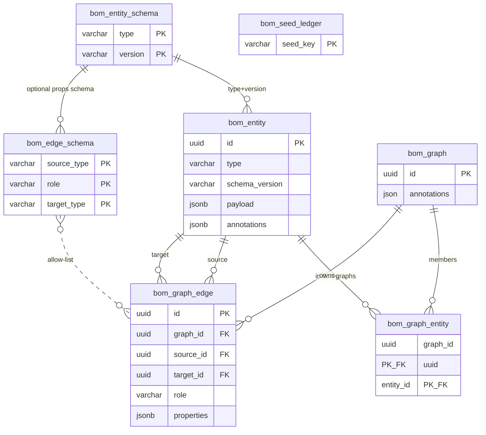

# Story: Graphs from objects

**Slug:** `graphs-from-objects`  
**Branch:** `graphs-from-objects` (track `origin/graphs-from-objects`)  
**Status:** closed  
**Backlog:** [C-13](../../BACKLOG.md)  
**Archived:** `docs/workitems/completed/20260811-graphs-from-objects/`  
**Base:** `origin/dev` (includes C-12 subgraphs-materialization)  
**Design:**  
[`model.md`](../../../design/graph/model.md),  
[`annotations-and-matchers.md`](../../../design/graph/annotations-and-matchers.md),  
[`persistence.md`](../../../design/graph/persistence.md),  
[`rest-api.md`](../../../design/service/rest-api.md),  
[`ui.md`](../../../design/ui.md)  
**Process:** [`docs/workitems/RULES.md`](../../RULES.md)

## Cold start (read this first)

### What you are building

There is **no global graph** and **no “subgraph” product concept**.

| Concept | Role |
|---------|------|
| **Global entity pool** | `bom_entity` — typed objects (payload + annotations). Building blocks only. |
| **Graph** | `bom_graph` — durable graph header + members. **The** graph you open/query/edit. |
| **Membership** | `bom_graph_entity` M2M — same entity may sit in **many** graphs; zero rows = **orphan**. |
| **Edges** | `bom_graph_edge` with **`graph_id` NOT NULL** — always owned by **one** graph (not a global edge pool). |
| **Schemas** | `bom_entity_schema` / `bom_edge_schema` — catalogs / allow-list only (not a graph). |
| **Snapshot (foundation)** | Optional **clone** op: new independent graph (new entity/edge ids). **No** parent/lineage columns on `bom_graph`. |
| **Snapshot hierarchy** | **Out of foundation** — apps record lineage (annotations, own tables, etc.) |

```text
Create entity in graph G
  → upsert row in bom_entity (pool)
  → insert bom_graph_entity(G, entityId)

Create edge in graph G
  → insert bom_graph_edge(..., graph_id=G)
  → both endpoints must already be members of G

Clone/snapshot(G)   # foundation primitive only
  → new bom_graph G' (header annotations from request; no parent FK)
  → clone members + edges into G'
  → source unchanged
  → app may stamp lineage in annotations if it wants a hierarchy
```

**Product language:** **graph** everywhere in objs. “Snapshot hierarchy” is an **application** concern (e.g. SBOM), not objs schema.

### What already exists (do not rebuild from scratch)

| Area | Location |
|------|----------|
| Soft-link packs (C-12) | `bom_subgraph` + M2M; `BoMSubgraphStore`; `/api/v1/objs/graph/subgraphs` |
| Entity/edge pool (misnamed) | `bom_graph_entity` / `bom_graph_edge` — treat as **rename sources** |
| Schemas | `bom_graph_entity_schema` / `bom_graph_edge_schema` |
| Snapshot algorithm | `BoMSubgraphStore.snapshot` — retarget as optional **clone** (no lineage columns) |
| Matchers | **Minimal set:** `graph-expr`, `obj-expr`, chained array — see § Matchers |
| Composer Save/Open | Elevate to **graph**; drop “whole store as graph”; hierarchy not in workbench |
| Base story archive | [`completed/20260807-subgraphs-materialization/`](../../completed/20260807-subgraphs-materialization/STORY.md) |

### Agent execution rules

1. Implement **one WI at a time** in tracker order (after WI-000).
2. Mark WI `[x]` in this file **before** starting the next.
3. One commit per finished WI: code + tests + story/WI tracker updates; then `git push`.
4. Do **not** story-close / archive / set C-13 `done` unless the user explicitly asks.
5. Prefer Kotlin in `:objs-core` / `:objs-service`; UI TypeScript in `objs-service/ui`.
6. Consumer-visible model change → **update `:objs-sbom-example`** in WI-006 (required).
7. **Stage gates (mandatory):** finish all WIs in a stage → run that stage’s automated checks → hand the user the **manual test checklist** → **STOP**. Do **not** start the next stage until the user explicitly confirms (e.g. “stage 1 ok, proceed”).

### Suggested first command after checkout

```bash
git fetch origin
git checkout graphs-from-objects
git pull
./gradlew :objs-core:test :objs-service:test -q
```

Next executable WI after scaffold: **WI-001**.

---

## UI cold start (Workbench)

Today’s UI still assumes a **global graph** with optional soft-link packs. C-13: **graphs** only; no pack chrome; no foundation snapshot-tree UX.

| Today | Target |
|-------|--------|
| Explorer whole-store query | Query **inside** selected graph |
| Composer global Save | Save = mutate **current graph** |
| Open packs / many matcher modes | **Open graph…**; matchers **graph-expr / obj-expr / chained** |
| Schema catalog | Unchanged |

**Must have:** current-graph context; Open/Create/Save graph; matcher modes **`graph-expr` / `obj-expr` / chained** only; no whole-store Exec/Save. Snapshot hierarchy UI **not** in objs workbench.

Normative UI WI: [`WI-005-workbench-graphs.md`](WI-005-workbench-graphs.md) (includes file-level review). Design sync: [`ui.md`](../../../design/ui.md) in WI-001 sketch + WI-007 final.

---

## Goal

```text
# No global graph — many graphs over a shared entity pool

bom_entity              = global objects (orphans OK)
bom_graph               = graph header
bom_graph_entity        = entity ∈ 0..n graphs (M2M)
bom_graph_edge.graph_id = edge belongs to exactly one graph

# REST (target)
/api/v1/objs/entities/**     pool CRUD
/api/v1/objs/graphs/**       graph CRUD, membership, edges, resolve, query, optional clone

# Kill
PUT/POST unscoped /graph as "the whole store is one graph"
```

## Keep C-13 simple (scope cut)

**One** inversion: no global graph → entity pool + many graphs (+ renames + graph-local edges).

| In C-13 (must) | Thin / optional | Not in objs foundation |
|----------------|-----------------|-------------------------|
| Table renames + edge `graph_id` | Clone graph API (independent new graph) | **Snapshot hierarchy / lineage tree** |
| Graph-scoped store / REST / query | UI current-graph context | Object content versioning |
| Matchers: `graph-expr` / `obj-expr` / chained | | Legacy `anno` / `ids` / `subg-expr` keys |
| Kill whole-store-as-graph | Retire “pack” wording | Auto-version N→M graphs |
| SBOM: use **graphs** (not packs) | | App-specific snapshot genealogy |
| Cleanup | | `parent_graph_id` / `kind` on `bom_graph` |

## Confirmed decisions

| Topic | Choice |
|-------|--------|
| Product language | **Graph** — no packs / subgraph packs |
| Entity membership | M2M — same entity in many graphs |
| Orphans | Allowed |
| Edges | Graph-local (`graph_id` NOT NULL) |
| Graph delete | Membership + edges CASCADE; entity rows kept |
| `bom_graph` header | **`id` + `annotations` only** — no parent/kind columns |
| Clone | Optional foundation op → new graph; **no** stored parent link |
| Snapshot hierarchy | **Application-level** (annotations or app tables) — not objs core |
| Matchers | **Minimal:** `graph-expr` + `obj-expr` + chained only |
| Table renames | In scope |
| REST | `/graphs` + entity pool |
| UI | Current graph; Open/Save; matcher three modes |
| Cleanup | WI-008 |

Gaps: [`GAPS.md`](GAPS.md).

## Matchers (minimal set)

Overarching DSL after C-13 — **`all`**, **`graph-expr`**, **`obj-expr`**, chained. Everything else is expressed through these (or removed in WI-008).

| DSL | Matches | Returns |
|-----|---------|---------|
| **`graph-expr`** | Graphs: JEXL over header `id` + `a` (graph annotations) | **Stored** member entities + **graph-local** edges of matching graph(s) (union if many) |
| **`obj-expr`** | Objects: JEXL over `id`, `type`, `schemaVersion`, `a.*`, `p.*` (as today) | Matching entities; edges among survivors **within the active graph scope** (stored edges with both ends kept — not whole-store induce) |
| **chained** (JSON/YAML array) | Ordered stages (as today) | Stage 0 may be `graph-expr` (source); later stages typically `obj-expr` filters |

```yaml
# Open / select graph(s) by header
graph-expr: "id == '…' || a.env == 'prod'"

# Filter objects (same bindings as today)
obj-expr: "type == 'Component' && a.app == 'payments' && p.kind == 'library'"

# Graph then filter objects inside those graphs' members
- graph-expr: "a.decisionId == 'D-42'"
- obj-expr: "type == 'Component'"
```

### Parity with today’s keys (retire in cleanup)

| Old | Express with |
|-----|----------------|
| `subg-expr` | `graph-expr` (same header bindings `id`, `a`) |
| `subgraph: { id }` | `graph-expr: "id == '<uuid>'"` |
| `obj-expr` | `obj-expr` (unchanged) |
| `anno: {k: v}` | `obj-expr: "a.k == 'v' && …"` |
| `anno-expr: "k == 'v'"` | `obj-expr: "a.k == 'v'"` (anno keys live under `a`, not top-level) |
| `ids: […]` | `obj-expr: "id == '…' \|\| id == '…'"` (or chained equals) |
| chained array | chained array |

**Scope rule:** With no global graph, `obj-expr` alone is not “scan the whole pool as a graph”. Prefer stage-0 `graph-expr` (or API path `/graphs/{id}/query` fixing the graph) then `obj-expr`. Exact default when `obj-expr` is used alone (reject vs require graph id vs scan pool) — **reject without graph scope** unless stage-0 `graph-expr` provided (lock G-G16).

**UI:** `MatcherQueryForm` modes → `graph-expr` / `obj-expr` / chained only.

## Table rename map

| Old | New | Role |
|-----|-----|------|
| `bom_graph_entity` | **`bom_entity`** | Global entity pool |
| `bom_graph_entity_schema` | **`bom_entity_schema`** | Entity schemas |
| `bom_graph_edge_schema` | **`bom_edge_schema`** | Allow-list |
| `bom_subgraph` | **`bom_graph`** | Graph header |
| `bom_subgraph_entities` | **`bom_graph_entity`** | Membership M2M |
| `bom_graph_edge` | **`bom_graph_edge`** | + `graph_id` NOT NULL |
| `bom_subgraph_edges` | **dropped** | Replaced by `graph_id` |
| `bom_seed_ledger` | unchanged | |

**Migration order:** rename pool → `bom_entity` **before** renaming membership → `bom_graph_entity`. Column `subgraph_id` → `graph_id`. **Do not** add `parent_graph_id` / `kind` on `bom_graph`.

## Final ER (all tables)



**Invariant:** edge endpoints must be members of `edge.graph_id`.

## Stages (incremental — manual confirm each)

Each stage is a **ship + stop** slice. After the stage’s WIs are `[x]` and pushed:

1. Agent runs **Automated**.
2. Agent pastes **Manual test** checklist and waits.
3. User tests and replies **confirm** (e.g. `stage 1 confirmed` / `proceed to stage 2`).
4. Only then start the next stage’s first WI.

| Stage                     | WIs        | What you can try | Automated            | Manual confirm focus                                |
| ------------------------- | ---------- | ---------------- | -------------------- | --------------------------------------------------- |
| **0** Scaffold            | WI-000     | Docs/branch only | —                    | done                                                |
| **1** Design + DB + store | WI-001…003 | Unit/store tests | `:objs-core:test`    | Schema; pool/graph/clone; **graph-expr / obj-expr** |
| **2** REST                | WI-004     | curl / OpenAPI   | `:objs-service:test` | `/graphs` + pool; three matchers; no global graph   |
| **3** Workbench           | WI-005     | Browser          | UI vitest if any     | Current graph; three matcher modes                  |
| **4** SBOM + docs         | WI-006…007 | SBOM profile     | example tests        | Seeds as graphs; docs match                         |
| **5** Cleanup             | WI-008     | Full regression  | core+service+example | No pack / old matcher leftovers                     |

### Stage 1 — Manual test

```text
[ ] Design docs describe pool + graphs (no global graph; no snapshot hierarchy in foundation)
[ ] Flyway applies on empty H2/Postgres (tables: bom_entity, bom_graph, bom_graph_entity, bom_graph_edge, …)
[ ] Create orphan entity (no membership)
[ ] Create graph; attach same entity to two graphs
[ ] Create edge only when both ends are members; reject otherwise
[ ] Resolve graph returns only its members/edges
[ ] Clone (if present) → new graph, new ids, source unchanged
[ ] Delete graph → entities remain; edges of that graph gone
[ ] `graph-expr` selects graph(s) → members + graph-local edges
[ ] chained `graph-expr` then `obj-expr` filters members
[ ] `obj-expr` alone without graph scope fails closed
```

**Confirm:** `stage 1 confirmed` → start WI-004.

### Stage 2 — Manual test

```text
[ ] POST/GET entity pool works without a graph
[ ] POST/GET/PUT/DELETE /api/v1/objs/graphs/…
[ ] Attach/detach members; create edge under graph id
[ ] POST …/graphs/{id}/query with `obj-expr` / chained
[ ] Query with `graph-expr` (path or body) returns that graph’s members
[ ] Old keys `anno` / `anno-expr` / `ids` / `subg-expr` / `subgraph` rejected
[ ] Unscoped whole-store-as-graph mutate/query gone or rejected
[ ] OpenAPI documents three matcher forms only
[ ] Optional: POST …/clone → independent graph
```

**Confirm:** `stage 2 confirmed` → start WI-005.

### Stage 3 — Manual test

```text
[ ] Workbench shows / selects a current graph
[ ] Cannot Exec/Save meaningfully without a graph (clear CTA)
[ ] Open graph loads members; Save persists to that graph
[ ] Explorer/Composer/Query matcher modes: graph-expr / obj-expr / chained only
[ ] Composer create entity lands in pool + current graph; edges are graph-local
[ ] No “Open packs” / subgraph-pack primary chrome
[ ] Schema catalog still works (global)
```

**Confirm:** `stage 3 confirmed` → start WI-006.

### Stage 4 — Manual test

```text
[ ] SBOM example / seeds create and use graphs (not global soup)
[ ] Demo path still runs under objs-app
[ ] Design + ui/rest docs match behaviour
```

**Confirm:** `stage 4 confirmed` → start WI-008.

### Stage 5 — Manual test

```text
[x] No production references to bom_subgraph* / SoftLink / anno|ids|subg-expr|subgraph DSL / global-graph Save
[x] Full test suite green
[x] Smoke Open/Save/query with all + graph-expr + obj-expr still works
```

**Confirm:** `stage 5 confirmed` / story closed 2026-08-11 → archived.

## Out of scope

- Sharing **edges** across graphs
- Snapshot **hierarchy** in foundation (`parent_graph_id` / tree UI)
- Object content versioning; auto-version on shared edit
- Gremlin `flatten` / `nested-vertices` (G-S9 follow-up)
- Platform-reserved annotation vocabulary
- Story closure without explicit user request

## Work Items

- [x] WI-000 — Story scaffolding (`WI-000-story-scaffold.md`)
- [x] WI-001 — Design docs: pool vs graphs (`WI-001-design-model.md`)
- [x] WI-002 — Flyway renames + edge `graph_id` (`WI-002-persistence-rename.md`)
- [x] WI-003 — Domain stores: pool, graph, clone, matchers (`WI-003-domain-store.md`)
- [x] WI-004 — REST `/graphs` + entity pool (`WI-004-rest-graphs.md`)
- [x] WI-005 — Workbench graph-centric UI (`WI-005-workbench-graphs.md`)
- [x] WI-006 — SBOM example + seeds (`WI-006-sbom-seeds.md`)
- [x] WI-007 — Docs sync (`WI-007-docs.md`)
- [x] WI-008 — Aggressive cleanup (`WI-008-cleanup.md`, inventory [`CLEANUP.md`](CLEANUP.md))
