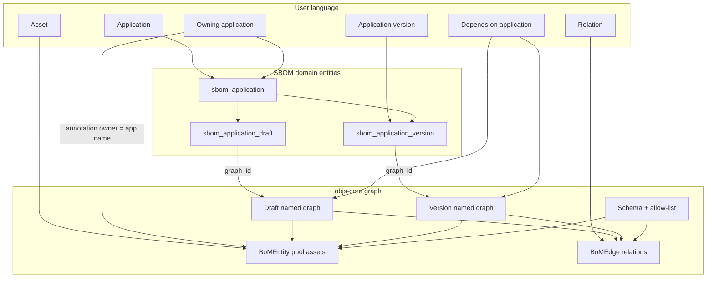

# Graph design and data retrieval strategies

**Story:** [`STORY.md`](STORY.md)  
**Audience:** engineers implementing D-2  
**Status:** normative for Stage 2–3 (WI-002)  
**Rule:** End-user UI and domain API **must not** expose terms from this document (graph, entity, edge, matcher, pool, annotation, …).

This document maps locked product requirements to **hybrid** storage (SBOM domain tables + objs graph) and how to **read/write** each capability. Gaps are decided in WI-003 / [`FOUNDATION-BACKLOG.md`](FOUNDATION-BACKLOG.md).

**Product glossary:** [`docs/design/sbom/example.md`](../../../design/sbom/example.md)  
**Personas (UI only):** Applications tab (J1–J2) vs Portfolios tab (J3 taxonomy + MI). MI selection pipeline: R21 → R22 → graph-id-set matcher (**FB-5**) → Gremlin (**FB-4**).

---

## 1. Hybrid persistence (normative)

**Lock (G-A6 / G-P3):** objs graph describes **assets** and BOM structure. The SBOM example **may** introduce its own tables for inventory metadata (classic enterprise app registry). Link domain rows ↔ graph with **stable ids and/or annotations** — do not duplicate assets outside objs.

| Layer | Owns | Examples |
|-------|------|----------|
| **SBOM domain DB** (example module) | Application inventory; **edit drafts**; **app versions**; **portfolios** (taxonomy); lifecycle rows with `graph_id` where needed | `sbom_application`; draft/version (+ `graph_id`); `sbom_portfolio` + subject-area tree + membership |
| **objs graph** (`objs-core`) | Assets (pool entities), relations (graph-local edges) **inside** each draft/version graph | One **separate named graph per** draft row and per version row |

```text
sbom_portfolio
       └─ subject areas (tree folders)
              └─ applications (each app ≤ 1 placement per portfolio)

sbom_application
       │
       ├─ sbom_application_draft  ──graph_id──► named graph (editable BOM)
       │                                              ├─ assets (BoMEntity)
       │                                              └─ relations (BoMEdge)
       │
       └─ sbom_application_version ──graph_id──► named graph (version BOM)
                                                      ├─ assets
                                                      └─ relations

owning annotation: owner=<application name>  ──► sbom_application.name
```

**Rule:** do not overload one graph for draft and version. **Each draft/version domain entity → its own graph.** Portfolios are **domain-only** (no portfolio graph).

**Anti-patterns:** storing component payloads only in SBOM tables; calling `objs-service` REST; exposing raw graph ids as primary UX; sharing one graph across draft and version rows; modeling portfolio taxonomy as objs entities.

---

## 2. Product concepts → storage (hidden mapping)

| User concept | Storage | Notes |
|--------------|---------|-------|
| **Application** (inventory entry) | **SBOM entity/table** (name, description, …) | Search/list apps = domain persistence |
| **Portfolio** | **SBOM entities**: portfolio + subject-area tree + **application** membership | Domain-only. Membership is **application id only** (no version). Used to **combine apps and their SBOMs/graphs**. App **once per portfolio** |
| **Subject area** | Folder node in portfolio taxonomy (parent/child) | Editable tree; 0+ applications |
| **Edit draft** | **SBOM entity** + **`graph_id` → separate named graph** | Maintainer edits this graph; not a version |
| **Application version** | **SBOM entity** + **`graph_id` → separate named graph** | Created from draft (copy); historical BOM. **Latest** = max(`captured_at`), tie-break `id` (R22) |
| **Portfolio level** | Selected subject-area node or portfolio root | R21 → application set; no objs |
| **MI report run** | Domain orchestration over R21→R22→matcher→Gremlin | See §4.5; **FB-4** / **FB-5** |
| **Link** | Every draft/version row has its own `graph_id`; graphs may carry `applicationId` annotation | Bidirectional join must be reliable |
| **Working BOM** (editable) | Contents of the **draft’s** graph | Assets + relations only in graph |
| **Asset** (component, DB, …) | objs pool **entity** | Never a parallel SBOM asset table for payload |
| **Relation** between assets | Graph-local **edge** (in that draft/version graph) | Display label via **role beautifier** (+ optional overrides) — G-P6 |
| **Reuse asset** | `attach` / membership on the **draft** (or target) graph | |
| **Create asset** | Pool upsert, then attach; optional annotation `owner` = application **name** | Immediately visible in assets inventory |
| **Owning application** | Entity annotation **`owner`** = **application name** (G-P5) | Distinct from “used by”; resolve via `sbom_application.name` |
| **App → app dependency** | **Inferred** — shared pool assets across apps’ BOM graphs (G-P4). No ApplicationRef; no explicit app-dep edges | Version V’s members define the freeze set for “deps at V” |
| **Shared asset usage** | Membership of an asset in this app’s version/draft graph that also appears in another app’s graph (and/or has another owner — G-P5) | |
| **Duplicate candidates** | Identity projection on objs entities | G-F2 |



---

## 3. Lifecycle sketches

### 3.1 Draft vs version (G-P2 / G-F5) — locked shape

**Normative:** SBOM domain entities for **edit draft** and **app version** (plus application). **Each has its own `graph_id`** → separate objs named graph.

1. Maintainer edits the **draft** entity’s graph (attach/detach assets, relations between assets). App→app dependency is **not** edited explicitly (G-P4).  
2. “Create version” creates a **new version entity** + **new graph**, copying memberships/edges from the draft graph (immutable-after-create preferred for the version graph).  
3. Draft continues to evolve independently; versions remain historical.

Soft-link packs / shared graphs across draft and version are **out** unless explicitly reopened.

### 3.2 Application owner edit path (Journey 1)

```text
search applications (sbom_application)
  → open edit draft (domain row → its graph_id)
    → add asset: search pool (J2) OR create asset (pool upsert + attach to draft graph)
    → remove asset / amend relations on draft graph
    → (no app-dep encoding — inferred from shared assets, G-P4)
  → create application version: new version entity + new graph (copy from draft)
```

Domain services use **SBOM repositories +** `BoMGraphStore` / `BoMNamedGraphStore` (no HTTP to `/api/v1/objs`).

---

## 4. Retrieval strategies by requirement

Legend: **OK** = feasible with current core APIs · **GAP** = likely foundation work · **DOMAIN** = example service composition (SBOM tables and/or objs)

| # | User capability | Strategy (sketch) | Layer |
|---|-----------------|-------------------|-------|
| R1 | Search applications | Query **`sbom_application`** (name, description, …) | DOMAIN **OK** (G-F3 resolved) |
| R2 | Load edit draft BOM | Draft entity → `graph_id` → `graphs.get` / `selectInGraph` → domain DTOs | DOMAIN **OK** |
| R3 | Add existing asset to application | `attach` on **draft** graph | DOMAIN **OK** |
| R4 | Create asset then use | Pool upsert + `attach` to draft graph; optional `owner` = app **name** | DOMAIN **OK** |
| R5 | Remove asset / amend relations | `detach` / `mutate` on **draft** graph | DOMAIN **OK** |
| R6 | Create application version | New version **entity** + new named graph; copy members/edges from draft graph | DOMAIN; copy helper may be **G-F5** |
| R7 | Version: which apps did we depend on? | Members of version graph → find other apps whose graphs also contain those assets (G-P4); join `sbom_application` | DOMAIN; may need **G-F1** / multi-graph scan |
| R8 | Version: which shared assets? | Members that also appear in other apps’ graphs (owner label optional via G-P5) | DOMAIN |
| R9 | Search assets by type | `selectFromPool` with type constraint / `obj-expr` | DOMAIN **OK** |
| R10 | Advanced search (schema text fields) | Form over **`searchable` only**; pushdown when possible else **slow path** (G-F4) | DOMAIN; improve pushdown → **FB-3** |
| R11 | Asset usage: which apps + how | Entity → graph memberships → map `graph_id` to SBOM app/version rows + incident roles | **G-F1** + DOMAIN join |
| R12 | Duplicates by identifier | `BoMIdentityProjection` + find-by-identity | **G-F2** |
| R13 | Owning application on asset | Read/write annotation `owner` (app name); resolve via `sbom_application.name` | DOMAIN **OK** (G-P5) |
| R14 | App depends on other apps | **Inferred** from shared objects (G-P4) — do not encode | DOMAIN |
| R15 | Portfolios / subject areas | CRUD portfolio + tree; place/remove **applications** (no version); unique app per portfolio | DOMAIN **OK** (no objs) |
| R16 | Weak CycloneDX export (demo) | Load draft/version `graph_id`; map Component + DEPENDS_ON (+ root app) → CDX JSON 1.6; omit rest | DOMAIN; optional schema tweaks **G-A7** |
| R17 | MI-1 Portfolio composition | R21→R22 graph ids → id-set matcher → Gremlin aggregates (counts by type, relation density) | **G-F7** / **G-F8**; DOMAIN DTO |
| R18 | MI-2 Application dependency map | Same selection; infer app→app deps from shared members **within set** (G-P4) | DOMAIN + **G-F8**; may need **G-F1** |
| R19 | MI-3 Shared asset hotspots | Same selection; assets in ≥2 in-scope latest graphs | **G-F8**; may need **G-F1** |
| R20 | MI-4 Duplicate & risk signals | Same selection; duplicate groups + lightweight risk signals | DOMAIN + **G-F2** / **G-F8** |
| R21 | Portfolio scope → application set | Given portfolio id + node id (or root): collect distinct application ids under that node | DOMAIN **OK** |
| R22 | Application set → latest version graphs | For each app id: pick version with max `captured_at` (tie-break `id`); take its `graph_id`; skip apps with no version | DOMAIN **OK** |

### 4.1 R11 / MI-3 — usage / shared hotspots (foundation candidate)

Today (sketch of what’s available):

- Membership is M2M `bom_graph_entity`; edges are graph-scoped.  
- Public store APIs emphasize graph→contents, not entity→graphs.  
- Repositories may allow ad-hoc queries, but a supported **`graphsContaining(entityId)`** (and optionally incident edges across graphs) would keep the example honest.

**Minimum foundation API (proposal for WI-003):**

```text
listGraphIdsForEntity(entityId): List<UUID>
listIncidentEdges(entityId, graphId?): List<BoMEdge>  // graph-scoped or all graphs
```

Domain layer joins graph ids → `sbom_application` / `sbom_application_version` for user-facing labels.

### 4.2 R12 / MI-4 duplicates — foundation candidate

`BoMIdentityProjection` builds the identity map for create/update immutability. Missing piece: **query** pool by identity map (and list collisions).

**Minimum foundation API (proposal):**

```text
findEntitiesByIdentity(type, version, identityMap): List<BoMEntity>
// or: findDuplicateGroups(type, version): List<DuplicateGroup>
```

Until then, example could scan `selectFromPool` by type and group in memory — acceptable only as temporary demo; record as **G-F2** technical debt if shipped.

### 4.3 R10 detail (schema-driven search)

UI: for selected type, load schema → render text inputs **only for `searchable` fields** (G-F4).  
Service: compile to `obj-expr` equality/contains.  
Prefer pushdown; **if no pushdown for that operator → slow path** (broader fetch + domain filter). Still never search non-searchable fields. Better pushdown tracked as **FB-3**.

### 4.4 R16 — weak CycloneDX export (demo)

**Purpose:** show the same BOM graph as another format — not a complete SBOM product.

| Ours | CycloneDX (min) |
|------|-----------------|
| Application (+ version label) | `metadata.component` (type application) |
| `Component` entities | `components[]` |
| `DEPENDS_ON` edges | `dependencies[]` (`ref` / `dependsOn`) |
| Everything else | Omit (or later cheap extras) |

Additive schema field tweaks (e.g. clearer purl/coordinates) allowed solely to improve this demo (**G-P11** / **G-A7**).

### 4.5 R17–R22 — MI reports and foundation pressure

MI is **Portfolio owner only**. UX: portfolio → level → report → Run. Every report uses the same selection pipeline.

```text
R21 (apps under node/root)
  → R22 (latest version graph_id per app; skip no-version)
  → graph-id-set matcher (+ optional obj-expr)     # FB-5
  → materialize union → gremlin-lang report script # FB-4
  → domain DTO (product language)
```

MI reports **must** prefer public objs-core / objs-gremlin-core APIs (not `objs-service` REST). For each report, WI-003 records: works today / domain stopgap / foundation WI.

Likely foundation mini-backlog items: **FB-1** / **FB-2** (parked), **FB-4**, **FB-5**. See [`FOUNDATION-BACKLOG.md`](FOUNDATION-BACKLOG.md).

### 4.6 Works today vs gap (R16–R22)

| # | Works today | Gap / stopgap |
|---|-------------|----------------|
| R16 | Load one `graph_id`, map in domain | None (optional schema tweaks G-A7) |
| R17–R20 | Domain can N× `selectInGraph` + fold | Prefer **FB-5** id-set matcher + **FB-4** Gremlin; stopgap = N-select until WI-003 |
| R21 | Pure domain SQL/tree walk | None |
| R22 | Domain query on `sbom_application_version` | None — ordering: `captured_at` DESC, `id` DESC |

**FB-5 (G-F8):** foundation matcher for explicit graph-id set (name TBD, e.g. `graphs-in`). Portfolio remains domain-only.  
**FB-4 (G-F7):** programmatic `BoMGremlinEngine.selectAndEval` (or equivalent) over that selection; domain maps to product DTOs.

---

## 5. Domain service boundaries (`:sbom-service`)

Suggested packages (names illustrative):

| Service | Responsibility |
|---------|----------------|
| `ApplicationInventoryService` | `sbom_application` CRUD/search; open **draft** + its graph; mutate assets/relations; **infer** app deps from shared objects when asked |
| `ApplicationVersionService` | Create **version entity** + new graph (copy from draft); get version BOM; answer R7/R8 |
| `PortfolioService` | Portfolio + subject-area tree CRUD; place/remove applications; unique-app-per-portfolio; R21 |
| `AssetInventoryService` | Type/schema search on objs pool; create asset; owner; usage (R11); duplicates (R12) |
| `CycloneDxExportService` | Weak CDX JSON from draft/version `graph_id` (R16) |
| `MiReportService` | MI-1…MI-4 (R17–R20); R22; prefer id-set matcher + Gremlin; record foundation gaps |
| `SbomOntology` / registry pack | Canonical asset types + allow-listed relations; seeds |
| SBOM JPA/Flyway | application, **draft**, **version** (`graph_id`), **portfolio** taxonomy, … |

Controllers/UI call **only** these services. Services call **SBOM repositories + `objs-core` programmatic APIs**.

**Do not:** call `objs-service` REST, embed workbench, store asset payloads outside objs, or return `BoMGraph` as the public DTO shape.

---

## 6. Ontology / allow-list implications

**Reuse first (G-A7):** start from existing SBOM graph schema (`seeds/sbom-ontology.yaml`, catalog types Waves A–D, allow-listed roles). Do not invent a second ontology for assets.

**Schema SoT (G-A8 / WI-005):**

| Layer | Role |
|-------|------|
| `seeds/sbom-ontology.yaml` (+ demo seeds) | **Source of truth** for asset types and allow-listed relations at runtime |
| `BoMSchemaCatalog` after seed load | Runtime model for forms / validation / `AssetTypeCatalogService` |
| `SbomRegistry` / Wave* typed classes | **Parity / builder helpers only** — not SoT; kept until external schema→code generation replaces builders |
| Portfolios / apps / drafts / versions | **Domain tables only** — never objs entity types |

Runtime Journey 2 forms call `GET /api/v1/inventory/asset-types` and use **`searchable` fields only**. Identifier fields drive find-only duplicates (G-P7).

Still may need **additive** schema/allow-list changes (prefer extending the existing catalog):

- Owning-application: annotation **`owner`** = app **name** (`SbomAnnotationKeys.OWNER`, G-P5) — encoding, not a new schema type  
- Friendly relation labels: **beautifier** (`RelationLabels`) + optional override map (G-P6)  
- Optional fields that improve **weak CDX** mapping (purl/coordinates) — demo-scoped only (G-P11)  

**Not required:** ApplicationRef types or explicit app→app dependency edges (G-P4).

Breaking changes in `:sbom-service` packaging under `examples/sbom/` are allowed; **prefer evolving the existing schema** over replacing it wholesale.

---

## 7. Demonstration value (why this story exists)

| Layer | What the example shows |
|-------|------------------------|
| Product | Realistic applications + assets inventory for non-technical users |
| Hybrid integration | Domain entities (app, draft, version) each with `graph_id`; assets/relations only in objs graphs |
| Platform pressure | Reverse lookups, identity search, MI roll-ups, multi-graph reads — surface as foundation gaps (not REST hacks) |
| Format demo | Weak CycloneDX export from the same graph |

---

## 8. Open decisions (feed WI-003 / implementation)

| Topic | Default for v1 |
|-------|----------------|
| SBOM DDL | One **edit draft** per application; many **versions**; portfolio + subject_area + membership tables |
| Version capture (WI-007) | New graph; **reuse pool entity ids** (membership copy) + duplicate edges — do **not** hard-clone entities (keeps G-P4 sharing) |
| G-F1 / G-F2 | **Parked** (FB-1 / FB-2); domain stopgaps |
| FB-4 / FB-5 | **Open** — prefer in-story foundation WIs in WI-003 |
| G-A8 codegen | Defer toolchain detail to WI-005; schema remains SoT |

Locked earlier: portfolios pin applications only; app deps inferred (G-P4); ownership `owner`=name (G-P5).

---

## 9. Revision history

| Date | Note |
|------|------|
| 2026-08-12 | Initial sketch from Journey 1–2 locks (WI-000) |
| 2026-08-12 | Hybrid lock: SBOM tables for applications; assets/BOM in objs graph (G-A6 / G-P3) |
| 2026-08-12 | Reuse existing SBOM schema; compile object model from schema (G-A7 / G-A8) |
| 2026-08-12 | Draft/version as domain entities; each points to its own graph (G-P2) |
| 2026-08-12 | Portfolios: subject-area taxonomy; app once per portfolio (G-P10) |
| 2026-08-12 | Weak CDX export demo (G-P11); MI-1…MI-4 + foundation pressure (G-P12) |
| 2026-08-13 | MI rewrite: portfolio-owner only; R22 latest version; R17–R20 via id-set matcher + Gremlin |
| 2026-08-12 | Portfolio node/root scopes MI application set (R21) |
| 2026-08-12 | G-P4: app deps inferred from shared objects; no ApplicationRef |
| 2026-08-13 | WI-002: R22 ordering; §4.6 works-today vs gap; status normative |
