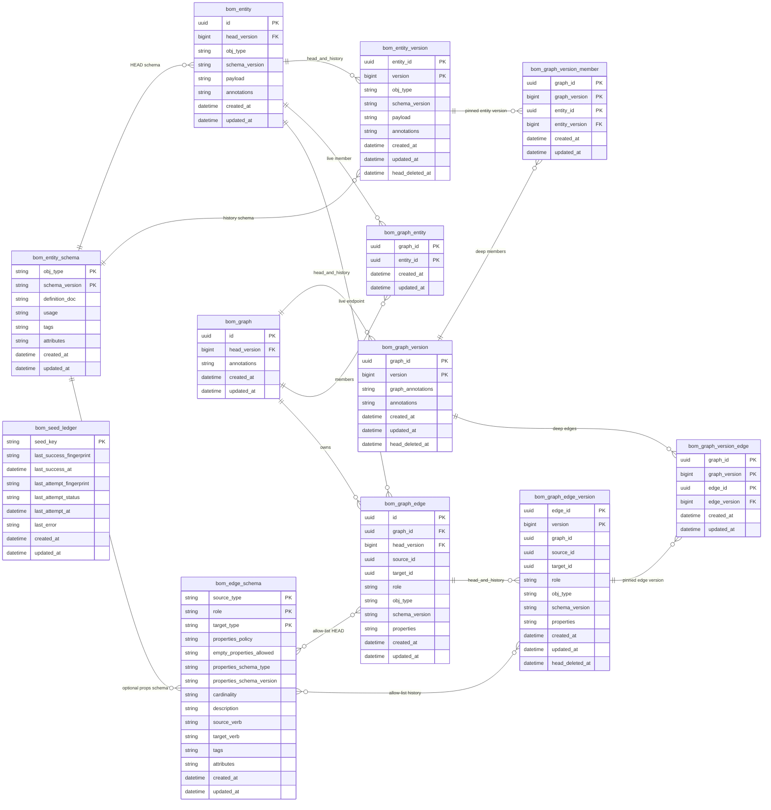

# Target ER — versions, deep graph versions, audit clocks

**Story:** [`STORY.md`](STORY.md) (C-18)  
**Status:** target model (not in Flyway yet)  
**Vendors:** PostgreSQL + H2, same tables  
**Flyway:** objs **V3** (clocks) then **V4** (HEAD + history). This file is the **end state**.

**Locked shape:** live content on HEAD tables. Live GET never joins history. **Default persist = today:** in-place HEAD update, **no** version row. Versions are created **only explicitly** (`createDeepGraphVersion`). There is **no snapshot graph**. Reconstruct is the slow path.

Living design copies this into [`docs/design/graph/persistence.md`](../../../design/graph/persistence.md) at WI-001.

**Out of this ER:** `created_by` / AuthZ, version GC, C-20 `q`, app tables (`sbom_*`, `ar_*`).

**Compat:** none. No data migration, no history backfill. **Greenfield:** recreate the database (drop `bom_*` + both Flyway histories). `clone()` stays a live deep copy (not a freeze alias). See [Flyway](#flyway).

**Limitation:** H2 is demo/test only. Editing `*_version` (or HEAD outside `create*` / `update*` / `delete*`) is **unsupported — at your own risk.** See [Design limitations](#design-limitations).

---

## Performance contract

| Path | Bar | Tables |
|------|-----|--------|
| **Live graph GET** | **Maximize** | `bom_graph` + `bom_graph_entity` + `bom_entity` + `bom_graph_edge`. **No** `*_version` join |
| **Pool / catalog** | Maximize | `FROM bom_entity` (GIN stays here) |
| **Graph list / header search** | Maximize | `FROM bom_graph` (GIN stays here) |
| **Load deep graph version** | Lower OK | `bom_graph_version` + `_member` / `_edge` pins → `bom_entity_version` / `bom_graph_edge_version` |
| **History listing** | Lower OK | `*_version` by PK |

HEAD is the row in `bom_entity` / `bom_graph` / `bom_graph_edge`. Never `max(version)` / `ORDER BY created_at` to find latest. `version` is only for **order** and **pins**.

---

## Same pattern (entity, graph, edge)

| HEAD (hot) | History (cold) | Deep freeze |
|------------|----------------|-------------|
| `bom_entity` | `bom_entity_version` | `entity_id` + `entity_version` (BIGINT) |
| `bom_graph` | `bom_graph_version` | the deep version **is** this row (`graph_id` + `version`) |
| `bom_graph_edge` | `bom_graph_edge_version` | `edge_id` + `edge_version` (BIGINT) |

**No** second graph id. **No** `mode=SNAPSHOT`. **No** pin column on live membership/edges.

**Integrity:** `head_version` is **nullable**. Composite FK `(id, head_version) → *_version(parent_id, version)` when set. Never versioned ⇒ `head_version` NULL, no `*_version` rows. Version parent ids are logical — **no FK back to HEAD**.

### Version identifier (`BIGINT`, growing, not sequential)

Not a UUID. Not `1,2,3`. Per parent (entity / graph / edge):

```
nextVersion(prev) = max(epochMillis, (prev ?: 0) + 1)
```

Strictly **increasing** for that parent even if the clock jumps back or two writes share a millisecond. Gaps are fine. **`version` is not unique.** Only `(parent_id, version)` is unique (entity, graph, or edge). Two rows may share the same BIGINT. Do **not** add `UNIQUE(version)`. History listing may `ORDER BY version` **within a parent**. HEAD is still the HEAD row, not `max(version)`.

`created_at` remains an audit Instant (may match that millis; not the pin key).

---

## Versioning strategy (extension point)

**When** a version row is written is not hardcoded in the store. Persist always updates HEAD; it asks a **`BomVersioningStrategy`** whether to **also** capture a `*_version` row.

C-18 ships **one** implementation: **`ExplicitOnlyVersioningStrategy`** (default). It never captures on ordinary create/update/delete — same as today. The only guaranteed capture is **`createDeepGraphVersion`**, which is an explicit API (not a strategy outcome).

| Event | Default strategy | Store |
|-------|------------------|--------|
| Create/update entity, edge, graph header | skip capture | HEAD only |
| `createDeepGraphVersion` | n/a (explicit) | copy current HEAD → new `*_version` rows + pins |

`head_version` is **last capture** (nullable). After in-place edits, HEAD content may diverge from `*_version` at `head_version` until the next capture. Live GET always reads HEAD columns.

### SPI (future-proof, not implemented beyond default)

```
shouldCapture(VersioningContext): Boolean
```

Context (illustrative): `graphId` (null = pool write), `kind` (entity \| edge \| graph), `op` (create \| update \| delete), parent id, current `head_version`.

**Write-context graph is the golden source** for future per-graph policies (not union of all membership graphs). Pool writes (`graphId == null`) use the store default strategy. Edges are graph-local — always that edge’s graph. Shared nodes: the graph of **this** mutate, not “any member graph said on_write.”

Later implementations (not C-18): `OnWriteVersioningStrategy`; `PerGraphVersioningStrategy` reading graph config (`nodes` / `edges` / `graph` = `explicit` \| `on_write`). Optional later resolver `any-member` is **out** unless product asks — it creates extra versions.

Do **not** bake `on_write` into persist. Register the strategy (Spring bean / constructor). C-18 tests the default only.

---

## Deep graph version vs snapshot graph vs clone

The earlier “new SNAPSHOT graph” idea is **replaced** by `createDeepGraphVersion(graphId, versionAnnotations)` (product **Snapshot**):

- Same `graph_id`; live HEAD stays editable
- One new `bom_graph_version` (header freeze + **version metadata** `annotations`)
- Child rows pin **current** entity/edge `head_version` values (the member set and edge set **as they are now**)
- **Provenance:** pins keep the **original** `entity_id` / `edge_id` plus a version. Reconstruct is those identities at the pinned versions.
- Later HEAD writes do not move those pins
- Fingerprint stores `(graph_id, graph_version)` (graph UUID + version BIGINT)

C-12 **`clone()` is kept.** It is a live deep copy, not a freeze:

- New `graph_id`, new entity ids, new edge ids (endpoints remapped)
- Copies **current HEAD** payloads only
- Does **not** copy source `*_version` rows (would graft the old history onto new ids)
- New HEAD rows start with `head_version` NULL — empty history line until Snapshot on **that** graph
- Source graph and its versions are unchanged

Ordinary header persist does not write `bom_graph_version` unless a **non-default strategy** says so (C-18 default does not). Deep freeze is the explicit full-graph capture.

`copyGraph` / `mergeGraph` stay live: new graph id, same entity ids, new edge ids, HEAD. They do not create a deep version. Draft-from-fingerprint still `copyGraph` of the **live** graph (HEAD), not a restore of the freeze.

---

## End-state diagram

SQL column `type` is drawn as `obj_type` (`type` breaks Mermaid ER). One relationship per entity pair.



---

## Live vs deep-version SQL

**Live GET** (hot):

```sql
SELECT * FROM bom_graph WHERE id = :id;
SELECT * FROM bom_graph_entity WHERE graph_id = :id;
SELECT * FROM bom_entity WHERE id IN (:member_ids);
SELECT * FROM bom_graph_edge WHERE graph_id = :id;
```

**Load deep graph version** (cold):

```sql
SELECT * FROM bom_graph_version
 WHERE graph_id = :graphId AND version = :graphVersion;
SELECT m.entity_id, ev.*
  FROM bom_graph_version_member m
  JOIN bom_entity_version ev
    ON ev.entity_id = m.entity_id AND ev.version = m.entity_version
 WHERE m.graph_id = :graphId AND m.graph_version = :graphVersion;
SELECT p.edge_id, xv.*
  FROM bom_graph_version_edge p
  JOIN bom_graph_edge_version xv
    ON xv.edge_id = p.edge_id AND xv.version = p.edge_version
 WHERE p.graph_id = :graphId AND p.graph_version = :graphVersion;
```

Does not read `bom_entity` / `bom_graph_edge` HEAD. Works after Delete HEAD (versions remain).

Shallow header history: `bom_graph_version` with **no** member/edge children.

---

## HEAD mutations (C-18 default)

Ordinary persist **does not** write `*_version` (today’s behaviour).

| Op | HEAD | Version table |
|----|------|----------------|
| **Create** | insert content; `head_version` NULL | none |
| **Update** | in-place content + `updated_at`; `head_version` unchanged | none |
| **Delete** | detach live refs; delete HEAD | **keep** any existing version rows; stamp `head_deleted_at` |
| **Capture** (`createDeepGraphVersion`) | one TX: insert version rows from **current** HEAD (`nextVersion(head_version)`), set `head_version`, insert pin children | append-only |

DIY inserts to `*_version` without Capture: **at your own risk.**

---

## Referential integrity

| Constraint | Meaning |
|------------|---------|
| `(bom_entity.id, head_version) REFERENCES bom_entity_version(entity_id, version)` | When `head_version` is **non-null**, that version row must exist |
| `(bom_graph.id, head_version) REFERENCES bom_graph_version(graph_id, version)` | Same for graphs |
| `(bom_graph_edge.id, head_version) REFERENCES bom_graph_edge_version(edge_id, version)` | Same for edges |
| `(entity_id, entity_version) REFERENCES bom_entity_version` | Deep member pin |
| `(edge_id, edge_version) REFERENCES bom_graph_edge_version` | Deep edge pin |
| `(graph_id, graph_version) REFERENCES bom_graph_version` | Freeze set belongs to that graph version |

`head_version` is `BIGINT NULL` until first capture. Version PK is `(parent_id, version)`.

No FK from `*_version` parent id to HEAD. Deep pins do not FK HEAD rows (so Delete HEAD keeps reconstruct).

A version row **may exist without** a HEAD row. A live HEAD row **may** exist with `head_version` NULL (never captured).

---

## Design limitations

**H2** is demo/unit only. No trigger / `REVOKE` requirement. Two statements in one TX. DIY `*_version` SQL: **at your own risk.**

**PostgreSQL** owns production constraints. Optional later: HEAD trigger; `REVOKE UPDATE, DELETE` on version tables. Not a C-18 must.

---

## Invariants

1. Default persist is in-place HEAD (no version row). Version rows never updated.
2. After **capture**, HEAD bytes = `*_version` at `head_version`. Later in-place edits may diverge until the next capture. HEAD is not `max(version)`.
3. Delete HEAD keeps any history and deep pin rows.
4. Live membership/edges have **no** pin column; they always mean HEAD.
5. `createDeepGraphVersion` copies **current** HEAD into new version rows, then pins those. Pins do not move.
6. No shallow auto header version in C-18. Deep = pin children present.

---

## `bom_graph_version.annotations` (version metadata)

Not the graph header. Frozen header is `graph_annotations`. `annotations` is **this version’s metadata** (JSON string map).

Examples (not schema-enforced): `label`, `comment`, `kind` (`deep`). Deep freeze sets `kind=deep`. Live GET does not read this map. Ordinary persist does not write this table.

---

## Persist / deep version / delete

**Create / update** entity, edge, or graph header: HEAD only (today). `head_version` unchanged (often NULL).

**createDeepGraphVersion** (explicit capture, one TX):

1. Insert `bom_graph_version` from current graph HEAD (`graph_annotations`, `annotations.kind=deep`, `version = nextVersion(graph.head_version)`); set `bom_graph.head_version`.
2. For each live member: insert `bom_entity_version` from **current** entity HEAD (`nextVersion(entity.head_version)`); set `entity.head_version`; insert `bom_graph_version_member` pinning that pair.
3. Same for each live edge → `bom_graph_edge_version` + `bom_graph_version_edge`.
4. Do not insert a second graph. Do not stub rows on live `bom_graph_edge`.

If `head_version` was NULL, this is the first version for that parent.

**Delete pool entity:** detach live membership; delete live incident edges but keep `bom_graph_edge_version`; `DELETE bom_entity`; stamp `head_deleted_at` on entity versions; **keep** deep member pins.

**Delete live edge HEAD:** delete `bom_graph_edge`; keep `bom_graph_edge_version`; deep edge pins remain.

**Delete graph HEAD:** detach live membership + live edges; `DELETE bom_graph`; keep `bom_graph_version` and pin children. Reconstruct still works.

---

## Dual-write (accepted)

Capture uses two statements, **one transaction**. Ordinary persist is a single HEAD write. Tests: after capture, HEAD = version at `head_version`; after a later in-place edit, reconstruct is unchanged; after delete HEAD, deep load still works.

Live GIN on `bom_entity` / `bom_graph`. Deep load is PK lookup, not GIN.

---

## Audit clocks

Every `bom_*` table: `TIMESTAMP NOT NULL DEFAULT CURRENT_TIMESTAMP`. `Instant` UTC. Persist owns values.

| Table | `created_at` | `updated_at` |
|-------|----------------|--------------|
| HEAD tables | identity birth | last HEAD content write |
| `*_version` | append time | = `created_at`; never updated |
| `bom_graph_entity` | attach | = `created_at` |
| `bom_graph_version_member` / `_edge` | pin time | = `created_at` |
| catalog + seed | already V1 | keep |

Graph HEAD `updated_at` also bumps when live membership or live edges change. `copyGraph` / `mergeGraph`: new graph + new edges get now; **shared pool entities keep clocks**.

---

## Table dictionary (V4)

### HEAD — `bom_entity`, `bom_graph`, `bom_graph_edge`

Today’s content + clocks + nullable `head_version` (composite FK when set). No `mode`. No pin column on membership/live edges.

### History — `bom_entity_version`, `bom_graph_version`, `bom_graph_edge_version`

| Column | Notes |
|--------|--------|
| `(parent_id, version)` | PK. `version BIGINT` growing (`nextVersion`). Pin target. `ORDER BY version` for history, not for HEAD |
| parent id | logical UUID; **no** FK to HEAD |
| content | Immutable copy (`graph_annotations` = frozen header on graph versions) |
| `annotations` | **`bom_graph_version` only:** version metadata |
| `head_deleted_at` | Set on Delete HEAD for that parent |

### Deep freeze children

| Table | PK | Pins |
|-------|-----|------|
| `bom_graph_version_member` | `(graph_id, graph_version, entity_id)` | `(entity_id, entity_version)` → `bom_entity_version` |
| `bom_graph_version_edge` | `(graph_id, graph_version, edge_id)` | `(edge_id, edge_version)` → `bom_graph_edge_version` |

`edge_id` is the live edge’s logical id at freeze time (may have no HEAD row later). Topology/properties come from `bom_graph_edge_version`.

### `bom_graph_entity`

`(graph_id, entity_id)` PK. Live only. `graph_id` → `bom_graph` `ON DELETE CASCADE`. `entity_id` does not FK `bom_entity`.

---

## Flyway

**Greenfield only.** No backward compatibility. No `UPDATE`/`INSERT` data migration of existing HEAD rows into `*_version`. Recreate the DB (drop `bom_*` and both Flyway history tables) rather than upgrade a populated store.

**V3:** `ALTER` clocks onto HEAD tables (`NOT NULL DEFAULT CURRENT_TIMESTAMP`). Schema only.

**V4:**

1. Create `bom_entity_version`, `bom_graph_version`, `bom_graph_edge_version`, `bom_graph_version_member`, `bom_graph_version_edge`.
2. Add nullable `head_version` + composite FKs. Do **not** backfill version rows (`head_version` stays NULL until first `createDeepGraphVersion`).
3. No `bom_graph.mode`. No pin column on membership/live edges.
4. Drop FKs that would block Delete HEAD if they `RESTRICT` (membership/endpoints → `bom_entity`). Do not FK version parent ids to HEAD.
5. GIN stays on `bom_entity.annotations` and `bom_graph.annotations`.

Both vendors, same WI. `clone()` kept (WI-004 adds freeze; does not remove clone).

---

## JPA / domain

| Table | JPA | Domain |
|-------|-----|--------|
| `bom_entity` | + clocks, `headVersion` | `BoMEntity` = HEAD |
| `bom_entity_version` | new; PK `(entityId, version)` | history / deep reconstruct |
| `bom_graph` | + clocks, `headVersion` | live header |
| `bom_graph_version` | new; PK `(graphId, version)` | header + metadata; deep if children exist |
| `bom_graph_version_member` / `_edge` | new | freeze set |
| `bom_graph_entity` | + clocks | live membership only |
| `bom_graph_edge` | + clocks, `headVersion` | live HEAD only |
| `bom_graph_edge_version` | new; PK `(edgeId, version)` | history / deep reconstruct |

Live write still sends `BoMEntity` / `BoMEdge` without a caller version. `getGraph(id)` = live HEAD. `getGraphVersion(graphId, version)` = reconstruct from pins.
