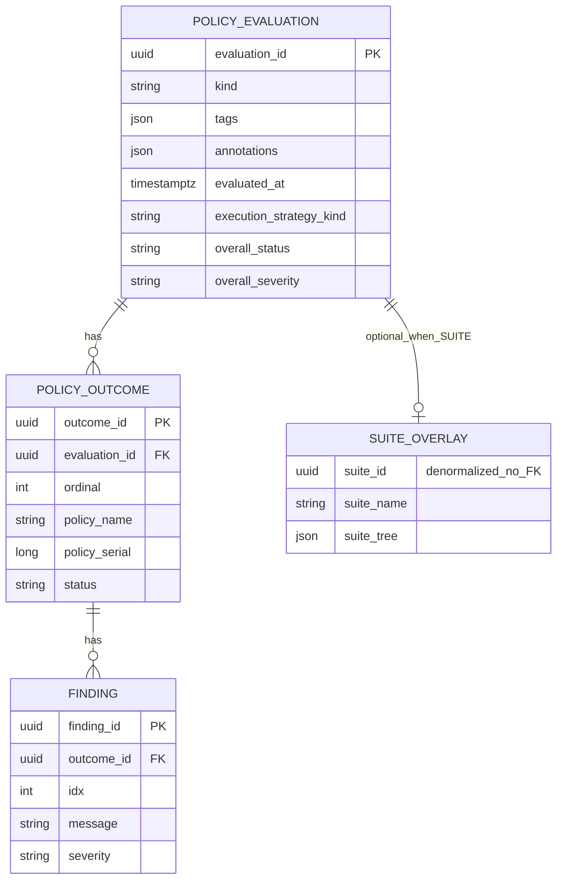

# Evaluation results — indicative relational model (shared)

**Status:** durable store **shipped** (C-33); relational sketch aligned with APIs  
**Story:** [`policy-results-persistence`](../../in-progress/policy-results-persistence/STORY.md) · Gaps: [`GAPS.md`](../../in-progress/policy-results-persistence/GAPS.md) · **Concrete store:** [`PERSISTENCE-MODEL.md`](../../in-progress/policy-results-persistence/PERSISTENCE-MODEL.md) · Design: [`suites.md`](../../../../design/policy/suites.md) · Flat results: [`results.md`](../../../../design/policy/results.md)

Sketches a **relational** mental model for evaluation results reused across:

| Kind | Entry | Uses |
|------|--------|------|
| **Flat** | `evaluate(fragment, policyRefs)` | Core only |
| **Suite** | `evaluateSuite(...)` | Core + suite taxonomy overlay |
| **App-owned** | Product wraps foundation | Same **`evaluationId`**; app may mint/store the row |
| **Batch** (C-29, later) | batch pack | Same core per slice; batch links many `evaluationId`s |

C-27 suite API: **`meta` + `tree` + `outcomes`**, **no input persist**.

---

## Central identity: `evaluationId`

Prefer **`evaluationId`** over `executionId` / `run_id`:

| Name | Why not / why |
|------|----------------|
| `executionId` | Collides mentally with **`ExecutionStrategy`** (how policies are run / deduped) |
| `run_id` | Vague; “run” is overloaded |
| **`evaluationId`** | Names the **result aggregate** of one evaluate / evaluateSuite (or app-equivalent): outcomes + optional overlays |

**Semantics:**

- One **`evaluationId`** = one cohesive result set: meta (**including tags & annotations**) + zero or more `policy_outcome` rows + optional suite overlay.
- **May or may not** be suite-based (`kind`).
- **May be foundation-assigned** or **application-minted** (app persistence / correlation); foundation types still key results by this id when present.
- Does **not** imply input snapshot or fragment freeze (C-27: no input persist).

```text
evaluationId  →  PolicyEvaluation (meta, tags, annotations)
                    ├─ PolicyOutcome*     (always, when policies ran)
                    │     └─ Finding*
                    └─ Suite overlay?     (only if kind = SUITE)
                          ├─ folders / tags / annotations
                          └─ leaves → outcome refs
```

---

## Layering

```text
┌─────────────────────────────────────────────┐
│  Suite overlay (optional)                   │
│  folder tree · policy leaves → outcome refs │
├─────────────────────────────────────────────┤
│  Core (always for policy results)           │
│  PolicyEvaluation · PolicyOutcome · Finding │
│  keyed by evaluationId                      │
└─────────────────────────────────────────────┘
```

---

## Entity-relationship (indicative)

**Shipped C-33 shape:** one `objs_policy_evaluation` row (tags/annotations as JSON; optional denormalized `suite_id` / `suite_name` / `suite_tree` when `kind = SUITE`) + outcome/finding children. **No FK** to catalog suite/policy tables (G-P46r). The sketch below keeps a logical suite overlay for readability; implementation flattens that overlay onto the evaluation row.



---

## Core tables

### `policy_evaluation` (identity = `evaluation_id`)

| Column | Type | Notes |
|--------|------|--------|
| **`evaluation_id`** | UUID PK | Central identity |
| `kind` | text | `FLAT` \| `SUITE` \| app-defined extension |
| `evaluated_at` | timestamptz | |
| `execution_strategy_kind` | text null | How policies were executed (dedupe, …); distinct from evaluation id |
| `overall_status` | text null | Flat optional aggregate; suite = root roll-up |
| `overall_severity` | text null | |
| `tags` | JSON / JSONB | Array of strings (same shape as policy/suite catalog) |
| `annotations` | JSON / JSONB | String map (same shape as policy/suite catalog) |
| `persist_profile` | JSON / JSONB | Extensible PersistSpec projection (axes, filters, preset, name, description, origin, durationMs, …) — see [`PERSISTENCE-MODEL.md`](../../in-progress/policy-results-persistence/PERSISTENCE-MODEL.md) |
| `suite_id` / `suite_name` | UUID / text null | **Denormalized optional overlay** when `kind = SUITE` — **not** a catalog FK |
| `suite_tree` | JSON / JSONB null | Suite reporting tree snapshot when persisted with results |

### `policy_outcome`

| Column | Type | Notes |
|--------|------|--------|
| `outcome_id` | UUID PK | |
| **`evaluation_id`** | UUID FK | → `policy_evaluation` |
| `ordinal` | int | Stable order within the evaluation |
| `policy_name` / `policy_serial` / `policy_id` | | As G-P27s |
| `engine_kind` | text | |
| `status` | text | Flat may include `NOT_APPLICABLE`; suite overlay omits N/A leaves |
| `severity` | text null | |
| `message` / `not_applicable_reason` | text null | |

### `finding` (+ bindings)

Findings **only** under outcomes; tree leaves **ref** `outcome_id`. Column `idx` = order within the parent outcome.

---

## Suite overlay (only if `kind = SUITE`)

Optional — **not** required to persist an evaluation. C-33 stores suite identity + tree as **nullable columns / JSON on `policy_evaluation`** (no separate suite-result tables; no catalog FK).

| Logical field | Shipped as | Notes |
|---------------|------------|--------|
| `suite_id` / `suite_name` | columns on evaluation | Denormalized labels for suite runs only |
| folder / leaf tree | `suite_tree` JSON | DISABLED omitted; IGNORED with `votes = false`; leaves ref outcomes by index |
| `rollup_strategy_kind` | column on evaluation | From suite meta when present |

---

## Mapping to in-memory APIs

| Relational | Flat / custom policy set | Suite |
|------------|--------------------------|--------|
| `evaluation_id` + `policy_evaluation` (+ tags/annotations) | `saveFlat` — first-class; suite columns null | `SuiteEvaluationResult.meta` incl. tags/annotations |
| `suite_id` / `suite_name` / `suite_tree` | — | denormalized overlay on same row |
| `policy_outcome` + `finding` | `EvaluationResult.outcomes` | `outcomes` |

Apps may allocate `evaluationId` before calling foundation, pass it through, and persist the same relational shape outside objs-policy.

---

## Example query shapes

- All outcomes: `WHERE evaluation_id = ?`  
- Suite tree: overlay tables for that `evaluation_id`  
- App report: join on `evaluation_id` without caring if suite overlay exists  

---

## Persistence API (C-33)

Normative locks: [`policy-results-persistence/GAPS.md`](../../in-progress/policy-results-persistence/GAPS.md) (G-P48r, G-P49r, G-P46r).  
**Column-level store:** [`PERSISTENCE-MODEL.md`](../../in-progress/policy-results-persistence/PERSISTENCE-MODEL.md).

**Evaluation ≠ suite hard-link:** archives are keyed by `evaluationId` alone. **FLAT / custom policy-set** runs (`evaluate` → `saveFlat`) are **first-class** — no suite catalog row, no `SuiteRepository`, suite overlay columns stay null. **SUITE** runs (`evaluateSuite` → `saveSuite`) add optional denormalized `suite_*` / `suite_tree` on the same evaluation row. Catalog Drop is never blocked by archive FKs (G-P46r).

**Content axes** (combine freely):

| Axis | Persists |
|------|----------|
| `results` | `meta` + `outcomes` [+ suite `tree`], subject to filters below |
| `executionContext` | Policies executed, matchers, bodies / suite config at T₀ |
| `input` | Replay pack (frozen fragment) |

**Result filters** — fine-tune which sets persist when `results` is on (independent include-sets):

| Filter | Include independently |
|--------|------------------------|
| Outcome status | `PASS`, `FAIL`, `ERROR`, `NOT_APPLICABLE` |
| Finding severity | `INFO`, `WARNING`, `ERROR`, `UNSPECIFIED` (null severity) |

**Named presets** (convenience; default filters = all statuses + all severities incl. UNSPECIFIED):

```text
EPHEMERAL  — no content axes
STANDARD   — results + executionContext
FULL       — results + executionContext + input
```

- Caller may use a preset and still narrow filters (e.g. FULL but only `FAIL`/`ERROR` outcomes).
- Archive with `results`+`executionContext` **usable as STANDARD** even if `input` is stored.
- Persist options may set **name**, **description**, **tags**, **annotations**, plus run metadata **`evaluatedAt`** and **`durationMs`**.
- Software/engine version is **not** required on the `input` pack.

C-27 shipped EPHEMERAL only. C-33 implements axes, filters, presets, labeling, and runtime metadata (see story GAPS — WI-001 closed).

---

## Naming summary

| Concept | Name |
|---------|------|
| Result aggregate id | **`evaluationId`** / `evaluation_id` |
| How policies are run (dedupe, …) | `executionStrategyKind` (not the id) |
| Suite roll-up algorithm | `rollupStrategyKind` |

---

## Out of scope here

- Flyway / JPA for **catalog** (Policy / Category / Suite) — **C-28**  
- Flyway / JPA for **evaluation results** / input persist — **[C-33 `policy-results-persistence`](../../in-progress/policy-results-persistence/STORY.md)** (G-P11r / G-P32r)  
- G-P27s identity field names  
- Batch header detail (C-29)  
