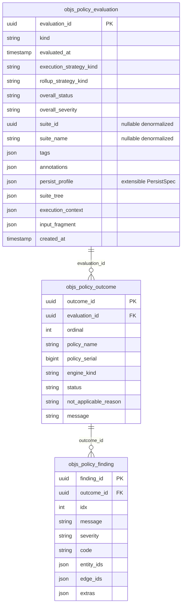

# Evaluation archive — detailed persistence model (C-33)

**Status:** shipped on branch `policy-results-persistence`  
**Story:** [`STORY.md`](STORY.md) · Gaps: [`GAPS.md`](GAPS.md)  
**Indicative / shared shape:** [`RESULTS-MODEL.md`](../../completed/20260905-policy-suites/RESULTS-MODEL.md)  
**Migrations:** `objs-persistence` Flyway **V8** (`h2` + `postgresql`)  
**Port:** `org.poc.objs.policy.api.EvaluationArchive` · Impl: `JpaEvaluationArchive`

This document is the **concrete** store model for evaluation archives. Prefer it over RESULTS-MODEL when implementing or reviewing schema/JPA. RESULTS-MODEL remains the shared mental model across flat / suite / app / batch.

---

## Principles

| Principle | Meaning |
|-----------|---------|
| **`evaluationId` is central** | One archive row = one cohesive result set |
| **Evaluation ≠ suite hard-link** | `kind` may be `FLAT` or `SUITE`. Custom / programmatic policy sets persist via `saveFlat` with **null** suite overlay. Suite runs add optional denormalized metadata on the **same** row |
| **Catalog ≠ results** | Archive port is **not** `PolicyRepository` / `SuiteRepository` (G-P47r) |
| **No catalog FK** | Archives must not block catalog Drop*/REPLACE (G-P46r). Internal FKs only: outcome → evaluation, finding → outcome (`ON DELETE CASCADE`) |
| **Explicit save** | `evaluate` / `evaluateSuite` do **not** auto-persist. No axes ⇒ EPHEMERAL (no durable write) |
| **Axes are independent** | `results`, `executionContext`, `input` combine freely; presets are convenience only |
| **Extensible persist profile** | Axes, filters, preset, labeling, duration, origin live in one **`persist_profile`** JSON/JSONB object — **not** fixed columns — so the profile can grow without migrations |
| **JSON like catalog** | Tags, annotations, finding bindings, tree/context/input payloads use JSON (H2) / JSONB (PostgreSQL) |

---

## Tables (objs Flyway V8)

Three tables. Prefix `objs_`. Vendor twins under:

- `…/db/migration/h2/V8__policy_evaluation_archive.sql`
- `…/db/migration/postgresql/V8__policy_evaluation_archive.sql`



### `objs_policy_evaluation`

Slim header + extensible profile + optional large payloads.

| Column | Type (concept) | Null | Notes |
|--------|----------------|------|--------|
| `evaluation_id` | UUID PK | no | App- or foundation-minted |
| `kind` | varchar | no | `FLAT` \| `SUITE` (extensible) |
| `evaluated_at` | timestamp | no | From meta / spec |
| `execution_strategy_kind` | varchar | yes | How policies were run / deduped |
| `rollup_strategy_kind` | varchar | yes | Suite roll-up when present |
| `overall_status` | varchar | yes | Aggregate / root status |
| `overall_severity` | varchar | yes | |
| `suite_id` | UUID | yes | **Denormalized** when `kind = SUITE` — **not** FK to catalog |
| `suite_name` | varchar | yes | Same |
| `tags` | JSON/JSONB | no | `[]` default — correlation tags (catalog-shaped) |
| `annotations` | JSON/JSONB | no | `{}` default — string map |
| `persist_profile` | JSON/JSONB | no | `{}` default — **extensible** PersistSpec projection (see below) |
| `suite_tree` | JSON/JSONB | yes | Suite reporting tree when results axis on + suite save |
| `execution_context` | JSON/JSONB | yes | Opaque map when axis on |
| `input_fragment` | JSON/JSONB | yes | Frozen fragment when axis on |
| `created_at` | timestamp | no | Row insert time |

**FLAT / custom policy set:** `suite_id`, `suite_name`, `suite_tree` stay null. Outcomes still written when profile axes.results is true.

**SUITE:** same header; suite fields filled from `SuiteEvaluationResult.meta` + serialized tree.

### `objs_policy_outcome`

| Column | Notes |
|--------|--------|
| `outcome_id` | UUID PK |
| `evaluation_id` | FK → evaluation `ON DELETE CASCADE` |
| `ordinal` | Stable order within the evaluation (0-based write order after filters) |
| `policy_name` / `policy_serial` / `engine_kind` | Identity of the policy run |
| `status` | `PASS` \| `FAIL` \| `ERROR` \| `NOT_APPLICABLE` |
| `not_applicable_reason` / `message` | Optional text |

Written only when profile `axes.results` is true (and filters keep the outcome).

### `objs_policy_finding`

| Column | Notes |
|--------|--------|
| `finding_id` | UUID PK |
| `outcome_id` | FK → outcome `ON DELETE CASCADE` |
| `idx` | Order within the parent outcome (not `ordinal`) |
| `message` | Required |
| `severity` / `code` | Optional |
| `entity_ids` / `edge_ids` | JSON arrays of UUID strings (bindings) |
| `extras` | JSON object |

No separate finding-binding tables.

---

## `persist_profile` (extensible)

Single JSON/JSONB object = effective **PersistSpec** at save time (minus `evaluationId` / `evaluatedAt`, which stay on the row / meta). **Open for extension:** unknown keys are allowed; readers ignore keys they do not understand.

**Known keys today** (`PersistProfileKeys` in code):

| Key | Type | Maps from PersistSpec |
|-----|------|------------------------|
| `presetName` | string \| null | `EPHEMERAL` / `STANDARD` / `FULL` or custom |
| `axes` | object | `{ results, executionContext, input }` booleans |
| `filters` | object | `{ outcomeStatuses?: string[], findingSeverities?: string[] }` — omit / empty object = all |
| `name` | string \| null | Archive display name |
| `description` | string \| null | |
| `origin` | string \| null | |
| `durationMs` | number \| null | Wall-clock run time |

Example (STANDARD + filters + labeling):

```json
{
  "presetName": "STANDARD",
  "axes": {
    "results": true,
    "executionContext": true,
    "input": false
  },
  "filters": {
    "outcomeStatuses": ["FAIL", "ERROR"],
    "findingSeverities": ["ERROR", "WARNING"]
  },
  "name": "nightly",
  "description": "demo run",
  "origin": null,
  "durationMs": 42
}
```

Future PersistSpec fields (or app-specific hints) add keys here — **no new columns**.

Tags / annotations remain **top-level JSON columns** (same shape as catalog entities; useful for listing/filter without digging into the profile).

---

## Content axes & filters

### Axes (inside `persist_profile.axes`)

| Axis | Columns / rows | When false |
|------|----------------|------------|
| `results` | Outcome + finding rows; `suite_tree` when suite | No outcome/finding rows; `suite_tree` null |
| `executionContext` | `execution_context` JSON | Column null |
| `input` | `input_fragment` JSON | Column null |

### Filters (inside `persist_profile.filters`) — only when `results` is on

| Filter | Semantics |
|--------|-----------|
| `outcomeStatuses` | omit/null = all; empty array = no outcome rows |
| `findingSeverities` | omit/null = all; empty = outcomes may persist with **no** findings; token `UNSPECIFIED` matches null severity |

Suite tree leaves are remapped to kept outcomes (or dropped) after status filter.

### Presets (`PersistPresets`)

| Preset | Axes | Typical use |
|--------|------|-------------|
| `EPHEMERAL` | none | No durable write (`save*` returns null) |
| `STANDARD` | results + executionContext | Historization / reporting |
| `FULL` | STANDARD + input | Audit / replay pack |

Presets set **content axes** only; filters and labeling remain orthogonal overrides.

**STANDARD view on load:** `loadAsStandard(id)` returns the archive with `input` omitted even if `input_fragment` is stored.

---

## API mapping

| Call | Kind | Suite overlay | Typical source |
|------|------|---------------|----------------|
| `saveFlat(EvaluationResult, PersistSpec, …)` | `FLAT` | null | Selected `policyRefs` / programmatic result |
| `saveSuite(SuiteEvaluationResult, PersistSpec, …)` | `SUITE` | id/name/tree from meta + tree | `evaluateSuite` |
| `load(evaluationId)` | as stored | as stored | Full axes including input if present |
| `loadAsStandard(evaluationId)` | as stored | as stored | Input omitted |
| `delete(evaluationId)` | — | — | Cascades outcomes/findings |

`PersistSpec` → `persist_profile` on save; profile → `EvaluationArchiveDocument` axes/filters/name/description/origin/durationMs/presetName on load.

Modules:

| Module | Role |
|--------|------|
| `:objs-policy-api` | `PersistSpec`, axes, filters, presets, `EvaluationArchive`, `EvaluationArchiveDocument` |
| `:objs-persistence` | V8 SQL, records/DAOs, `JpaEvaluationArchive`, `PersistProfileKeys` |
| `:objs-policy-service` | Boot wiring when `UnitOfWork` present; **HTTP** `POST /api/v1/objs/policy/evaluations/suite` (workbench Persist result) |

Capability probe includes `"archive"` when [EvaluationArchive] bean is present.

---

## Other JSON payload shapes (indicative)

### `tags` / `annotations`

```json
["ci", "nightly"]
```

```json
{ "ticket": "T-1", "source": "caller-selected-refs" }
```

### `suite_tree` (root folder object)

Recursive folder nodes with `children` and `leaves`. Leaf `outcomeIndex` indexes into the **persisted** (post-filter) outcome list.

```json
{
  "folderId": "…",
  "key": "root",
  "name": "Root",
  "parentFolderId": null,
  "participation": "ENABLED",
  "status": "FAIL",
  "severity": null,
  "votes": true,
  "tags": [],
  "annotations": {},
  "children": [],
  "leaves": [
    {
      "policyId": "…",
      "policyName": "leaf-policy",
      "policySerial": 3,
      "policyVersion": "1.0",
      "status": "FAIL",
      "severity": null,
      "outcomeIndex": 0
    }
  ]
}
```

### `execution_context`

Opaque JSON-friendly map owned by the caller / engine snapshot. Not a fixed schema in C-33.

### `input_fragment`

Serialized `GraphFragment`: `entities[]` / `edges[]` with id, type, schemaVersion, payload, annotations (and edge endpoints).

### Finding bindings

```json
["aaaaaaaa-bbbb-cccc-dddd-eeeeeeeeeeee"]
```

---

## Lifecycle & cascade

```text
save* (replace same evaluation_id)
  → delete findings for existing outcomes
  → delete outcomes for evaluation_id
  → upsert evaluation row (incl. persist_profile)
  → insert filtered outcomes / findings (if axes.results)

delete(evaluation_id)
  → delete findings → outcomes → evaluation
  (or rely on ON DELETE CASCADE)
```

Catalog Drop of a suite/policy **must not** fail because of archive rows.

---

## Custom policy-set flow (FLAT)

```text
select PolicyRefs (or build EvaluationResult programmatically)
  → evaluate(fragment, refs)          // in-memory only
  → EvaluationArchive.saveFlat(result, PersistSpec, executionContext?, input?)
  → load(evaluationId)                // suite_* null; outcomes if axes.results
```

Suite is never required for this path.

---

## Out of scope here

- Catalog Policy / Category / Suite tables (C-28)
- Batch header linking many `evaluationId`s (C-29)
- Auto-persist inside evaluate paths
- Requiring engine/software version inside the input pack
