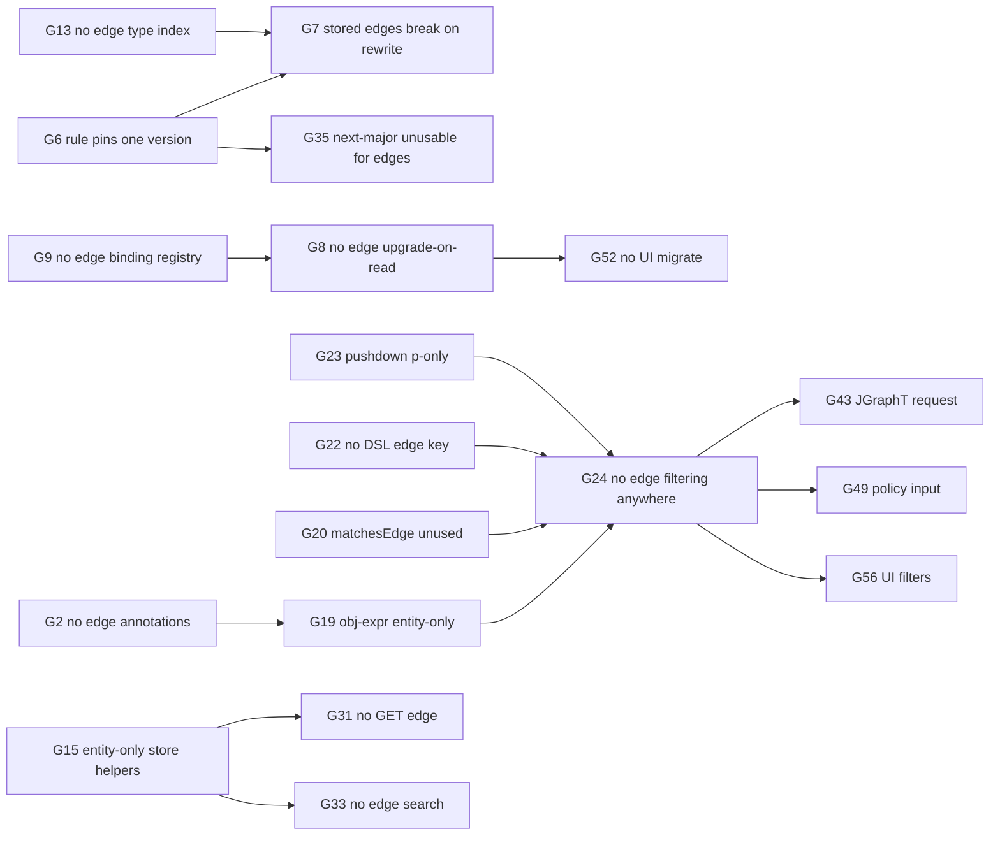

# Edge payload vs entity payload — gap inventory

**Story:** [`STORY.md`](STORY.md) (C-48) · **Tracker:** [`GAPS.md`](GAPS.md)  
**Baseline:** `origin/dev` at story creation (`218f087`). Line numbers are indicative; re-check before
quoting them in a WI.  
**Nature:** inventory only. This document states **what differs and why it matters**. It does not
propose fixes; triage and decisions belong to WI-001.

---

## 1. Purpose and reading guide

objs has two payload carriers:

- **Entity payload** — `Entity.payload`, a JSON document typed by `(type, schemaVersion)`.
- **Edge payload** — `Edge.properties`, an optional JSON document typed by the edge's optional
  `(type, schemaVersion)` and governed by the allow-list rule `(sourceType, role, targetType)`.

The question this document answers: *if an application wants to use edge payload as fully as it
uses entity payload, where does objs fall short?* Every component was checked: model, validation,
schema evolution, persistence, matcher/query, mutation and merge, REST, Gremlin, JGraphT, policies,
the workbench UI, and both example apps.

Each gap has this shape:

- **Severity** — how much it limits full edge-payload use.
- **Scope** — `edge-only` (entity has it, edge does not) or `both` (missing for both; listed
  because full edge utilisation needs it too).
- **Edge today** — current behaviour for edges.
- **Entity today** — the reference behaviour.
- **Impact** — what an application concretely cannot do, or what goes wrong.
- **Evidence** — source locations (and short excerpts where the code is the clearest proof).

### Severity legend

| Severity | Meaning |
|----------|---------|
| **Blocker** | Edge payload cannot be used for this purpose at all, or existing data breaks |
| **Major** | Works only with workarounds (load whole graph, client-side filtering, custom code) |
| **Minor** | Inconsistency, missing convenience, test gap, or cosmetic bug |

---

## 2. Executive summary

Edge properties are **stored, schema-validated, seeded, deep-versioned, and carried into every
engine**. The problem is not storage; it is **everything around it**:

1. **Edge payloads cannot evolve.** The allow-list rule pins exactly one schema version, so moving
   to v2 makes every stored v1 edge invalid on its next write, and there is no upgrade-on-read for
   edges at all (G6–G10, G35). This is the defect that triggered the story.
2. **Edge payloads cannot be queried.** The matcher language binds entity fields only; there is no
   edge predicate, no pushdown, no edge listing or lookup in the store, and no edge search in REST
   (G15–G17, G19–G24, G31, G33). Every consumer that selects input by matcher (Gremlin, JGraphT,
   policies, workbench, examples) inherits this.
3. **Edges are second-class in the typed and mutation layers.** No typed read-back, no
   payload-based rewriting, and de-duplication that ignores properties and can silently drop
   parallel edges (G25–G28).
4. **Edges have no annotations** (G2), which in turn removes the `a` binding, the annotation index,
   and the annotation UI for edges.
5. **The UI and examples barely touch edge properties.** The canvas never shows them, the
   edge-schema relations UI is unwired, SBOM writes `{}` and drops properties from its DTOs, and the
   asset-repository example forbids edge properties entirely (G51–G65).

### Count by area and severity

| Area | Blocker | Major | Minor | Gaps |
|------|:------:|:-----:|:-----:|------|
| Domain model | – | 2 | 3 | G1–G5 |
| Validation and schema evolution | 2 | 3 | 2 | G6–G12 |
| Persistence | – | 4 | 2 | G13–G18 |
| Query / matcher | 2 | 3 | 1 | G19–G24 |
| Mutation / rewriter / merge | – | 4 | 1 | G25–G29 |
| REST (`objs-service`) | – | 3 | 4 | G30–G36 |
| Gremlin | – | 1 | 4 | G37–G41 |
| JGraphT | – | 2 | 3 | G42–G46 |
| Policies | – | 2 | 2 | G47–G50 |
| Workbench UI | – | 6 | 3 | G51–G59 |
| Examples | – | 6 | – | G60–G65 |
| **Total** | **4** | **36** | **25** | **65** |

### Dependency map between gaps



---

## 3. Parity baseline (no gap)

These already behave the same for edges and entities and are **not** part of the gap list.

| Capability | Evidence |
|------------|----------|
| JSON storage | `bom_entity.payload JSONB NOT NULL` vs `bom_graph_edge.properties JSONB` (nullable) — `objs-persistence/.../db/migration/{postgresql,h2}/V1__bom_schema.sql` |
| JSON Schema validation | Same `validateAgainstSchema` (networknt) for both; edges when rule policy is `SCHEMA` — `Validator.kt` 66-74 vs 254-262 |
| Seeds | `GraphSeedHandler` parses and serializes edge `type` / `schemaVersion` / `properties`; `ObjectSchemaSeedHandler` accepts `usage: EDGE_PROPERTIES` |
| Deep versioning | `listEdgeVersions`, `edgeVersionStats`, `getEdgeVersion`, `compactEdge`; REST `ObjsEdgesController` mirrors entity version endpoints |
| Bulk mutation | `GraphMutation.edges.set` / `edges.unset` alongside entities |
| Delete | `DELETE /graphs/{id}/edges/{edgeId}` |
| Identifier immutability | `validateEdgeIdentifierImmutability` mirrors the entity check (with a caveat, see G12) |
| Catalog JSON Schema export | `includeEdgePropertySchemas` option |
| Engine carry-through | Gremlin edge property `properties`; JGraphT `GenericGraphEdge.edge`; Drools `EdgeFact.properties` |

---

## 4. Domain model (`objs-api`)

Reference: [`GraphPrimitives.kt`](../../../../objs-api/src/main/kotlin/org/poc/objs/api/domain/GraphPrimitives.kt)

```kotlin
data class Entity(
    var id: UUID? = null,
    var type: String,
    var schemaVersion: String,
    var payload: MutableMap<String, Any?> = mutableMapOf(),
    var annotations: MutableMap<String, String> = mutableMapOf(),
    ...
)

data class Edge(
    var id: UUID? = null,
    var graphId: UUID? = null,
    var source: UUID,
    var target: UUID,
    var role: String,
    var type: String? = null,
    var schemaVersion: String? = null,
    var properties: MutableMap<String, Any?>? = null,
    ...
)
```

### G1 — Edge payload identity and document are nullable

- **Severity:** Major · **Scope:** edge-only
- **Edge today:** `type`, `schemaVersion`, and `properties` are all nullable. A typed edge
  (`SCHEMA` policy) and a bare edge (`NONE` policy) share one shape. `properties = null` and
  `properties = {}` are distinct states.
- **Entity today:** `type` and `schemaVersion` are required; `payload` is non-null and defaults to
  `{}`.
- **Impact:** every consumer must branch on three nullable fields. That shows up as divergent
  serialization (Gremlin `null` vs `{}`, G38), skipped checks (G12), nullable Drools fields (G47),
  and API ambiguity on update (whether `properties: null` means "clear" or "keep"; today it clears).
- **Evidence:** `GraphPrimitives.kt` 12-41.

### G2 — Edges have no annotations

- **Severity:** Major · **Scope:** edge-only
- **Edge today:** no `annotations` field in the model, no column in `bom_graph_edge`, no seed
  field, `EdgeFact.annotations` hard-coded to `emptyMap()`, no annotations tab in the UI.
- **Entity today:** `annotations: Map<String,String>` with a GIN index, the matcher binding `a`,
  seeds, the UI tab, and Drools access.
- **Impact:** caller metadata (provenance, tags, ownership) cannot sit beside edge properties.
  Applications must either pollute the schema-governed `properties` document or keep side tables.
  The `a.*` matcher binding cannot apply to edges even once edges are matchable.
- **Evidence:** `GraphPrimitives.kt` 29-41; `V1__bom_schema.sql` (`bom_entity.annotations` and
  index vs `bom_graph_edge`); `PolicyFacts.kt` 64; `docs/design/graph/annotations-and-matchers.md`
  ("edges not annotated — provisional").

### G3 — No "latest edge-properties schema" helper

- **Severity:** Minor · **Scope:** edge-only
- **Edge today:** `CatalogSupport.latestEntitySchema(s)` filters to `usage = ENTITY`. Only
  `FullCatalogJsonSchemaExporter` computes a latest edge-properties schema internally.
- **Entity today:** a public helper returns the latest version per entity type.
- **Impact:** UI and tooling cannot ask "what is the current version of edge schema X" without
  re-implementing version ordering. This is also a prerequisite for any upgrade-to-latest
  behaviour (G8).
- **Evidence:** `objs-api/.../domain/CatalogSupport.kt` 24-35; `FullCatalogJsonSchemaExporter.kt`
  104-106.

### G4 — No display or field-hint helpers for edges

- **Severity:** Minor · **Scope:** edge-only
- **Edge today:** no `displayLabel`, `fieldHints`, or `firstLevelScalarFields` for edge
  properties.
- **Entity today:** `CatalogSupport.displayLabel`, `fieldHints`, and `firstLevelScalarFields`
  drive labels and inspectors.
- **Impact:** UI cannot render meaningful edge labels or field kinds from edge schemas (see G55).
- **Evidence:** `CatalogSupport.kt` 37-83.

### G5 — Schema `usage` is never enforced

- **Severity:** Minor · **Scope:** both
- **Today:** `Schema.usage` (`ENTITY` or `EDGE_PROPERTIES`) is metadata only. The validator looks
  schemas up by `(type, version)` alone, so an entity can be validated against an edge-properties
  schema and an edge against an entity schema.
- **Impact:** catalog mistakes go undetected, and the entity/edge schema boundary is a convention
  rather than a rule.
- **Evidence:** `Validator.kt` 51 (entity lookup), 239 (edge lookup);
  `objs-api/.../domain/Schema.kt` 8-31.

---

## 5. Validation and schema evolution

Reference: [`Validator.kt`](../../../../objs-persistence/src/main/kotlin/org/poc/objs/core/validation/Validator.kt),
[`RelationMetadata.kt`](../../../../objs-api/src/main/kotlin/org/poc/objs/api/domain/RelationMetadata.kt),
[`TypedGraphView.kt`](../../../../objs-api/src/main/kotlin/org/poc/objs/api/typed/TypedGraphView.kt)

```kotlin
data class AllowedEdgeRule(
    val sourceType: String,
    val role: String,
    val targetType: String,
    val propertiesPolicy: PropertiesPolicy = PropertiesPolicy.NONE,
    val emptyPropertiesAllowed: Boolean = true,
    val propertiesSchemaType: String? = null,
    val propertiesSchemaVersion: String? = null,
    ...
)
```

### G6 — The allow-list rule pins one edge schema version

- **Severity:** Blocker · **Scope:** edge-only
- **Edge today:** under `SCHEMA` policy, if the rule declares `propertiesSchemaType` and
  `propertiesSchemaVersion`, the edge's `type@schemaVersion` must equal them **exactly**; otherwise
  `EDGE_SCHEMA_REF_MISMATCH`. The seed handler (`AllowedEdgeRuleSeedHandler`) requires both fields
  under `SCHEMA`, so every seeded rule is pinned in practice.

  ```kotlin
  if (
      rule.propertiesSchemaType != null &&
      rule.propertiesSchemaVersion != null &&
      (type != rule.propertiesSchemaType || schemaVersion != rule.propertiesSchemaVersion)
  ) {
      issues += ValidationIssue(code = "EDGE_SCHEMA_REF_MISMATCH", ...)
  }
  ```

- **Entity today:** an entity only needs `schemas.get(type, schemaVersion)` to exist. Any
  registered version is valid, so v1 and v2 entities coexist.
- **Impact:** an edge-properties schema has exactly one valid version at a time per relation.
  Mixed-version edge populations, which are the normal state during a schema migration, are
  impossible.
- **Evidence:** `Validator.kt` 187-205 vs 51; `RelationMetadata.kt` 45-61;
  `AllowedEdgeRuleSeedHandler.kt` 40-48; `docs/design/graph/validation.md` (edge ref must match the
  rule).

### G7 — Bumping a rule breaks every stored edge on its next write

- **Severity:** Blocker · **Scope:** edge-only
- **Edge today:** if a rule moves from `CanonicalEdge@1.0.0` to `@2.0.0`, stored v1 edges stay
  valid only until rewritten. Any path that re-validates them then fails with
  `EDGE_SCHEMA_REF_MISMATCH`: a MERGE or REPLACE mutation touching the edge, `clone`, `copyGraph`,
  `mergeGraph`, seed re-apply, and restore flows.
- **Entity today:** a stored v1 entity stays valid after v2 is registered; writes keep working.
- **Impact:** an edge schema upgrade is a **destructive, all-or-nothing operation** that needs an
  out-of-band bulk rewrite, and objs provides none (G10). Graph copy and merge of older graphs fail.
- **Evidence:** consequence of G6; re-validation in `NamedGraphStore` copy/merge write paths
  (`graphStore.write`), `GraphStore.applyUpserts`.

### G8 — No upgrade-on-read for edge properties

- **Severity:** Major · **Scope:** edge-only
- **Edge today:** `TypedGraphView` snapshots edges raw and never hydrates them. `RelationEdgeView`
  exposes the stored map only, with no effective version and no diagnostics.

  ```kotlin
  data class RelationEdgeView(val edge: Edge, val source: ReadNode?, val target: ReadNode?) {
      val properties: Map<String, Any?>? get() = edge.properties
  }
  ```

- **Entity today:** `PayloadUpgrade.hydrate(entity: Entity, ...)` runs the
  `SchemaUpgradeRegistry` chain under `HydrationPolicy`. `ReadNode` exposes `hydratedPayload`,
  `effectiveSchemaVersion`, and `upgradeDiagnostics`.
- **Impact:** readers of an edge must handle every historical shape themselves. The C-35
  dual-view approach (stored v1, presented v2) does not exist for edges. Note that
  `SchemaUpgradeStep` and `SchemaUpgradeRegistry` are keyed by `(type, version)` over a plain map
  and are **not** entity-specific; only the wiring is missing.
- **Evidence:** `TypedGraphView.kt` 64-73, 154-156, 207-212; `PayloadUpgrade.kt` 17-24 (signature
  takes `Entity`); `docs/design/graph/schema-evolution.md` ("edges unchanged").

### G9 — No typed edge binding registry

- **Severity:** Major · **Scope:** edge-only
- **Edge today:** nothing maps `(edgeType, version)` to an application class.
- **Entity today:** `TypedEntityBinding` and `TypedEntityBindingRegistry` hydrate payloads into
  application types.
- **Impact:** typed edge properties (for example `DependencyScope`) exist only as raw maps on the
  read side. Combined with G28, there is no typed edge round-trip.
- **Evidence:** `TypedGraphView.kt` 17-24.

### G10 — No stored-payload migration, no default upgrade wiring

- **Severity:** Major · **Scope:** both
- **Today:** upgrades are read-time only; nothing rewrites stored documents. `objs-autoconfigure`
  registers no `SchemaUpgradeRegistry`; SBOM wires its own, for entities only.
- **Impact:** for edges this is the only possible way out of G7, and it does not exist. For entities
  it is a convenience gap (tracked as C-35 G-E6).
- **Evidence:** `docs/workitems/completed/20260923-codegen-schema-evolution/GAPS.md` G-E5 / G-E6;
  `SbomSchemaUpgradeConfiguration.kt` 27-38; BACKLOG C-45 (absorbed by C-48).

### G11 — `NONE` policy ignores stray edge schema references

- **Severity:** Minor · **Scope:** edge-only
- **Edge today:** under `NONE`, only non-empty `properties` are rejected. An edge carrying
  `type` / `schemaVersion` without properties passes silently.
- **Entity today:** n/a (always typed).
- **Impact:** inconsistent data (typed-looking bare edges), which later confuses G8-style logic and
  UI.
- **Evidence:** `Validator.kt` 157-170.

### G12 — Edge identifier immutability skipped for partially typed edges

- **Severity:** Minor · **Scope:** edge-only
- **Edge today:** the check returns early when either the stored or the incoming edge lacks `type`
  or `schemaVersion`.

  ```kotlin
  val storedType = stored.type ?: return emptyList()
  val storedVersion = stored.schemaVersion ?: return emptyList()
  val incomingType = incoming.type ?: return emptyList()
  val incomingVersion = incoming.schemaVersion ?: return emptyList()
  ```

- **Entity today:** always checked, since type and version are required.
- **Impact:** an update that drops `type` / `schemaVersion` (possible under `NONE`, or with a
  malformed request) bypasses identifier protection on edge properties.
- **Evidence:** `Validator.kt` 355-375.

---

## 6. Persistence (`objs-persistence`)

### G13 — No `(type, schema_version)` index on edges

- **Severity:** Major · **Scope:** edge-only
- **Edge today:** `bom_graph_edge` indexes cover graph, source, target, role, graph+source, and
  graph+target.
- **Entity today:** `idx_bom_entity_type_schema_version`.
- **Impact:** "find all edges of type X at version V", the core query of any edge migration, is a
  full scan.
- **Evidence:** `db/migration/postgresql/V1__bom_schema.sql` 11 vs 36-58; same in `h2/`.

### G14 — No GIN index on document columns

- **Severity:** Minor · **Scope:** both
- **Today:** neither `payload` nor `properties` has a GIN index; only `bom_entity.annotations`
  does.
- **Impact:** containment predicates on edge properties (once G23 exists) and on entity payload
  scale linearly.
- **Evidence:** `postgresql/V1__bom_schema.sql` 13-14.

### G15 — Store helpers exist only for entities

- **Severity:** Major · **Scope:** edge-only
- **Edge today:** the store offers `deleteEdge`, version reads, `compactEdge`, and
  `listIncidentEdges(entityId)`. There is no get-by-id, list, count, identity lookup, or duplicate
  detection.
- **Entity today:** `getEntity`, `listEntities`, `upsertEntities`, `countByType`,
  `findEntitiesByIdentity`, `findDuplicateGroups`, and `identityOf` (identity resolution only for
  `ENTITY` schemas).
- **Impact:** applications cannot fetch a single edge, count relations per type, or detect
  duplicate edges by identity fields in edge properties, even though schemas can declare
  identifier fields on edge properties (`object-schema-dsl.md`).
- **Evidence:** `GraphStore.kt` 157, 239-365; `NamedGraphStore.kt` 573.

### G16 — `EdgeDao` cannot select by type or version

- **Severity:** Major · **Scope:** edge-only
- **Edge today:** DAO lookups are by graph, source/target, and incident only.
- **Entity today:** lookups by type and schema version back pool queries and counts.
- **Impact:** same as G13 at the DAO level; there is no programmatic way to enumerate edges to
  migrate or audit.
- **Evidence:** `EntityDao.kt` 122-195.

### G17 — Selection never returns edges on their own merit

- **Severity:** Major · **Scope:** edge-only
- **Edge today:** `selectFromPool` returns `GraphContents(entities, edges = emptyList())`.
  Graph-scoped selection returns only edges **induced** by the selected entities (both endpoints
  selected).
- **Entity today:** entities are selected by predicate and paged.
- **Impact:** "all `DEPENDS_ON` edges with `scope = test`" cannot be expressed. You must select
  candidate endpoints and filter edges client-side.
- **Evidence:** `GraphStore.kt` 282, 447-449, 466-467, 538-539.

### G18 — Versioning hook skipped for graph-scoped edge upserts

- **Severity:** Minor · **Scope:** edge-only
- **Edge today:** `NamedGraphStore.applyGraphEdgeUpserts` does not call
  `VersioningStrategy.shouldCapture`. `GraphStore.applyUpserts` (edges) and the entity paths do.
- **Entity today:** called on every upsert path.
- **Impact:** latent. The default strategy returns `false` and the result is ignored today, but a
  capture-on-write strategy would silently skip graph-scoped edge writes.
- **Evidence:** `NamedGraphStore.kt` (~902 entity vs ~951-967 edge); `GraphStore.kt` 219, 377.

---

## 7. Query and matcher

Reference: [`ObjExprMatcher.kt`](../../../../objs-api/src/main/kotlin/org/poc/objs/api/match/ObjExprMatcher.kt),
[`Matcher.kt`](../../../../objs-api/src/main/kotlin/org/poc/objs/api/match/Matcher.kt)

### G19 — `obj-expr` binds entity fields only

- **Severity:** Blocker · **Scope:** edge-only
- **Edge today:** the JEXL context is built from `EntityMatchCandidate` only:

  ```kotlin
  override fun get(name: String): Any? = when (name) {
      "id" -> candidate.id?.toString()
      "type" -> candidate.type
      "schemaVersion" -> candidate.schemaVersion
      "a" -> LinkedHashMap(candidate.annotations)
      "p" -> LinkedHashMap(candidate.payload)
      else -> null
  }
  ```

- **Entity today:** full predicate language over `id`, `type`, `schemaVersion`, `a.*`, `p.*`.
- **Impact:** no expression can mention edge `role`, `type`, `schemaVersion`, or `properties`.
- **Evidence:** `ObjExprMatcher.kt` 43-62, 160-176.

### G20 — `matchesEdge` is endpoint-only and unused

- **Severity:** Major · **Scope:** edge-only
- **Edge today:** the default keeps induced edges. No matcher overrides it (`ChainedMatcher` only
  delegates), and no main-code path calls it.

  ```kotlin
  fun matchesEdge(candidate: EdgeMatchCandidate, selectedEntityIds: Set<UUID>): Boolean =
      candidate.source in selectedEntityIds && candidate.target in selectedEntityIds
  ```

- **Entity today:** `matches(EntityMatchCandidate)` is the primary contract and is always applied.
- **Impact:** the extension point for edge filtering exists in name only.
- **Evidence:** `Matcher.kt` 14-15; stores filter edges by endpoints directly (`GraphStore.kt`
  447-448, 466-467, 538-539).

### G21 — Edge matching infrastructure is unused

- **Severity:** Minor · **Scope:** edge-only
- **Edge today:** `EdgeMatchCandidate.properties`, `EdgeCandidateStrategy`,
  `CandidateSourceWithEdges`, and `LazyJsonMap.properties()` exist with no implementation or caller.
- **Impact:** dead API surface that suggests capability that does not exist.
- **Evidence:** `MatchCandidate.kt` 37-55; `CandidateSource.kt` 23-38; `LazyJsonMap.kt` 90-91.

### G22 — Matcher DSL has no edge clause

- **Severity:** Major · **Scope:** edge-only
- **Edge today:** the DSL keys (`obj-expr`, chained stages, `graph-expr`) all target entities or
  graph headers.
- **Entity today:** `obj-expr` and chained entity stages.
- **Impact:** REST and UI have no syntax to express an edge filter even if the engine supported it.
- **Evidence:** `MatcherDsl.kt` 25-28, 214-356.

### G23 — SQL pushdown covers entity payload only

- **Severity:** Major · **Scope:** edge-only
- **Edge today:** none.
- **Entity today:** `ObjExprLowerer` lowers `p.*` (`==`, `!=`, ordered compares, anchored prefix)
  to DNF; `PoolEntityReader` emits `payload @> …` and `payload ->> ?` predicates on Postgres.
- **Impact:** edge-property filtering, once added, would be in-memory only, so large graphs need a
  pushdown story too.
- **Evidence:** `ObjExprLowerer.kt` (142, 196, 316-323); `PoolEntityReader.kt` 168-230.

### G24 — No component can filter by edge payload

- **Severity:** Blocker · **Scope:** edge-only (consequence)
- **Edge today:** because of G19–G23, every matcher-driven consumer selects input by entity only:
  gremlin-service (`GremlinTraverseRequest.matcher`), jgrapht-service
  (`GraphCycleAnalysisRequest.matcher`), policy-service (`PolicyEvaluateRequest.matcher`), workbench
  Objects/Explorer, and the examples' search endpoints.
- **Impact:** edge payload is **write-only and read-in-bulk only**. There is no "find by edge
  property" anywhere in objs.
- **Evidence:** request DTOs listed in G43 and G49; `ObjectWriteService.java` 100-112 (AR search).

---

## 8. Mutation, rewriter, and merge

### G25 — Rewriter has no edge decisions

- **Severity:** Major · **Scope:** edge-only
- **Edge today:** `MutationRewriter.edge(edge, ctx): Edge?` can only keep, replace, or drop one
  edge at a time.
- **Entity today:** `EntityDecision` (`Keep`, `ReplaceWith`, `Drop(redirectTo)`) plus helpers
  `replace(...)` and `replaceByPayload(to, field)` for payload-keyed de-duplication against the
  store.
- **Impact:** "replace by identity in edge properties" or "redirect duplicate edge" must be
  hand-written.
- **Evidence:** `GraphMutationRewriter.kt` 8-32, 102-132.

### G26 — Rewriter de-duplication ignores edge properties

- **Severity:** Major · **Scope:** edge-only
- **Edge today:** after rewriting, edges are de-duplicated by `(source, target, role)`:

  ```kotlin
  set = newEdges.distinctBy { Triple(it.source, it.target, it.role) }.toMutableList()
  ```

- **Entity today:** de-duplicated by `id`.
- **Impact:** **silent data loss.** Two parallel edges with the same endpoints and role but
  different properties (for example the same dependency in `compile` and `test` scope) collapse to
  the first one, and the other edge's properties are dropped without an issue being reported.
- **Evidence:** `GraphMutationRewriter.kt` 92.

### G27 — Merge policy keys edges by triple, never merges properties

- **Severity:** Major · **Scope:** edge-only
- **Edge today:** `FirstSeenGraphMergePolicy.edgeKey = Triple(source, role, target)`;
  `onDuplicateEdge` keeps the first edge and discards the incoming properties.
- **Entity today:** `nodeKey` is identity-aware; the policy is overridable per node.
- **Impact:** `mergeGraph` loses parallel edges and edge-property updates from the incoming graph.
  Same failure mode as G26 at graph level.
- **Evidence:** `GraphMergePolicy.kt` 20-31.

### G28 — Typed edges are write-only

- **Severity:** Major · **Scope:** edge-only
- **Edge today:** `TypedEdge.toEdge(sourceId, targetId, mapper)` only. `EdgeCatalog` offers
  `toMap` / `fromMap`, with no `toTyped` or `fromEdge`.
- **Entity today:** `TypedEntity.toEntity`, `fromEntity`, and `syncFrom`; catalogs expose
  `toEntity` / `toNode` / `toTyped`.
- **Impact:** typed applications cannot read edge properties back into their own types, or patch
  them in place.
- **Evidence:** `TypedEdge.kt` 14-33; `TypedEntity.kt` 29-70;
  `docs/design/graph/typed-conversion-recipes.md` ("`EdgeCatalog` does not provide `toEntity` /
  `toNode` / `toTyped`").

### G29 — Writes replace whole documents

- **Severity:** Minor · **Scope:** both
- **Today:** upsert sets `record.payload = …` / `record.properties = …`. MERGE mode is set/unset
  at element level, not field level. For edges, sending `properties: null` clears them.
- **Impact:** changing one edge property requires resending the whole document and the edge
  envelope (see G32).
- **Evidence:** `GraphStore.kt` 216, 373; `NamedGraphStore.kt` 963;
  `docs/design/graph/object-schema-dsl.md` ("writes are full-document replace").

---

## 9. REST API (`objs-service`)

### G30 — Edge create uses the raw domain type

- **Severity:** Minor · **Scope:** edge-only
- **Edge today:** `POST /graphs/{id}/edges` binds `Edge` directly; OpenAPI shows `graphId`,
  `createdAt`, `updatedAt`, and `headVersion` as writable inputs.
- **Entity today:** a dedicated, documented `EntityWriteBody`.
- **Impact:** a misleading contract for generated clients; there are no field descriptions for
  `type`, `schemaVersion`, or `properties`.
- **Evidence:** `ObjsGraphsController.kt` 478-510; `ObjsEntitiesController.kt` 132-153.

### G31 — No endpoint to read one live edge

- **Severity:** Major · **Scope:** edge-only
- **Edge today:** there is neither `GET /edges/{id}` nor `GET /graphs/{id}/edges/{edgeId}`. A
  client must load the whole graph (`GET /graphs/{id}`) or a frozen version.
- **Entity today:** `GET /entities/{id}`.
- **Impact:** an edge-centric UI or integration cannot refresh one relation cheaply.
- **Evidence:** `ObjsGraphsController.kt`; `ObjsEdgesController.kt` 30-79 (versions only).

### G32 — Property-only update needs the full edge

- **Severity:** Minor · **Scope:** edge-only
- **Edge today:** `PUT /graphs/{id}/edges/{edgeId}` wraps a MERGE mutation and takes an `Edge`.
  `source`, `target`, and `role` are non-null, so a client changing one property must resend the
  endpoints and role too.
- **Entity today:** `PUT /entities/{id}` takes the write body without graph context.
- **Impact:** chatty clients and a risk of accidental endpoint changes.
- **Evidence:** `ObjsGraphsController.kt` 512-556.

### G33 — No edge list or search

- **Severity:** Major · **Scope:** edge-only
- **Edge today:** no list or search endpoint. `POST /entities/query` documents that edges are not
  returned, and its paged envelope always carries `edges = []`.
- **Entity today:** `GET /entities`, and `POST /entities/query` with paging.
- **Impact:** the REST face of G17 and G24.
- **Evidence:** `ObjsEntitiesController.kt` 65-130 (92, 124).

### G34 — Relation lookup by type works for entity types only

- **Severity:** Minor · **Scope:** edge-only
- **Edge today:** `GET /registry/types/{type}/edges` resolves incoming and outgoing rules for an
  **entity** type. The edge-schema counterpart is `GET /registry/schemas/{t}/{v}/edges`, which is
  keyed by schema version (see G6).
- **Impact:** asymmetric navigation; there is no "rules using edge type X across versions" view.
- **Evidence:** `ObjsRegistryController.kt` 303-460, 704-720.

### G35 — `next-major` exists for edge schemas but cannot be adopted

- **Severity:** Major · **Scope:** edge-only (consequence of G6/G7)
- **Edge today:** `POST /registry/schemas/{type}/versions/next-major` works for edge-properties
  schemas. Switching rules to the new version triggers G7.
- **Entity today:** a new major version can be adopted gradually.
- **Impact:** the schema evolution UI and API give a false sense of support for edges.
- **Evidence:** `ObjsRegistryController.kt` 554-603.

### G36 — No edge-to-graph membership endpoint

- **Severity:** Minor · **Scope:** edge-only
- **Edge today:** none. Edges are graph-local (`graphId`), so the answer is a single graph.
- **Entity today:** `GET /entities/{id}/graphs`.
- **Impact:** low; listed for completeness. It is related to G31, because without GET-by-id the
  owning graph cannot be discovered from an edge id alone.
- **Evidence:** `ObjsEntitiesController.kt` 186-210.

---

## 10. Gremlin (`objs-gremlin-core`, `objs-gremlin-service`)

Reference: [`EnvelopeMaterializationStrategy.kt`](../../../../objs-gremlin-core/src/main/kotlin/org/poc/objs/gremlin/core/materialize/EnvelopeMaterializationStrategy.kt),
[`GremlinResultProjector.kt`](../../../../objs-gremlin-core/src/main/kotlin/org/poc/objs/gremlin/core/GremlinResultProjector.kt)

### G37 — `hasLabel` means different things on vertices and edges

- **Severity:** Major · **Scope:** edge-only
- **Edge today:** the TinkerGraph edge label is `edge.role`; the edge's schema `type` is a separate
  property `type`.

  ```kotlin
  graph.addVertex(T.id, id, T.label, entity.type, ...)      // vertex label = schema type
  out.addEdge(edge.role, `in`, *props.toTypedArray())       // edge label = role
  ```

- **Entity today:** the vertex label is the schema `type`.
- **Impact:** `g.V().hasLabel('Component')` filters by schema type, but `g.E().hasLabel(...)`
  filters by role. Selecting edges by edge schema type needs `has('type', …)`. Scripts that treat
  both uniformly are wrong.
- **Evidence:** `EnvelopeMaterializationStrategy.kt` 31 vs 48-60.

### G38 — Absent edge properties serialize as `null`

- **Severity:** Minor · **Scope:** edge-only
- **Edge today:** with `properties == null`, no TinkerGraph property is written, and `edgeToMap`
  emits `"properties": null`. `type` and `schemaVersion` may also be `null`.
- **Entity today:** `vertexToMap` always emits `payload: {}` and `schemaVersion: ""`.
- **Impact:** clients need null-handling only for edges, and `has('properties')` semantics differ
  between bare and typed edges.
- **Evidence:** `EnvelopeMaterializationStrategy.kt` 56-59; `GremlinResultProjector.kt` 132-160.

### G39 — Edge hits lose metadata in result subgraphs

- **Severity:** Minor · **Scope:** edge-only (partially both)
- **Edge today:** `mapToEdge` rebuilds edges from the projected map and drops `graphId`,
  `createdAt`, `updatedAt`, and `headVersion`. Edges re-attached from the input subgraph keep full
  fidelity.
- **Entity today:** `mapToEntity` drops the same fields, except that entities have no `graphId`.
- **Impact:** result shape depends on whether an element was a hit or context; edge hits cannot be
  traced back to their graph.
- **Evidence:** `GremlinResultProjector.kt` 70-93, 191-228.

### G40 — Payloads are nested, never flattened

- **Severity:** Minor · **Scope:** both
- **Today:** `payload` and `properties` are single nested-map properties. The `flatten` and
  `nested-vertices` strategies are documented but not implemented.
- **Impact:** `has('properties.scope', 'test')`-style filters are impossible for edges (and for
  entities); traversals must use `map` / `filter` lambdas or unfold.
- **Evidence:** `GremlinMaterializationStrategy.kt` 9-10; KDoc in
  `EnvelopeMaterializationStrategy.kt` 13-17.

### G41 — No edge-property test coverage

- **Severity:** Minor · **Scope:** edge-only
- **Edge today:** tests assert only the edge `type` and `properties.scope`. There are no tests for
  nested or list edge properties, the `edgeToMap` / `mapToEdge` round-trip, null-properties edges,
  or edge properties in the REST response.
- **Entity today:** nested payload and lists are asserted.
- **Evidence:** `EnvelopeMaterializationStrategyTest.kt` 63-78; `GremlinEngineTest.kt` 41-46;
  `ObjsGremlinControllerTest.kt` 43-51, 192.

---

## 11. JGraphT (`objs-jgrapht-core`, `objs-jgrapht-service`)

### G42 — Edge properties are carried but never used

- **Severity:** Major · **Scope:** edge-only
- **Edge today:** `GenericGraphEdge(edgeId, edge, role)` holds the full edge, but the default graph
  is an unweighted `DirectedPseudograph` and nothing reads `edge.properties`. There is no
  weight-from-property mapping.
- **Entity today:** also unused by algorithms (see G44), but entities are the selection unit.
- **Impact:** weighted or attribute-aware analyses (shortest path by latency, cost, or confidence)
  are impossible without a custom `JGraphTGraphFactory`.
- **Evidence:** `DefaultJGraphTGraphFactory.kt` 9-12; `GenericGraphElements.kt` 14-18;
  `JGraphTGraphFactory.kt` 9-15.

### G43 — The analysis request has no edge parameters

- **Severity:** Major · **Scope:** edge-only
- **Edge today:** `GraphCycleAnalysisRequest(matcher, graphId, graphVersion, algorithm,
  materialization)`. There is no edge role or property filter and no weight key.
- **Impact:** an analysis cannot be restricted to, say, runtime-scope dependencies.
- **Evidence:** `GraphCycleAnalysisRequest.kt` 21-35.

### G44 — Analysis is topological and results are ids-only

- **Severity:** Minor · **Scope:** both
- **Today:** the SCC cycle analyzer uses source and target only. `GraphCycleComponent` and
  `GraphAnalysisStats` return ids and counts, with no payload.
- **Evidence:** `DirectedCycleRegionAnalyzer.kt` 31-77; `GraphAlgorithmDtos.kt` 30-40.

### G45 — No graph export

- **Severity:** Minor · **Scope:** both
- **Today:** no DOT, GraphML, or JSON export, so edge attributes cannot be exported either.
- **Evidence:** no exporter in `objs-jgrapht-*`.

### G46 — No test that edge properties survive materialization

- **Severity:** Minor · **Scope:** edge-only
- **Evidence:** `GenericJGraphTMaterializerTest.kt` (no edge has properties).

---

## 12. Policies (`objs-policy-*`)

Reference: [`PolicyFacts.kt`](../../../../objs-policy-drools/src/main/kotlin/org/poc/objs/policy/drools/PolicyFacts.kt)

### G47 — `EdgeFact` is a weaker fact than `EntityFact`

- **Severity:** Major · **Scope:** edge-only
- **Edge today:** `annotations = emptyMap()` always (G2). `type`, `schema`, and `schemaVersion` are
  nullable, so DRL must guard every comparison. `graphId` is not projected. Property access via
  `get(key)` works.
- **Entity today:** `EntityFact` has non-null `type`, `schema`, and `schemaVersion`, real
  annotations, and `get(key)` over payload.
- **Impact:** policies over edge payload are possible but awkward. There is no rule by annotation,
  and no rule by graph.
- **Evidence:** `PolicyFacts.kt` 12-33 vs 41-67.

### G48 — No edge-property policy test or fixture

- **Severity:** Minor · **Scope:** edge-only
- **Edge today:** Drools tests match edges by `role` only. There is no `EdgeFact.from` test and no
  DRL using `properties[...]` or a null `type`.
- **Entity today:** `EntityFact.from` is tested, including payload access.
- **Evidence:** `DroolsPolicyEngineTest.kt` 38, 54, 230-244.

### G49 — Policy input selection is entity-only

- **Severity:** Major · **Scope:** edge-only (consequence of G24)
- **Edge today:** `PolicyEvaluateRequest.matcher` and the suite evaluate requests select fragments
  through the entity matcher. There is no "evaluate over edges where `properties.scope = runtime`".
- **Evidence:** `PolicyHttpDtos.kt` 18-33; `SuiteHttpDtos.kt` 94-99;
  `PolicyPlayService.kt` 151-207, 259-273.

### G50 — No subject-level targeting, conditions, or archive filters

- **Severity:** Minor · **Scope:** both
- **Today:** `Policy` has no target type (only `ALWAYS_APPLY`). The CUSTOM engine never reads the
  context. `Finding` carries entity and edge ids only, with no snapshot. Archives filter by status
  and severity only.
- **Impact for edges:** a policy cannot be declared "for `DEPENDS_ON` edges"; findings on edges
  carry no evidence of the offending property values.
- **Evidence:** `Policy.kt` 14-64; `Applicability.kt` 18-20; `CustomPolicyEngine.kt` 16, 49-62;
  `Finding.kt` 9-16; `EvaluationArchive.kt` 22-31.

---

## 13. Workbench UI (`objs-service-ui`)

### G51 — TypeScript types lag the backend

- **Severity:** Minor · **Scope:** edge-only
- **Edge today:** `BoMEdge` lacks `graphId`, `createdAt`, and `updatedAt`. `EdgeRelationRequest`
  lacks `description`, `sourceVerb`, `targetVerb`, `tags`, and `attributes`, all present on
  `AllowedEdgeRule`.
- **Entity today:** `BoMEntity` mirrors `Entity`.
- **Evidence:** `src/types.ts` 1-22, 217-223; `ObjsRegistryController.kt` 879-900.

### G52 — No schema-version migrate for edges

- **Severity:** Major · **Scope:** edge-only
- **Edge today:** the Composer edge editor has no "Schema" menu.
- **Entity today:** the Composer "Schema" menu migrates payload between versions
  (`migratePayloadByKey`).
- **Impact:** even a manual, per-edge version change is impossible in the UI (and blocked anyway
  by G6).
- **Evidence:** `ObjectLinterVisualPanel.tsx` 914-956, 1482-1501 vs 1751-1765.

### G53 — Edge editor lacks annotations and field delete

- **Severity:** Major · **Scope:** edge-only
- **Edge today:** `SchemaInstanceForm compact` with locked identifier fields. There is no
  annotations tab and no field delete.
- **Entity today:** Payload and Annotations tabs; `PayloadInspector` with `allowFieldDelete`.
- **Evidence:** `ObjectLinterVisualPanel.tsx` 1598-1631 vs 1751-1765.

### G54 — New edges ignore schema defaults

- **Severity:** Major · **Scope:** edge-only
- **Edge today:** new edges start with `properties: {}`. Under a rule with
  `emptyPropertiesAllowed = false` they are invalid until edited.
- **Entity today:** a new entity's payload is pre-filled with `defaultValueForSchema(...)`.
- **Evidence:** `ObjectLinterVisualPanel.tsx` 900-901, 972 vs 982, 1009.

### G55 — Canvas never shows edge properties

- **Severity:** Major · **Scope:** edge-only
- **Edge today:** the graph canvas labels links with `role` only; `GraphLink` has no field kinds.
- **Entity today:** entity cards render payload fields with kinds (`EntityPayloadView`).
- **Impact:** edge payload is invisible in Explorer unless the edge is opened in the inspector.
- **Evidence:** `GraphCanvas.tsx` 259; `EntityCardNode.tsx` 606; `types.ts` 122-138.

### G56 — Edge filters are role-only

- **Severity:** Major · **Scope:** edge-only
- **Edge today:** the toolbar filters edges by role. There is no edge type or property filter, no
  edge search page, and no properties column in the Structured Edges grid.
- **Entity today:** type filter plus `obj-expr` pool search (Objects page).
- **Evidence:** `GraphFilterToolbar.tsx` 416-427, 508-524; `queryStructuredModel.ts` 59-94;
  `ObjectsPage.tsx`.

### G57 — Edge-schema relations UI is not wired

- **Severity:** Major · **Scope:** edge-only
- **Edge today:** in `SchemaExplorerPage`, edge-properties schemas get no Edges tab and an empty
  relationship view, and the catalog overview skips non-`ENTITY` schemas. `getSchemaEdges`,
  `replaceSchemaEdges`, and `EdgeRelationsEditor.tsx` exist but nothing uses them, although the
  backend supports `GET` and `PUT /registry/schemas/{t}/{v}/edges`.
- **Entity today:** entity schemas get an Edges tab (`ObjectEdgesEditor`) and a relationship graph.
- **Impact:** there is no UI to see or change which relations use an edge schema, the very place
  where an edge schema upgrade would be managed.
- **Evidence:** `SchemaExplorerPage.tsx` 433-436, 1239-1241, 1292-1304, 1472-1500;
  `SchemaCatalogOverview.tsx` 820; `api.ts` 729-750.

### G58 — Edge viewer mislabels identity

- **Severity:** Minor · **Scope:** edge-only
- **Edge today:** `ObjectInspectPane` passes `identityLabel="Node"` for edges.
- **Evidence:** `ObjectInspectPane.tsx` 468.

### G59 — No version diff view

- **Severity:** Minor · **Scope:** both
- **Today:** version inspect renders one version at a time for entities and edges; there is no
  diff.
- **Evidence:** `InstanceVersionInspect.tsx` 158-180.

---

## 14. Examples

### G60 — SBOM declares an edge schema it never fills

- **Severity:** Major · **Scope:** edge-only
- **Edge today:** `CanonicalEdge@1.0.0` (`createdAt`, `source`, `confidence`) is attached to every
  rule with `propertiesPolicy: SCHEMA`, but relations are always written with
  `properties = mutableMapOf()`, and the demo seed uses `properties: {}`. There are no
  domain-specific edge fields (dependency scope, optional, dev, version range).
- **Entity today:** rich typed payloads per asset type.
- **Impact:** the canonical consumer does not exercise edge payload, so regressions go unnoticed.
- **Evidence:** `sbom-ontology.yaml` 140-168, 1120-1543; `ApplicationVersionService.kt` 375-382,
  621-629; `sbom-demo-graph.yaml` 74-102.

### G61 — SBOM DTOs drop edge type and properties

- **Severity:** Major · **Scope:** edge-only
- **Edge today:** `RelationView`, `AssetUsageRelation`, and `DraftRelationWrite`, plus the UI
  `RelationView` type, carry no `type` or `properties`. Materialization copies properties
  faithfully, but no response exposes them.
- **Entity today:** asset views expose payload; `PUT /assets/{id}` updates it.
- **Evidence:** `ApplicationModels.kt` 46-71; `AssetInventoryModels.kt` 53-59;
  `sbom-service-ui/src/api/types.ts` 32-38; `client.ts` 135, 159.

### G62 — SBOM cannot update relations or export edge properties

- **Severity:** Major · **Scope:** edge-only
- **Edge today:** relations support `POST` and `DELETE` only. CycloneDX `dependencies` are built
  from edge roles; edge properties are ignored.
- **Entity today:** components export payload-derived properties.
- **Evidence:** `ApplicationInventoryController.kt` 329-343; `CycloneDxExportService.kt` 68-84
  vs 138-143.

### G63 — SBOM evolution and schema pages are entity-only

- **Severity:** Major · **Scope:** edge-only
- **Edge today:** only `Component_1_0_0_to_2_0_0` is wired. The "Used in" view and the schema pages
  hide edge schemas.
- **Evidence:** `SbomSchemaUpgradeConfiguration.kt` 27-38; `SchemaBrowseService.kt` 103-117;
  `SchemaPortalPage.tsx` 57, 86; `SchemaViewPage.tsx` 120, 206, 247.

### G64 — Asset-repository forbids edge properties

- **Severity:** Major · **Scope:** edge-only
- **Edge today:** all 29 rules are `propertiesPolicy: "NONE"`, with no edge-properties schemas.
  Edges are built as `new Edge(null, null, source, target, role, null, null, null)`.
- **Impact:** the second example exercises no edge-payload path at all.
- **Evidence:** `asset-repository-ontology.yaml` (for example 1293); `ObjectWriteService.java`
  154-159.

### G65 — Asset-repository relation API is property-less and append-only

- **Severity:** Major · **Scope:** edge-only
- **Edge today:** `RelationInput(sourceKey, role, targetKey)` and
  `ObjectRelationDto(edgeId, role, direction, related)`, plus the UI `ObjectRelation` and
  `CompositionRelation` types, have no properties. Relations can only be created via
  `/collections/{id}/compositions`; there is no update or delete. Object search returns entities
  only.
- **Entity today:** objects have full CRUD and search.
- **Evidence:** `ApiDtos.java` 97-113; `ObjectWriteService.java` 81-112;
  `AssetRepositoryController.java` 222-275; `asset-repository-service-ui/src/api.ts` 177-200;
  `ObjectPages.tsx` 172-208.

---

## 15. Related tracking

- C-35 [`GAPS.md`](../../completed/20260923-codegen-schema-evolution/GAPS.md) — G-E5 (edge-property
  migrations, deferred), G-E6 (persist rewrite).
- [`BACKLOG.md`](../../BACKLOG.md) — C-45 (edge upgrades, absorbed by C-48), C-41 (freeze-scoped edge
  history, out of scope).
- Design docs that state current edge limits: `docs/design/graph/schema-evolution.md`,
  `validation.md`, `annotations-and-matchers.md`, `typed-conversion-recipes.md`,
  `object-schema-dsl.md`.
